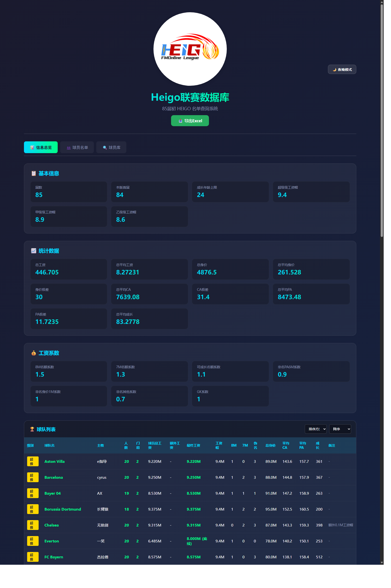
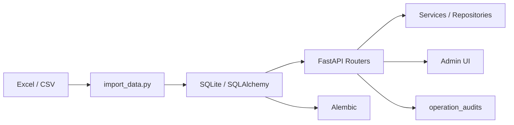

# HEIGO Football Manager Online League Database



HEIGO 联机联赛数据库后台，面向 Football Manager 联机联赛的球队、球员、属性库、联赛规则、管理员操作与维护审计管理。

当前仓库已经从早期单文件原型，演进为一套可本地运行、可正式导入、可审计、可迁移的单实例后台系统。

## 项目亮点

- `FastAPI + SQLAlchemy + SQLite + Alembic` 的单体后台架构
- 严格模式数据导入，默认只接受 `信息总览 + 联赛名单 + 2600球员属性.csv`
- 真实外键与强类型联赛配置，不再只靠字符串关联和弱类型规则表
- 管理员写操作、正式导入、Schema 启动事件统一进入后端持久化审计
- 管理员页面内置球队统计来源调试、缓存重算、工资重算、正式导入与运维审计视图
- 具备自动化测试、数据库迁移、备份恢复和紧急修表流程

## 当前能力

- 联赛规则管理：`league_info`
- 球队管理：`teams`
- 球员管理：`players`
- 属性库管理：`player_attributes`
- 管理员认证与会话：`admin_users`、`admin_sessions`
- 操作审计：`operation_audits`
- 正式导入、严格校验、幂等 upsert、备份恢复

## 本地启动

### 1. 安装依赖

```powershell
cd D:\HEIGOOA
python -m pip install -r requirements.txt
```

### 2. 启动服务

推荐直接使用内置脚本：

```powershell
cd D:\HEIGOOA
.\start_local.ps1
```

或者：

```powershell
cd D:\HEIGOOA
python main1.py
```

默认访问地址：

- [http://127.0.0.1:8001](http://127.0.0.1:8001)

### 3. 启动后检查

```powershell
python audit_schema.py
```

你应该能看到：

- 当前 `alembic_version`
- `teams / players / player_attributes / operation_audits` 记录规模
- 最近一次 `schema_bootstrap` 事件

## 常用命令

### 跑回归测试

```powershell
python test_alembic_migrations.py
python test_phase1.py
python test_simulation.py
python test_import_data.py
```

### 做一次严格模式导入检查

```powershell
python import_data.py --dry-run --report-json strict_import_report.json
```

### 查看数据库结构审计

```powershell
python audit_schema.py
```

## 目录结构

```text
HEIGOOA/
├─ alembic/              # 数据库迁移
├─ docs/                 # 审计说明、截图
├─ repositories/         # 数据访问层
├─ routers/              # FastAPI 路由
├─ services/             # 业务服务层
├─ static/               # 前端页面与静态资源
├─ main1.py              # 应用装配入口
├─ import_data.py        # 严格导入 / dry-run / 正式导入核心
├─ database.py           # 数据库初始化与 Alembic 升级入口
└─ DEPLOY.md             # 部署、恢复、紧急修表手册
```

## 架构概览



## 数据与迁移策略

- `players.team_id`、`transfer_logs.from_team_id`、`transfer_logs.to_team_id` 已使用真实外键
- `transfer_logs.operation` 已受数据库约束保护
- `league_info` 已升级为强类型结构
- 启动时优先执行 `alembic upgrade head`
- 正常启动不再依赖自动 runtime fallback，紧急修表请显式运行 `runtime_schema_repair.py`

## 运维与审计

管理员维护页目前支持：

- 工资全量重算
- 球队缓存安全全量重算
- 正式导入联赛数据
- 按类别筛选运维审计
- 导出审计 CSV
- 查看最近一次正式导入完整明细
- 查看最近一次 Schema 启动状态

后端审计已经沉淀到 `operation_audits`，并包含：

- Schema 启动事件
- 正式导入结果
- 工资重算与球队缓存重算
- 登录/登出
- 转会、海捞、解约、消费、返老
- 批量操作、撤销、球队修改、球员修改、UID 修改
- 历史 `admin_operations.log` 导入记录

## 文档

- [部署与恢复手册](DEPLOY.md)
- [技术审计与改造说明](docs/HEIGO_AUDIT.md)

## 当前状态

这套系统目前适合：

- 单实例
- 中小规模联机联赛后台
- 强调数据一致性、可维护性和运维可追踪

如果后续要继续走多实例或更高并发，建议在当前 Alembic 和分层基础上，继续推进 PostgreSQL 演进。
