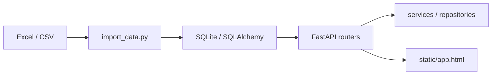

# HEIGO 联机联赛技术审计与优化说明

## 当前技术方案

系统当前采用单体式实现：

1. 数据导入层：`import_data.py` 从 Excel/CSV 导入球队、球员、属性库和联赛规则。
2. 数据库层：`SQLAlchemy ORM + SQLite`，核心表为 `players`、`teams`、`player_attributes`、`transfer_logs`、`admin_users`、`league_info`。
3. 业务计算层：`wage_calculator.py` 负责工资和名额计算，`services/*` 负责球队统计、导入、导出、认证和写操作编排。
4. 管理接口层：`FastAPI + routers/*` 暴露登录、转会、海捞、解约、消费、返老、批量操作、撤销、导出、正式导入和维护审计接口。
5. 前端展示层：`static/app.html` 直接消费同进程 API，并提供管理员维护区、统计来源调试视图和运维审计面板。

## 本次落地改造

### 已完成

- 将管理员密码从单纯 `sha256` 升级为 `pbkdf2_sha256`，并保留旧 hash 的登录时自动升级能力。
- 将管理员会话从进程内内存字典迁移到数据库表 `admin_sessions`，解决重启失效和多实例不可共享的问题。
- 为 `transfer_logs.created_at`、`transfer_logs.operation`、`players(team_name, name)` 增加运行时索引初始化。
- 为 `players` 引入兼容性 `team_id` 字段，并在启动时自动回填历史数据，开始从字符串关联平滑过渡到 ID 关联。
- 为 `transfer_logs` 引入 `from_team_id / to_team_id`，让历史操作在球队改名后仍能稳定关联到原始球队实体。
- 将 `Player.team_id`、`TransferLog.from_team_id`、`TransferLog.to_team_id` 升级为真正的数据库外键约束，并在 SQLite 启动阶段自动重建历史表以完成迁移。
- 将 `transfer_logs.operation` 升级为数据库级受控枚举约束，非法操作类型将被 CHECK constraint 直接拒绝写入。
- 将 `league_info` 从弱类型 `value` 单列升级为 `value_type + int_value/float_value/text_value` 的强类型结构，并对 key/category/type 关系做数据库级校验。
- 将 `main1.py` 的管理端写接口开始下沉到 `services/admin_service.py` 和 `services/league_service.py`，把入口文件逐步收敛为薄路由。
- 新增 `league_settings.py`，把关键联赛规则键收敛为受控集合，并提供强类型读取 `成长年龄上限` 的入口。
- 将转会、海捞、解约、消费、返老、批量交易、批量消费、批量解约、撤销等关键写操作收敛为单事务保存，并统一通过 `persist_with_team_stats()` 提交。
- 将球队统计缓存刷新从“全量遍历所有可见球队”优化为“只重算受影响球队”，降低常规写操作的统计刷新开销。
- 将球队统计内部拆为“工资统计、阵容统计、价值统计”三个更新函数，并支持按统计块选择性刷新。
- 进一步明确缓存边界：`team_size / gk_count / count_8m / count_7m / count_fake / wage / final_wage` 继续作为持久缓存维护，`total_value / avg_value / avg_ca / avg_pa / total_growth` 改为读接口与导出链路实时聚合。
- 在 `/api/teams` 返回中显式附带 `stat_sources` 元数据，标出哪些统计字段来自持久缓存、哪些字段来自实时聚合，便于前后端和运维排查。
- 进一步为球队缓存统计记录最近一次刷新方式、范围与时间，并在管理员前端调试视图中展示“缓存命中 / 实时覆盖 / 写后增量刷新 / 全量重算”等提示。
- 新增管理员“安全全量重算球队缓存”入口，用于一次性重算所有可见球队的缓存统计，并把历史 `unknown` 刷新元数据补齐为可追踪状态。
- 将 `import_data.py` 重写为可复用 CLI/函数入口，支持 `dry-run`、JSON 报告、显式文件解析、工作表/列校验、失败整体回滚和幂等 upsert。
- 为导入链路切到默认严格模式：主数据仅接受 `信息总览 + 联赛名单 + 球员属性.csv`，并输出结构化报错清单；旧版 `球员对应球队` / 俱乐部回退仅在显式兼容模式下启用。
- 为导入链路新增独立自动化回归测试，覆盖 `dry-run` 不落库、重复导入幂等、缺列回滚、严格模式报错，以及显式兼容模式下的旧版映射/回退场景。
- 已引入 Alembic 迁移基础设施，并将当前正式 schema 以 `bootstrap + themed follow-up revisions` 纳入 `alembic upgrade head` 流程；其中 `players/transfer_logs` 的 team-link 回填已拆成独立 revision，且共用的 SQLite 重建/回填逻辑已下沉到独立 migration helper，启动阶段优先使用正式迁移，运行时修表仅保留为兼容回退。
- 新增后端持久化审计表 `operation_audits`，将 `schema_bootstrap.log`、正式导入结果、工资重算和球队缓存重算等维护动作沉淀为数据库审计记录，不再只依赖文件日志或浏览器本地状态。
- 进一步将管理员写操作全部纳入后端持久化审计，登录、登出、转会、海捞、解约、消费、返老、批量操作、撤销、球队修改、球员修改、UID 修改、正式导入、工资重算、球队缓存重算都会写入 `operation_audits`。
- 已将历史 `admin_operations.log` 一次性并入 `operation_audits`，后续查询与导出不再需要先看文件日志。
- 新增 `/api/admin/operations-audit`、`/api/admin/operations-audit/export` 和 `/api/admin/import/latest` 接口，并在管理员维护页展示最近的 schema 启动、正式导入和系统维护结果；正式导入摘要也改为优先从后端审计记录恢复，且支持按类别筛选、导出 CSV、查看最近一次正式导入完整明细。
- 修复消费、返老、球员年龄/位置修改后未同步刷新工资与球队统计的问题。
- 修复球队统计在空队伍场景下可能保留旧值的问题。
- UID 修改时同步更新 `transfer_logs.player_uid`，降低后续撤销与审计失联风险。
- 已补充可执行部署/恢复手册 [DEPLOY.md](/D:/HEIGOOA/DEPLOY.md)，覆盖新机器部署、Alembic 升级、正式导入、备份恢复和紧急修表流程。

### 仍待后续阶段推进

- `main1.py` 已明显瘦身并收敛为装配层，但 repository/query helper 仍有继续下沉空间。
- 仍以 SQLite 单库部署为主，适合当前单实例中小规模后台，不建议直接承载真正高并发联机。
- 运维审计已经后端持久化，但如果未来要做更细粒度的合规/追责，还可以继续拆成“系统审计”和“业务审计”两套视图。

## 风险与优化建议

### 立即可做

- 让导入链路、导出链路和审计链路全面以 `team_id` 为主，只把 `team_name` 作为兼容展示字段保留。
- 继续把导入链路中的球队别名和版本差异抽成受控映射配置，而不是只保留在导入脚本常量中。
- 为管理员维护页补更多审计筛选、聚合视图和错误诊断辅助能力。

### 中期重构

- 为管理员操作引入更明确的审计域模型，区分业务日志和系统日志。
- 将审计记录和部署/恢复流程继续产品化，例如支持直接下载备份、查看恢复结果摘要和告警提示。

### 规模化后再做

- 从 SQLite 迁移到 PostgreSQL，并在现有 Alembic 基础上继续补历史 revision 和环境差异迁移。
- 将前后端分离，降低单文件应用复杂度。
- 引入异步任务或后台队列处理大批量导入、全量工资重算和导出。

## 验收建议

- 登录后重启服务，确认会话失效逻辑和重新登录逻辑符合预期。
- 消费、返老、球员年龄/位置修改后，确认球员工资和球队统计同步刷新。
- 批量交易、批量消费、批量解约后，确认 `transfer_logs` 与球队汇总一致。
- 执行 `python audit_schema.py`，确认表、索引、记录数和会话表状态符合预期。
- 执行 `python test_import_data.py`，确认导入链路在 `dry-run`、幂等、回滚与别名回退场景下持续通过。
