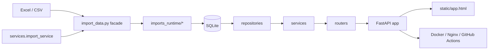

# HEIGO 椤圭洰鎬绘墜鍐?
鏈墜鍐屾槸 HEIGO 褰撳墠鍞竴瀹屾暣鎶€鏈枃妗ｏ紝鐢ㄤ簬璇存槑椤圭洰瀹氫綅銆佹灦鏋勮璁°€佹牳蹇冮摼璺€佸叧閿害鏉熴€佸凡鐭ラ闄╁拰鏂囨。缁存姢瑙勫垯銆?
## 1. 椤圭洰瀹氫綅涓庨€傜敤杈圭晫

HEIGO 鏄竴濂楀洿缁?Football Manager 鑱旀満鑱旇禌杩愯惀鐨勫崟浣撳紡鏁版嵁骞冲彴锛屼富瑕佽В鍐充互涓嬮棶棰橈細

- 鑱旇禌鍚嶅崟濡備綍绋冲畾灞曠ず鍜屾洿鏂?- 鐞冨憳灞炴€у浣曚究鎹锋煡璇€佸垎浜拰瀵规瘮
- 绠＄悊鍛樺啓鎿嶄綔濡備綍鐣欑棔銆佸彲杩借釜銆佸彲鎾ら攢
- 鑱旇禌瑙勫垯銆佸伐璧勫拰鐞冮槦缁熻濡備綍淇濇寔涓€鑷?- 鏈湴寮€鍙戝拰绾夸笂閮ㄧ讲濡備綍灏介噺绠€鍗曞彲闈?
褰撳墠绯荤粺鏇撮€傚悎琚悊瑙ｄ负锛?
- 闈㈠悜鐜╁鐨勮仈璧涙暟鎹伐浣滃彴
- 闈㈠悜绠＄悊鍛樼殑缁存姢涓庡鍏ュ悗鍙?- 鍩轰簬 SQLite 鐨勫崟瀹炰緥鑱旇禌杩愯惀绯荤粺

閫傚悎锛?
- 鍗曞疄渚嬮儴缃?- 涓皬瑙勬ā鑱旀満鑱旇禌鍚庡彴
- 浠ユ寮忓鍏ラ┍鍔ㄦ暟鎹洿鏂扮殑杩愯惀鍦烘櫙
- 寮鸿皟瀵煎叆鍙潬鎬с€佸璁¤兘鍔涘拰缁存姢鏁堢巼鐨勫唴閮ㄧ郴缁?
涓嶉€傚悎锛?
- 澶氱鎴?SaaS
- 楂橀骞跺彂鐨勫ぇ瑙勬ā鍏綉鏌ヨ鏈嶅姟
- 澶氬疄渚嬪叡浜啓鍏?- 楂樺害渚濊禆澶嶆潅寮傛浠诲姟璋冨害鐨勭郴缁?
## 2. 鎶€鏈爤涓庨儴缃插舰鎬?
### 2.1 鎶€鏈爤

- 鍚庣锛欶astAPI
- ORM锛歋QLAlchemy 2.x
- 杩佺Щ锛欰lembic
- 鏁版嵁搴擄細SQLite锛堝綋鍓嶄富鏂规锛?- 鏁版嵁澶勭悊锛歱andas銆乷penpyxl
- 鍓嶇锛氬師鐢?HTML / CSS / JavaScript
- 閮ㄧ讲锛欴ocker銆丏ocker Compose銆丯ginx
- 鑷姩閮ㄧ讲锛欸itHub Actions + SSH

### 2.2 閮ㄧ讲褰㈡€?
鎺ㄨ崘鐢熶骇缁撴瀯锛?
`GitHub -> 鏈嶅姟鍣?/srv/heigo -> Docker Compose -> Nginx -> HTTPS`

褰撳墠璁捐閲嶇偣鏄細

- 鍗曚綋鏈嶅姟锛岄儴缃查摼鐭?- 鏁版嵁鐩綍銆丯apCat 杩愯鎬佺洰褰曚笌瀵煎叆鐩綍瀹夸富鎸佷箙鍖?- 搴旂敤鍗囩骇涓嶈鐩栫敓浜ф暟鎹簱鍜屽鍏ユ枃浠?- 绠＄悊鍛樺垵濮嬪寲涓庡唴閮?HTML / SVG 娓叉煋璁块棶閫氳繃鐜鍙橀噺鏄惧紡鎺у埗

閮ㄧ讲鎿嶄綔璇﹁锛?
- `DEPLOY.md`
- `DEPLOY_FIRST_RUN_CHECKLIST.md`

## 3. 鎬讳綋鏋舵瀯涓庣洰褰曡亴璐?
### 3.1 鎬讳綋鏋舵瀯



补充说明：

- `imports_runtime/` 当前承载正式导入运行时模块，负责 source resolver、parser、validator、reporting 和 persistence 的职责拆分。
- `import_data.py` 继续保留为兼容 facade，供 CLI、测试脚本和 `services/import_service.py` 直接调用。
- `scripts/maintenance/` 当前承载运维、排障、修复和诊断脚本，避免继续堆在仓库根目录。
- `scripts/maintenance/rename_teams_from_workbook.py` 可在正式导入前，按新工作簿批量把数据库中的球队名对齐到 Excel 命名，减少球队更名带来的严格模式失败。
- `output/` 当前承载日志、截图、分析报表等可再生产物；`data/backups/` 承载可留档的数据库备份。

### 3.2 椤跺眰鐩綍鑱岃矗

```text
HEIGOOA/
鈹溾攢 alembic/                     # Alembic 杩佺Щ鑴氭湰
鈹溾攢 bot/                         # 鍩轰簬 NapCat / OneBot 鐨?QQ 缇ゆ満鍣ㄤ汉鏈嶅姟涓庣嫭绔嬮儴缃插崟鍏冿紙鍙€?profile锛?鈹溾攢 deploy/                      # Nginx 妯℃澘绛夐儴缃茶祫婧?鈹溾攢 docs/                        # 椤圭洰鏂囨。涓庢埅鍥?鈹溾攢 repositories/                # 鏁版嵁璁块棶灞?鈹溾攢 routers/                     # 璺敱灞?鈹溾攢 services/                    # 涓氬姟鏈嶅姟灞?鈹溾攢 static/                      # 鍓嶇闈欐€侀〉闈?鈹溾攢 data/                        # 鏈湴 / 鏈嶅姟鍣ㄦ暟鎹簱鐩綍锛堣繍琛屾椂锛?鈹溾攢 imports/                     # 鏈湴 / 鏈嶅姟鍣ㄥ鍏ョ洰褰曪紙杩愯鏃讹級
鈹溾攢 main1.py                     # 搴旂敤瑁呴厤鍏ュ彛
鈹溾攢 database.py                  # 鏁版嵁搴撳垵濮嬪寲涓庤縼绉诲叆鍙?鈹溾攢 import_data.py               # 姝ｅ紡瀵煎叆涓荤▼搴?鈹溾攢 Dockerfile                   # 搴旂敤闀滃儚
鈹溾攢 docker-compose.yml           # 瀹瑰櫒缂栨帓
鈹溾攢 CHANGELOG.md                 # 鏇存柊璁板綍
鈹溾攢 VERSION                      # 褰撳墠鐗堟湰
鈹斺攢 AGENTS.md                    # Agent 宸ヤ綔鍑嗗垯
```

### 3.3 鍒嗗眰鑱岃矗

褰撳墠鍚庣涓昏閬靛惊锛?
`routers -> services -> repositories -> database/models`

鍚勫眰鑱岃矗濡備笅锛?
- `routers/`
  - 璐熻矗 HTTP 鎺ュ彛杈圭晫銆佽姹傚弬鏁版帴鍏ュ拰鍝嶅簲杈撳嚭
- `services/`
  - 璐熻矗涓氬姟缂栨帓銆佽鍒欒绠椼€佸鍏?瀵煎嚭銆佸啓鎿嶄綔鑱斿姩銆佸璁″啓鍏?- `repositories/`
  - 璐熻矗鏁版嵁搴撹鍐欏皝瑁咃紝鍑忓皯鏈嶅姟灞傜洿鎺ユ嫾瑁呮煡璇?- `database.py` / `models.py`
  - 璐熻矗寮曟搸鍒濆鍖栥€佽縼绉诲惎鍔ㄣ€佹ā鍨嬪畾涔変笌 SQLite 杩愯鏃剁害鏉?
### 3.4 涓昏璺敱妯″潡

- `frontend_routes.py`
  - 杩斿洖鍓嶇鍏ュ彛椤甸潰
- `public_routes.py`
  - 鐞冨憳浜掑姩鎺掕姒?`/api/reactions/leaderboard` 涔熺敱姝ゆā鍧楁彁渚?
  - 鎻愪緵鍏紑鏌ヨ銆佸睘鎬ц鎯呫€佸鍑恒€佷簰鍔ㄦ帴鍙?- `admin_read_routes.py`
  - 鎻愪緵绠＄悊鍛樿鎺ュ彛锛屽瀹¤銆佸鍏ユ憳瑕併€佽繍缁磋鍥?- `admin_write_routes.py`
  - 鎻愪緵绠＄悊鍛樺啓鎺ュ彛锛屽杞細銆佹秷璐广€佽繑鑰併€佹寮忓鍏ャ€侀噸绠?
### 3.5 涓昏鏈嶅姟妯″潡

- `read_service.py`
  - 鏌ヨ閫昏緫涓庡叕寮€璇绘ā鍨嬬粍瑁?- `admin_write_service.py`
  - 绠＄悊鍛樺啓鎿嶄綔缂栨帓
- `import_service.py`
  - 姝ｅ紡瀵煎叆銆佸鍏ユ牴鐩綍瑙ｆ瀽銆佸浠芥帶鍒?- `league_service.py`
  - 宸ヨ祫銆佺悆闃熺粺璁°€佺紦瀛樺埛鏂般€佽仛鍚堣绠?- `auth_service.py`
  - 鐧诲綍銆佺櫥鍑恒€佺鐞嗗憳浼氳瘽
- `operation_audit_service.py`
  - 瀹¤璁板綍鍐欏叆銆佸鍑恒€佹煡璇?- `transfer_service.py` / `roster_service.py` / `wage_service.py`
  - 浜ゆ槗銆佸悕鍗曘€佸伐璧勭瓑瀛愰鍩熼€昏緫

### 3.6 鍓嶇缁撴瀯

鍓嶇褰撳墠閲囩敤鍘熺敓闈欐€佹柟妗堬細

- `static/app.html`
- `static/app.css`
- `static/js/app.core.js`
- `static/js/app.home.js`
- `static/js/app.overview.js`
- `static/js/app.players.js`
- `static/js/app.database.js`
  - 鍚屾椂鎵块€佺悆鍛樻悳绱㈢粨鏋溿€佽鎯呴〉鍜?`鐞冨憳鎼滅储 / 浜掑姩鎺掕姒?` 浜岀骇鍒囨崲
- `static/js/app.admin.js`

瀹冪殑浼樺娍鏄瀯寤洪摼绠€鍗曘€侀儴缃茶交閲忥紱浠ｄ环鏄殢鐫€鍔熻兘澧為暱锛屽ぇ鍨嬭剼鏈枃浠堕渶瑕佹寔缁帶鍒惰竟鐣屻€?
缁存姢涓績褰撳墠閬靛惊鈥滀袱灞傛潈闄愨€濓細

- `admin` tab 鍙綔涓虹鐞嗗憳鐧诲綍鍏ュ彛琚樉寮忓敜璧?- 鏈櫥褰曠敤鎴疯繘鍏ユ椂鍙樉绀虹櫥褰曞尯
- 宸茬櫥褰曠鐞嗗憳鎵嶆樉绀哄畬鏁寸淮鎶ら潰鏉?
## 4. 鏍稿績鏁版嵁娴?
### 4.1 鍏紑鏌ヨ閾捐矾

鏌ヨ涓昏矾寰勶細

`娴忚鍣?-> routers/public_routes.py -> services/read_service.py -> repositories/* -> SQLite`

鍏稿瀷鑳藉姏鍖呮嫭锛?
- 鑱旇禌姒傝
- 鐞冮槦鍒楄〃涓庣粺璁?- 鑱旇禌鍚嶅崟涓庢悳绱?- 灞炴€у簱鎼滅储涓庣悆鍛樿鎯?- 宸ヨ祫鏄庣粏
- Excel 瀵煎嚭

鐞冨憳浜掑姩鎺掕姒滃綋鍓嶄篃灞炰簬鍏紑鏌ヨ閾捐矾锛屾帴鍙ｅ涓嬶細

- `GET /api/reactions/leaderboard`
- 鏀寔鍙傛暟锛?`metric=flowers|eggs|net`銆?`limit`銆?`team`銆?`version`
- 鏁版嵁鏉ユ簮涓?`player_reaction_summaries` 锛屽綋鍓嶈繑鍥炵疮璁￠矞鑺便€侀浮铔嬬粺璁″拰鍑€濂借瘎鍊?
- 鍓嶇鍏ュ彛浣嶄簬 `鐞冨憳搴?tab` 锛岄€氳繃 `鐞冨憳鎼滅储 / 浜掑姩鎺掕姒?` 浜岀骇鍒囨崲杩涘叆

鎼滅储绾﹀畾锛?
- 鐞冨憳鎼滅储涓庡睘鎬ф悳绱㈠叡鐢ㄧ粺涓€鐨勬悳绱㈠綊涓€鍖栭€昏緫
- 榛樿鏀寔澶у皬鍐欐姌鍙犮€佺┖鏍?甯歌鍒嗛殧绗︽竻鐞嗗拰甯歌鍙橀煶绗﹀彿鍘婚櫎
- 褰撳墠宸查澶栨敮鎸佷竴鎵硅冻鐞冩暟鎹腑甯歌鐨勬娲茶瑷€鐗规畩瀛楁瘝锛屼緥濡?`脴 / 酶`銆乣脝 / 忙`銆乣艗 / 艙`銆乣艁 / 艂`銆乣膼 / 膽`銆乣脽`
- 褰撳墠宸叉敮鎸佸痉璇紡鏇夸唬杈撳叆鐨勫鏉炬悳绱紝渚嬪 `枚 -> oe`銆乣眉 -> ue`銆乣盲 -> ae`
- 褰撳墠宸叉敮鎸佸笇鑵婂瓧姣嶅悜鎷変竵鎼滅储閿殑鍩虹鏄犲皠锛屾柟渚挎病鏈夊笇鑵婂瓧绗﹁緭鍏ユ潯浠剁殑鐜╁妫€绱?- 棣栭〉 Hero 鎼滅储鐨勨€滅簿纭懡涓苟鐩存帴杩涘叆璇︽儏鈥濆垽鏂紝鐜板凡涓庡悗绔悳绱㈠綊涓€鍖栬鍒欎繚鎸佷竴鑷?- 鍥犳鍍?`gundogan / guendogan`銆乣odegaard`銆乣sesko`銆乣gyokeres` 杩欑被鑻辨枃閿洏杈撳叆锛屽凡缁忓彲浠ュ懡涓搴旂殑鍘熷濮撳悕
- 璇ヨ兘鍔涘綋鍓嶈鐩栧叕寮€鐞冨憳鎼滅储鍜屽睘鎬у簱鎼滅储锛涚悆闃熷悕绉版悳绱㈣嫢鍚庣画闇€瑕佸悓绛夎兘鍔涳紝鍙鐢ㄥ悓涓€褰掍竴鍖栫瓥鐣?
### 4.2 绠＄悊鍛樺啓鎿嶄綔閾捐矾

鍐欐搷浣滀富璺緞锛?
`绠＄悊鍛樺墠绔?-> admin_write_routes -> admin_write_service / 瀛愰鍩熸湇鍔?-> repositories / models -> SQLite -> operation_audits`

瑕嗙洊鎿嶄綔鍖呮嫭锛?
- 杞細銆佹捣鎹炪€佽В绾︺€佹秷璐广€佽繑鑰?- 鎵归噺浜ゆ槗銆佹壒閲忔秷璐广€佹壒閲忚В绾?- 鎾ら攢鎿嶄綔
- 鐞冮槦淇敼銆佺悆鍛樹慨鏀广€乁ID 淇敼
- 宸ヨ祫閲嶇畻
- 鐞冮槦缂撳瓨閲嶇畻
- 姝ｅ紡瀵煎叆

鍏抽敭绾︽潫锛?
- 鍐欐搷浣滃悗閫氬父瑕佸悓姝ュ伐璧勩€佺悆闃熺粺璁″拰瀹¤
- 鍏抽敭鍐欐搷浣滆淇濇寔浜嬪姟涓€鑷存€?- 鍘嗗彶娴佽浆璁板綍淇濈暀鍦?`transfer_logs`

### 4.3 姝ｅ紡瀵煎叆閾捐矾

姝ｅ紡瀵煎叆涓昏矾寰勶細

`Excel / CSV -> import_data.py -> services/import_service.py -> SQLite -> 澶囦唤 / 瀹¤ / 鍒锋柊`

褰撳墠瀵煎叆绛栫暐锛?
- 浠ユ寮忓鍏ヤ綔涓虹敓浜ф暟鎹洿鏂颁富鍏ュ彛
- 榛樿涓ユ牸妯″紡鏍￠獙
- 瀵煎叆鍓嶈嚜鍔ㄥ浠?SQLite
- 澶辫触鏁翠綋鍥炴粴
- 鎴愬姛鍚庡埛鏂板叕寮€鏁版嵁鍜屽璁¤褰?
瀵煎叆鏍煎紡銆佸瓧娈靛拰甯歌閿欒璇﹁锛?
- `docs/IMPORT_TEMPLATE_GUIDE.md`

补充约定：

- 项目中的联赛导入 `xlsx`、球员属性 `csv` 以及同类历史导入原件，默认都视为“导入数据库的源数据”
- 这类文件主要服务于正式导入、问题回溯和版本留档，不应默认按普通代码文件理解
- 因此，看到这类文件出现在本地工作区时，应先判断它是否只是当前待导入 / 待留档的原始数据，而不是立刻把它并入功能提交
- 这类原始数据允许保留在项目根目录或 `imports/` 目录中用于本地导入，但通常不随功能提交一起推送

### 4.4 閮ㄧ讲涓庢洿鏂伴摼璺?
鏇存柊涓昏矾寰勶細

`鏈湴寮€鍙?-> Git 鎻愪氦 -> GitHub -> 鏈嶅姟鍣ㄦ媺鍙?/ Actions 閮ㄧ讲 -> Docker Compose 閲嶅缓 -> Nginx 杞彂`

姣忔鎺ㄩ€佸墠锛岄櫎浜嗕唬鐮佹湰韬紝杩樺簲鍚屾妫€鏌ワ細

- `VERSION`
- `CHANGELOG.md`
- `docs/PROJECT_MANUAL.md`
- 瀵煎叆/閮ㄧ讲鐩稿叧涓撻鏂囨。

褰撳墠閮ㄧ讲涓殑棰濆瀹夊叏绾︽潫锛?
- 鐢熶骇鐜涓嶅啀鑷姩鎾鍥哄畾榛樿绠＄悊鍛樺彛浠?- 濡傞渶棣栧惎鍒涘缓绠＄悊鍛橈紝搴旀樉寮忛厤缃?`HEIGO_BOOTSTRAP_ADMINS`
- 绠＄悊鍛樹細璇?cookie 鐨?`Secure` 绛栫暐榛樿浣跨敤 `SESSION_COOKIE_SECURE=auto`锛屾寜 HTTP 鐩磋繛鎴?HTTPS / 鍙嶄唬璇锋眰鑷姩鍖归厤
- `/internal/share/player/{uid}` 涓?`/internal/render/player/{uid}.svg` 鍦ㄩ儴缃插満鏅腑搴旈€氳繃 `INTERNAL_SHARE_TOKEN` 淇濇姢
- `napcat` 鐨?OneBot API 璧?Docker 鍐呯綉璁块棶锛屽涓绘満榛樿浠呬繚鐣欐湰鍦?WebUI 鍏ュ彛
- `bot-nonebot` 涓?`napcat` 閫氳繃 Compose `bot-nonebot` profile 鍙€夊惎鐢紝涓嶅簲闃诲涓荤珯榛樿閮ㄧ讲
- `data/napcat/*` 鐢ㄤ簬鎸佷箙鍖?NapCat 鐧诲綍鎬?/ 閰嶇疆锛宍data/bot-nonebot-output` 鐢ㄤ簬鎸佷箙鍖栨満鍣ㄤ汉鍥剧墖缂撳瓨

## 5. 鏁版嵁妯″瀷涓庡叧閿璁＄害鏉?
### 5.1 鏍稿績琛?
- `league_info`
  - 鑱旇禌瑙勫垯涓庡弬鏁?- `teams`
  - 鐞冮槦涓昏〃
- `players`
  - 鑱旇禌鍚嶅崟鐞冨憳涓昏〃
- `player_attributes`
  - 鐞冨憳灞炴€у簱涓昏〃
- `transfer_logs`
  - 绠＄悊鍛樺啓鎿嶄綔褰卞搷涓嬬殑鐞冨憳娴佽浆鏃ュ織
- `admin_users`
  - 绠＄悊鍛樿处鍙?- `admin_sessions`
  - 绠＄悊鍛樹細璇?- `operation_audits`
  - 鍚庣鎸佷箙鍖栬繍缁村璁?- `player_reaction_summaries`
  - 鐞冨憳浜掑姩姹囨€?- `player_reaction_events`
  - 鐞冨憳浜掑姩浜嬩欢鏄庣粏

琛ㄧ粨鏋勪腑鍜岀悆鍛樹簰鍔ㄦ帓琛屾渶鐩稿叧鐨勪袱寮犺〃濡備笅锛?

- `player_reaction_summaries`
  - 鐢ㄤ簬绱鐞冨憳椴滆姳 / 楦¤泲姹囨€诲拰鍏紑鎺掕姒滄煡璇?
- `player_reaction_events`
  - 鐢ㄤ簬淇濈暀鍗曟浜掑姩浜嬩欢锛屼究浜庡悗缁仛鏃堕棿绐楃儹搴︾粺璁°

### 5.2 褰撳墠鏁版嵁璁捐閲嶇偣

- `players.team_id` 宸蹭娇鐢ㄧ湡瀹炲閿叧鑱?`teams`
- `transfer_logs.from_team_id / to_team_id` 宸蹭娇鐢ㄧ湡瀹炲閿?- `league_info` 宸蹭粠寮辩被鍨嬪崟鍒楀崌绾т负寮虹被鍨嬪瓨鍌?- 绠＄悊鍛樹細璇濆凡浠庡唴瀛樿縼绉诲埌鏁版嵁搴?- 杩愮淮瀹¤宸蹭粠鍗曠函鏂囦欢鏃ュ織琛ラ綈鍒版暟鎹簱鎸佷箙鍖?
### 5.3 SQLite 浣滀负褰撳墠涓绘柟妗堢殑杈圭晫

浼樼偣锛?
- 閮ㄧ讲绠€鍗?- 澶囦唤鐩存帴
- 鍗曟満寮€鍙戞柟渚?- volume 鎸佷箙鍖栧鏄?
灞€闄愶細

- 涓嶉€傚悎澶氬疄渚嬪叡浜啓鍏?- 楂樺苟鍙戝満鏅笂闄愭槑鏄?- 鏇村鏉傜殑鏉冮檺杈圭晫鍜岃繍缁磋兘鍔涗笉濡?PostgreSQL

### 5.4 褰撳墠杩愯绾︽潫

- 鐢熶骇鏁版嵁鏇存柊浼樺厛閫氳繃姝ｅ紡瀵煎叆瀹屾垚
- 瀵煎叆闂浼樺厛淇簮鏁版嵁锛屼笉寤鸿鐩存帴鎵嬫敼鐢熶骇搴?- `data/` 涓?`imports/` 瑙嗕负杩愯鏃剁洰褰曪紝涓嶄綔涓轰唬鐮佹簮鎻愪氦
- 鍋ュ悍妫€鏌ョ粺涓€浣跨敤 `/health`

## 6. 褰撳墠宸ョ▼鐜扮姸涓庢灦鏋勬紨杩涙憳瑕?
### 6.1 宸插畬鎴愮殑鍏抽敭宸ョ▼鍖栨紨杩?
- 浠庡崟鏂囦欢鍘熷瀷閫愭婕旇繘涓哄垎灞傚崟浣?- 寤虹珛 Alembic 姝ｅ紡杩佺Щ璺緞
- 灏嗙鐞嗗憳浼氳瘽浠庡唴瀛樿縼绉诲埌鏁版嵁搴?- 灏嗚繍缁村璁′粠鏂囦欢鏃ュ織琛ラ綈鍒版暟鎹簱鎸佷箙鍖?- 瀵煎叆閾捐矾鏀舵暃鍒颁弗鏍兼ā寮忋€佹敮鎸?dry-run 鍜岀粨鏋勫寲鎶ュ憡
- 鐞冮槦缁熻鍒锋柊浠庡叏閲忛噸绠楅€愭鏀舵暃涓烘洿鍙帶鐨勫閲?/ 瀹氬悜鍒锋柊
- 鍏紑鎺ュ彛涓庣鐞嗗憳鍚庡彴鑳藉姏瀹屾垚鍩虹妯″潡鍖栨媶鍒?
### 6.2 褰撳墠澶嶆潅搴﹂泦涓尯鍩?
褰撳墠澶嶆潅搴︿富瑕侀泦涓湪锛?
- `import_data.py`
- `static/js/app.database.js`
- `services/read_service.py`
- `services/admin_write_service.py`

杩欒鏄庣郴缁熷凡缁忓叿澶囧伐绋嬪寲鍩虹锛屼絾澶嶆潅搴﹀苟娌℃湁鍧囧寑鍒嗗竷锛屽悗缁淮鎶ゆ椂瑕侀噸鐐瑰叧娉ㄥ鍏ヨ剼鏈€佸墠绔ぇ鏂囦欢鍜屽叧閿湇鍔℃ā鍧椼€?
### 6.3 褰撳墠閫傚悎鐨勮繍琛屾柟寮?
- 鍗曞疄渚嬮儴缃?- 鑱旇禌绠＄悊鍚庡彴
- 涓皬瑙勬ā鏁版嵁鏌ヨ
- 瀵煎叆椹卞姩鐨勬暟鎹繍钀?
### 6.4 褰撳墠涓嶅缓璁殑浣跨敤鏂瑰紡

- 澶氬疄渚嬪苟鍙戝啓搴?- 楂樺苟鍙戝叕缃?API 鏈嶅姟
- 缁曡繃姝ｅ紡瀵煎叆鐩存帴鎿嶄綔鐢熶骇搴?- 鏈粡楠岃瘉鐨勬ā鏉垮拰缂栫爜鐩存帴瀵煎叆

## 7. 宸茬煡椋庨櫓銆佸吀鍨嬮棶棰樹笌浼樺寲鏂瑰悜

### 7.1 宸茬煡椋庨櫓涓庨棶棰?
- 瀵煎叆閾捐矾澶嶆潅搴﹂珮锛屾槸鏈€鍏抽敭涔熸渶鑴嗗急鐨勪笟鍔￠摼璺?- 鍘熺敓鍓嶇铏界劧杞婚噺锛屼絾澶ц剼鏈枃浠剁户缁闀夸細澧炲姞缁存姢鎴愭湰
- SQLite 涓庡崟瀹炰緥妯″瀷鍖归厤褰撳墠闃舵锛屼絾瑙勬ā涓婂崌鍚庝細閬囧埌澶╄姳鏉?- 婧愮爜銆佹ā鏉挎垨鍘嗗彶鏁版嵁涓瓨鍦ㄧ紪鐮?/ 涔辩爜椋庨櫓锛岄渶瑕佹寔缁不鐞?- 鍚姩鍒濆鍖栥€佸璁¤ˉ褰曘€侀粯璁よ处鍙锋挱绉嶇瓑閫昏緫浠嶉渶鎸佺画鏀舵暃杈圭晫

### 7.2 鐭湡浼樺寲鏂瑰悜

- 缁х画鏀舵暃鏂囨。缁撴瀯锛岄伩鍏嶉噸澶嶈鏄?- 鎻愬崌瀵煎叆鎶ラ敊鍙鎬т笌妯℃澘濂戠害娓呮櫚搴?- 澧炶ˉ鍏抽敭閾捐矾鍥炲綊娴嬭瘯锛屽挨鍏舵槸瀵煎叆銆佸仴搴锋鏌ャ€佺粺璁′竴鑷存€с€佸璁¤惤搴?- 褰撳墠宸茶ˉ鍏?`scripts/run-core-regressions.ps1`锛岀敤浜庣粺涓€鍥炲綊涓诲簲鐢ㄥ畨鍏ㄨ竟鐣屻€佺淮鎶や腑蹇冨叆鍙ｆ祦鍜屽墠鍚庣鎼滅储涓€鑷存€?- 缁х画鍑忚交 `main1.py` 鍜岃秴澶ц剼鏈殑鑱岃矗璐熸媴

### 7.3 涓湡浼樺寲鏂瑰悜

- 鎷嗗垎瀵煎叆澶фā鍧楀拰鍓嶇澶фā鍧?- 缁熶竴閿欒妯″瀷銆佸鍏ユ姤鍛婄粨鏋勩€佸璁℃憳瑕佺粨鏋?- 鎸佺画瀹屽杽缁熻缂撳瓨涓庡疄鏃惰鐩栬竟鐣?- 涓哄悗鍙扮淮鎶や腑蹇冭ˉ鍏呮洿寮虹殑璇婃柇鍜屽璁¤鍥?
### 7.4 闀挎湡婕旇繘鏂瑰悜

- 濡傛灉瑙勬ā鍜屽苟鍙戠户缁鍔狅紝璇勪及杩佺Щ PostgreSQL
- 瀵规寮忓鍏ャ€佸叏閲忛噸绠椼€侀噸鍨嬪鍑哄紩鍏ュ紓姝ヤ换鍔″寲鑳藉姏
- 缁х画浜у搧鍖栧悗鍙扮淮鎶や笌杩愮淮鑳藉姏
- 瑙嗗墠绔鏉傚害鍐冲畾鏄惁杩涗竴姝ュ伐绋嬪寲

## 8. 鏂囨。缁存姢绾﹀畾

### 8.1 鏂囨。瑙掕壊鍒掑垎

- `README.md`
  - 椤圭洰鍏ュ彛椤碉紝鍙繚鐣欑畝浠嬨€佺増鏈害瀹氥€佸揩閫熷惎鍔ㄣ€佹枃妗ｅ鑸?- `docs/PROJECT_MANUAL.md`
  - 鍞竴瀹屾暣鎶€鏈枃妗?- `CHANGELOG.md`
  - 鍞竴鏇存柊璁板綍
- `docs/IMPORT_TEMPLATE_GUIDE.md`
  - 瀵煎叆妯℃澘涓庡鍏ユ敞鎰忎簨椤逛笓棰樻枃妗?- `DEPLOY.md` / `DEPLOY_FIRST_RUN_CHECKLIST.md`
  - 閮ㄧ讲涓庝笂绾夸笓棰樻枃妗?- `AGENTS.md`
  - Agent 椤圭洰绾у伐浣滃噯鍒?- `bot_nonebot/README.md`
  - 鍩轰簬 NapCat / OneBot 鐨?QQ 缇ゆ満鍣ㄤ汉鎺ュ叆鏂规銆佹帴鍙ｈ竟鐣屻€佺洰褰曠粨鏋勪笌閮ㄧ讲寤鸿涓撻鏂囨。

### 8.2 鍙樻洿鍚屾瑙勫垯

姣忔鍑嗗鎺ㄩ€?GitHub 鍓嶏紝鑷冲皯妫€鏌ュ苟鎸夐渶鏇存柊锛?
1. `VERSION`
2. `CHANGELOG.md`
3. `docs/PROJECT_MANUAL.md`
4. 鍙楀奖鍝嶇殑涓撻鏂囨。

鐗堟湰鐩稿叧绾﹀畾锛?
- 鏍圭洰褰?`VERSION` 鏄綋鍓嶇増鏈敮涓€鏉ユ簮
- `README.md` 鍙鏄庡浣曡鍙栫増鏈紝涓嶇‖缂栫爜澶氬鐗堟湰鏂囨湰
- `CHANGELOG.md` 涓殑姝ｅ紡鐗堟湰鏉＄洰搴斾笌 `VERSION` 淇濇寔涓€鑷?
浠ヤ笅鏀瑰姩蹇呴』鍚屾鏇存柊鏂囨。锛?
- 鏋舵瀯璋冩暣
- 瀵煎叆妯℃澘鎴栧鍏ラ摼璺皟鏁?- 鏁版嵁搴撹縼绉荤瓥鐣ヨ皟鏁?- 閮ㄧ讲娴佺▼璋冩暣
- 瀹¤銆佺粺璁℃垨寮€鍙戞祦绋嬭皟鏁?
寤鸿鐨勫彂甯冨墠鑷鍏ュ彛锛?
- 鏂囨。涓€鑷存€ф鏌ワ細`scripts/release-docs-check.ps1`
- 涓诲簲鐢ㄦ牳蹇冨洖褰掞細`scripts/run-core-regressions.ps1`
- 缁熶竴鍙戝竷鍓嶆鏌ワ細`scripts/pre-release-check.ps1`

鍏朵腑 `scripts/run-core-regressions.ps1` 褰撳墠瑕嗙洊锛?
- `/health` 鍋ュ悍妫€鏌ュ绾?- `HEIGO_BOOTSTRAP_ADMINS` 鍒濆鍖栭厤缃В鏋?- `/internal/share/player/{uid}` 鐨勫唴閮?token 淇濇姢
- `/internal/render/player/{uid}.svg` 鐨勫唴閮?token 淇濇姢涓庤繑鍥炲绾?- `heigomanage` 鍏ュ彛涓庣淮鎶や腑蹇冪櫥褰曢〉鍒囨崲
- 缁存姢涓績鐧诲綍鍚庝細璇濇牎楠屼笌 `401` 鏈巿鏉冨洖閫€鐧诲綍椤?- 鍚庣鎼滅储褰掍竴鍖栦笌鍓嶇 Hero 绮剧‘鍛戒腑涓€鑷存€?
褰撳墠 GitHub Actions 閮ㄧ讲娴佺▼涔熶細鍦ㄧ湡姝ｉ儴缃插墠鍏堟墽琛?`scripts/pre-release-check.ps1`锛岀敤浜庨樆鏂湭閫氳繃涓诲簲鐢ㄦ牳蹇冨洖褰掓垨鏂囨。鑷鐨勫彉鏇寸洿鎺ヨ繘鍏ョ敓浜ч儴缃层€?
### 8.3 鏂囨。鍐欎綔鍘熷垯

- 涓嶆柊澧炲钩琛岀殑鈥滅浜屼唤鎶€鏈€昏鈥?- 鎬昏绫诲唴瀹圭粺涓€鍥炲啓鍒版湰鎵嬪唽
- 鏇存柊鍘嗗彶缁熶竴鍐欏叆 `CHANGELOG.md`
- 鎿嶄綔鎵嬪唽淇濇寔涓撻鍖栵紝涓嶆贩鍏ユ€绘墜鍐屾鏂?
## 9. 鏂扮淮鎶よ€呴槄璇婚『搴?
寤鸿鎸変互涓嬮『搴忛槄璇伙細

1. `README.md`
2. `docs/PROJECT_MANUAL.md`
3. `CHANGELOG.md`
4. `docs/IMPORT_TEMPLATE_GUIDE.md`
5. `DEPLOY.md`
6. `bot_nonebot/README.md`
7. `database.py`
8. `main1.py`
9. `routers/`
10. `services/`
11. `static/app.html` 涓?`static/js/*.js`

杩欐牱鍙互鍏堝缓绔嬪叏灞€璁ょ煡锛屽啀杩涘叆瀹炵幇缁嗚妭銆?
## 补充：分享渲染与机器人架构（2026-03）

当前分享链路已经调整为：

- 主站负责三类分享图：球员图、工资图、名单图
- 主站内部 SVG / PNG 路由统一收口在 `routers/frontend_routes.py`
- 默认分享模板版本已提升到 `3`，用于新的球员详情图版式
- 主站 PNG 渲染统一收口在 `services/share_png_service.py`
- 球员分享的共享模型 / HTML / SVG 已拆分为：
  - `services/share_card_model_service.py`
  - `services/share_html_renderer.py`
  - `services/share_svg_renderer.py`
- 机器人改为 `bot_nonebot/`，不再本地转图和缓存图片文件

当前机器人架构边界：

- `bot_nonebot` 只调用公开读接口和 PNG 签名接口约定
- 图片真实渲染与缓存都留在主站，减少重复逻辑与二次缓存
- `docker-compose.yml` 默认只负责主站
- `docker-compose.bot.yml` 作为 `napcat + bot-nonebot` 的可选叠加层
- 机器人命令中，`球员图 <名字或UID> +1~+5` 可直接请求主站成长预览分享图，默认使用当前最新属性版本
- 机器人命令中，`工资` 默认返回文字版工资计算过程，`工资图` 才显式请求图片
- 机器人命令中，`名单` 默认返回文字版名单，`名单图` 才显式请求图片；名单默认收口为单页最多 20 人，不再做翻页提示
- 机器人名单查询支持常见中文别名和英文简写，再回退到球队名模糊匹配
- 前端详情页、对比页与分享图中的成长预览只保留 `+N` 步进和逆足 `+1` 提示，不再显示预览 CA 推算值

当前主站新增图片接口：

- `/internal/render/player/{uid}.png`
- `/internal/render/wage/{uid}.png`
- `/internal/render/roster.png?team=...&page=...`

当前球员分享图版式要点：

- HTML 预览页与 SVG 成图共用同一套球员分享模型
- 球员详情图采用中文文案、位置熟练度图、属性分组与能力雷达的统一版式
- 无真实数据时不显示花 / 蛋反应徽标占位

这样做的目的：

- 避免 bot 侧再次维护一套 SVG / PNG 渲染链
- 避免同一业务数据在主站和 bot 两边各缓存一份
- 让图片分享样式与主站分享页保持同一套模型来源
- 让 NapCat / OneBot 层只做消息协议，不再承担业务渲染复杂度

## 补充：P0 结构收口说明（2026-03）

为降低入口文件和前端数据库页的维护风险，当前已开始按低风险方式做第一轮结构收口：

- `main1.py` 保留为兼容入口，负责对外暴露 `app`、本地启动和少量历史兼容函数
- 应用启动初始化、cookie 安全策略和 FastAPI 装配分别下沉到：
  - `app_bootstrap.py`
  - `app_security.py`
  - `app_factory.py`
- 前端数据库页按“共享状态 / 搜索与排行榜 / 对比夹”做了首轮拆分：
  - `static/js/app.database.js`
  - `static/js/database.search.js`
  - `static/js/database.compare.js`
- 当前数据库页的搜索区已扩展为“双层模式”：
  - 默认保留原有关键词搜索入口，继续支持姓名 / UID 搜索与直接进入详情
  - 新增高级搜索面板，由搜索框右侧图标按钮打开
  - 高级搜索面板支持 `CA / PA / 年龄` 上下限、全属性范围、位置熟练度图筛选
  - 位置筛选当前固定按 OR 逻辑处理；单个位置点击按 `>=10 -> >=15 -> >=18 -> 关闭` 循环
  - 桌面端使用锚定搜索区的弹出层，移动端与窄屏缩放下切换为底部抽屉式全宽面板

当前这轮拆分的目标是缩小热点文件职责，而不是改变现有页面行为、导入流程或部署方式。

## 补充：P1 后台写操作骨架收口（2026-03）

为降低后台继续新增管理动作时的重复开发成本，当前已开始按低风险方式收口后台写操作模板：

- 新增 `services/admin_action_runner.py`，统一承接后台写动作的：
  - 管理员校验
  - 变更后 transfer log 落库
  - 球队统计刷新与最终 commit 边界
  - 失败回滚
- `services/admin_write_actions.py` 继续负责后台接口级审计包装，但不再自己承载底层变更骨架。
- `services/transfer_service.py` 与 `services/roster_service.py` 已将核心单动作逐步改为返回统一 mutation 结果，再由 runner 处理公共收尾逻辑。
- `services/roster_service.py` 中原先函数内临时导入 `create_transfer_log` 的写法已清理，避免局部隐藏依赖。
- `services/league_service.py` 继续保留：
  - `recalculate_team_stats()` 作为“可选 commit”的底层统计刷新函数
  - `persist_with_team_stats()` 作为“刷新统计并提交”的统一持久化入口
- `services/admin_service.py` 当前仅作为兼容聚合层，避免旁路直接绕过统一后台写入口。

这一轮收口的目标是把“查对象 -> 变更 -> transfer log -> team stats -> commit -> 审计响应”拆成更清晰的责任边界，而不是改变现有管理后台接口协议。

当前后台写动作约定如下：

- `services/admin_write_actions.py`
  - 负责后台接口级包装。
  - 负责把 request 转成审计 payload，并调用 `execute_admin_action()`。
  - 允许记录成功/失败审计。
  - 不负责业务对象变更。
  - 不负责直接 `db.commit()`。
- `services/transfer_service.py` / `services/roster_service.py`
  - 负责查对象、校验、修改 ORM 对象、整理 transfer log 参数、声明受影响球队和统计 scope。
  - 单动作函数应优先返回统一的 `AdminMutationResult`，再交给 runner 处理公共收尾。
  - 这些函数默认不应自己写审计。
  - 这些函数默认不应自己直接 `db.commit()`。
  - 如需撤销逻辑等特殊辅助函数，应尽量只做对象回滚和 scope 计算，不重复提交策略。
- `services/admin_action_runner.py`
  - 负责统一管理员校验。
  - 负责统一执行 mutation 后的公共收尾：
    - transfer log 落库
    - 团队统计刷新
    - 最终 `commit`
    - 管理后台文本日志写入
  - 负责在异常时统一 `rollback`，保证失败动作不留下半完成状态。
- `services/league_service.py`
  - `recalculate_team_stats()` 是底层统计刷新函数。
  - 只有显式传入 `commit=True` 时才允许在内部提交。
  - `persist_with_team_stats()` 是“刷新统计并提交”的统一入口，供后台写动作公共收尾调用。

推荐的新增后台写动作实现顺序：

1. 在 `transfer_service.py` 或 `roster_service.py` 中实现对象变更与 `AdminMutationResult` 拼装。
2. 如动作需要 transfer log，则只声明 log 参数，不在动作函数里单独落库提交。
3. 在 `admin_write_actions.py` 中增加对应包装项，复用统一审计入口。
4. 补单测，优先验证：
   - 失败时是否回滚
   - 是否写入正确 transfer log
   - 是否刷新受影响球队统计
   - 是否维持外键 / 引用一致性

当前约定下，允许直接 `commit` 的位置只有两类：

- `admin_action_runner.py` 中统一收尾时
- `league_service.py` 中显式设计为持久化入口的 helper，例如 `persist_with_team_stats()`

除这两类之外，后台写动作函数应尽量只修改对象状态，不单独决定提交时机。

## 补充：P2-1 导入链路模块化（2026-03）

为继续按“分段替换、不中断现有导入与部署”的原则降低导入链路维护成本，当前已先完成第一轮导入运行时拆分：

- `import_data.py`
  - 当前收口为兼容 facade。
  - 继续保留 `run_import(...)`、CLI 参数入口以及外部脚本可直接 import 的兼容导出。
- 新增 `imports_runtime/`
  - `reporting.py`：导入报告数据结构与输出。
  - `source_resolver.py`：导入原件解析与自动选取。
  - `validators.py`：表头归一化、字段解析、校验辅助。
  - `workbook_parser.py`：工作表定位、Excel 读取、球员对应球队回退读取。
  - `attribute_parser.py`：属性 CSV/XLSX 解析、表头标准化、习惯解码、雷达衍生列。
  - `persistence.py`：正式导入的 ORM 写入编排、`flush` / `rollback` / `commit` 边界和 `run_import(...)` 实现。
- `services/import_service.py`
  - 继续通过 `import_data.run_import` 调用正式导入，不需要感知内部模块拆分。
- 当前保持不变的兼容约束：
  - 严格模式规则不变。
  - `dry-run` 语义不变。
  - `ImportReport` 结构与现有测试依赖字段不变。
  - 导入成功前的 `rollback` / `commit` 策略不变。

当前导入链路约定如下：

- `imports_runtime/source_resolver.py`、`validators.py`、`workbook_parser.py`、`attribute_parser.py`
  - 优先承载纯函数、只读解析和结构化校验逻辑。
  - 不负责数据库提交。
- `imports_runtime/persistence.py`
  - 负责正式导入时的数据库写入编排。
  - 负责 `Session` 生命周期以及 `flush` / `rollback` / `commit` 决策。
  - 负责在“无错误且非 dry-run”条件下提交。
- `import_data.py`
  - 仅作为 CLI 入口与兼容导出层。
  - 允许继续被 `services/import_service.py`、测试脚本和诊断脚本直接 import。

这一轮的目标是把导入复杂度按职责拆到目录边界里，而不是改变任何现有导入模板、后台入口或部署方式。

## 补充：P2-2 读取服务边界收紧（2026-03）

为降低公开读接口继续扩张时的耦合度，当前已先完成一轮读取链路职责拆分：

- `services/read_service.py`
  - 只保留查询编排、参数标准化、错误边界和少量跨仓库协调逻辑。
- 新增 `services/read_presenters.py`
  - 负责 `TeamResponse`、`PlayerResponse`、属性搜索结果、属性详情、排行榜条目、球队信息等 schema 组装。
  - 把球员位置排序、雷达维度映射等展示型拼装从主读服务中抽离。
- 新增 `services/team_stat_source_service.py`
  - 负责球队缓存字段 / 实时字段说明、最近一次缓存刷新状态说明以及实时 overlay 拼装。
- `repositories/attribute_repository.py`
  - 补充按可用版本选择属性模型的辅助函数，减少 `read_service.py` 直接依赖属性 ORM 类。
- `team_links.py`
  - 继续保留写操作侧的球队关联辅助，不再承担读服务的球队查询职责。

当前读取链路约定如下：

- `services/read_service.py`
  - 负责调用 repositories、决定查询路径、协调 attribute version / team overlay / audit read 等跨模块读取流程。
  - 不负责堆积展示字段映射和响应 schema 拼装细节。
- `services/read_presenters.py`
  - 负责把 ORM / 查询结果对象转换成对外响应模型。
  - 不负责数据库访问。
- `services/team_stat_source_service.py`
  - 负责球队统计来源说明与实时覆盖字段的呈现规则。
  - 不负责业务查询入口选择。

这一轮的目标是让公开读取链路更接近“repository 查询 -> read_service 编排 -> presenter 输出”，而不是改变现有接口协议。

## 补充：P2-3 仓库职责清理（2026-03）

为减少根目录噪音并明确“代码 / 原始导入 / 运行产物”的边界，当前已完成一轮仓库职责整理：

- 根目录保留：
  - 核心入口、配置文件、文档、应用代码、测试代码。
  - 允许留档的导入原件，例如联赛 Excel、属性 CSV/XLSX。
- `scripts/maintenance/`
  - 承载 `check_*`、`fix_*`、初始化、审计、严格导入诊断、手工 schema repair 等维护脚本。
  - 通过目录内的 `sitecustomize.py` 兼容脚本搬迁后的仓库模块导入。
  - 推荐再按用途理解为三类：
    - `check_*` / `audit_*` / `debug_*`：只读排查。
    - `fix_*` / `recalculate_*` / `init_*`：可写修复或批量维护。
    - `runtime_schema_repair.py`：仅限应急修复。
- `output/`
  - `output/logs/`：运行日志与启动日志。
  - `output/screenshots/`：临时 UI 截图与手工验证截图。
  - `output/reports/`：分析报表、严格导入问题导出、测试导出样例等可再生产物。
  - `output/debug/`：临时文本产物。
- `data/backups/`
  - 承载可保留的数据库备份文件。

当前约定下：

- 新增维护脚本应优先放到 `scripts/maintenance/`，而不是继续放在仓库根目录。
- 新增运行日志、分析文件、截图、调试导出应优先放到 `output/` 下合适子目录。
- 导入原件仍可留在根目录或 `imports/`，不与一般产物混放。

## 补充：站点更新与数据纠错页面（2026-03）

为给普通访问者提供一个低打扰的站点信息入口，当前新增了两类公开页面：

- `/updates`
  - 用于展示项目更新历史。
  - 数据源直接读取仓库内的 `CHANGELOG.md`。
  - 页面只做展示，不维护第二份独立更新文档。
- `/data-feedback`
  - 用于提交球员资料、球队归属、属性数值、工资名额等数据纠错反馈。
  - 当前为第一版，重点是“可提交、可留档、后台可查看”。

当前实现约定如下：

- 公开入口
  - 主站页脚上方展示：
    - `更新记录`
    - `数据纠错`
  - 这两个入口不并入联赛概览，也不放进主导航，避免打扰主要查询流程。
- 更新记录
  - 后端通过只读服务解析 `CHANGELOG.md`，对外提供结构化接口。
  - 网站前台单独页面消费该接口并展示版本、日期、分组和条目。
- 数据纠错
  - 公开页提交后，反馈会写入 SQLite 表 `data_feedback_reports`。
  - 当前默认状态为 `open`。
  - 后台管理员页面提供只读列表，便于集中核对。

这一轮的目标是先把“入口 -> 提交 -> 留档 -> 后台查看”的闭环打通，而不是一次性做完整工单系统、通知推送或反馈处理流。

## 补充：自动化测试入口约定（2026-03）

为避免本地排查脚本误伤自动化测试收集，当前补充以下约定：

- 仓库根目录的 `test_db.py` 与 `test_sqlite.py`
  - 当前定位为面向本地数据库文件的手工排查脚本。
  - 依赖开发者机器上的 `heigo.db` 现状，不保证在临时数据库、CI 或全新环境下可重复执行。
  - 不属于项目默认自动化测试套件。
- `pytest.ini`
  - 当前通过 `addopts = --ignore=test_db.py --ignore=test_sqlite.py` 将上述两个脚本排除出 `pytest` 自动收集入口。
- 后续新增测试时的边界
  - 可重复自动化测试应优先使用临时 SQLite、fixture 数据和显式初始化流程，不应依赖仓库根目录现成数据库内容。
  - 一次性数据库排查、线上问题复盘或手工核对脚本，应优先放入 `scripts/maintenance/` 或明确命名为诊断脚本，而不是继续挂在默认 `pytest` 发现路径下。

## 补充：正式导入全量同步约定（2026-04）

当前正式导入的联赛名单写入语义已从“仅按 UID 新增 / 更新”收口为“全量同步”：

- `imports_runtime.persistence.run_import()` 在成功解析 `联赛名单` 后，会先执行名单 upsert，再按本次 Excel 中出现过的 UID 集合清理 `players` 表里已经不在新名单中的旧球员。
- 旧球员清理与球队清理、球队缓存重算处于同一导入事务内；只要导入失败或 `dry-run`，这些变更都会一起回滚。
- 球队人数、门将数、名额占用、工资与最终工资缓存会在清理后的最终名单基础上重算，因此网站展示应与当次 Excel 名单保持一致。
- `player_attributes` 与 `player_attribute_versions` 仍按属性版本库语义维护，不因为联赛名单缺少某个 UID 就删除历史属性记录。

这一约定的目的，是避免旧名单球员残留在 `players` 表中，继续污染球队名单页、球队人数和工资统计。

## 补充：球员库高级搜索模式（2026-04）

当前球员库公开查询已在原有 `GET /api/attributes/search/{player_name}` 之外，新增高级搜索接口：

- `POST /api/attributes/advanced-search`
- 请求体支持：
  - `query`
  - `version`
  - `age / ca / pa` 的 `{min,max}`
  - `attributes` 范围字典
  - `positions` 列表，每项为 `{position,min_score}`
  - `limit`
- 响应当前返回：
  - `items`
  - `data_version`
  - `limit`
  - `truncated`
  - `applied_filters_summary`

当前实现约定如下：

- 空关键词允许搜索，但必须至少存在一个高级筛选条件；不允许“空关键词 + 无条件”直接全库拉取
- 仓库层对高级筛选字段使用 allowlist，只允许对白名单属性字段和位置字段生成过滤条件
- 位置筛选当前固定按 OR 语义处理；例如同时要求 `ST >= 15` 与 `AMC >= 15` 时，只要命中任一位置即可
- 为避免一次返回过大结果集，高级搜索当前默认上限为 `200`；命中过多时响应会返回 `truncated=true`
- 数据库页会把高级搜索条件纳入 SPA history capture / restore；切换属性版本、从详情页返回和浏览器前进后退时，都应保留高级筛选上下文
- 当前结果区会显示关键词 / 高级条件 chips，并提供“一键清空高级条件”入口；这部分属于数据库页搜索体验的一部分，不应绕开 `database.search.js` 再做平行实现


