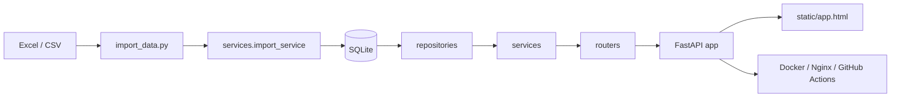

# HEIGO 项目总手册

本手册是 HEIGO 当前唯一完整技术文档，用于说明项目定位、架构设计、核心链路、关键约束、已知风险和文档维护规则。

## 1. 项目定位与适用边界

HEIGO 是一套围绕 Football Manager 联机联赛运营的单体式数据平台，主要解决以下问题：

- 联赛名单如何稳定展示和更新
- 球员属性如何便捷查询、分享和对比
- 管理员写操作如何留痕、可追踪、可撤销
- 联赛规则、工资和球队统计如何保持一致
- 本地开发和线上部署如何尽量简单可靠

当前系统更适合被理解为：

- 面向玩家的联赛数据工作台
- 面向管理员的维护与导入后台
- 基于 SQLite 的单实例联赛运营系统

适合：

- 单实例部署
- 中小规模联机联赛后台
- 以正式导入驱动数据更新的运营场景
- 强调导入可靠性、审计能力和维护效率的内部系统

不适合：

- 多租户 SaaS
- 高频并发的大规模公网查询服务
- 多实例共享写入
- 高度依赖复杂异步任务调度的系统

## 2. 技术栈与部署形态

### 2.1 技术栈

- 后端：FastAPI
- ORM：SQLAlchemy 2.x
- 迁移：Alembic
- 数据库：SQLite（当前主方案）
- 数据处理：pandas、openpyxl
- 前端：原生 HTML / CSS / JavaScript
- 部署：Docker、Docker Compose、Nginx
- 自动部署：GitHub Actions + SSH

### 2.2 部署形态

推荐生产结构：

`GitHub -> 服务器 /srv/heigo -> Docker Compose -> Nginx -> HTTPS`

当前设计重点是：

- 单体服务，部署链短
- 数据目录、NapCat 运行态目录与导入目录宿主持久化
- 应用升级不覆盖生产数据库和导入文件
- 管理员初始化与内部 HTML / SVG 渲染访问通过环境变量显式控制

部署操作详见：

- `DEPLOY.md`
- `DEPLOY_FIRST_RUN_CHECKLIST.md`

## 3. 总体架构与目录职责

### 3.1 总体架构



### 3.2 顶层目录职责

```text
HEIGOOA/
├─ alembic/                     # Alembic 迁移脚本
├─ bot/                         # 基于 NapCat / OneBot 的 QQ 群机器人服务与独立部署单元（可选 profile）
├─ deploy/                      # Nginx 模板等部署资源
├─ docs/                        # 项目文档与截图
├─ repositories/                # 数据访问层
├─ routers/                     # 路由层
├─ services/                    # 业务服务层
├─ static/                      # 前端静态页面
├─ data/                        # 本地 / 服务器数据库目录（运行时）
├─ imports/                     # 本地 / 服务器导入目录（运行时）
├─ main1.py                     # 应用装配入口
├─ database.py                  # 数据库初始化与迁移入口
├─ import_data.py               # 正式导入主程序
├─ Dockerfile                   # 应用镜像
├─ docker-compose.yml           # 容器编排
├─ CHANGELOG.md                 # 更新记录
├─ VERSION                      # 当前版本
└─ AGENTS.md                    # Agent 工作准则
```

### 3.3 分层职责

当前后端主要遵循：

`routers -> services -> repositories -> database/models`

各层职责如下：

- `routers/`
  - 负责 HTTP 接口边界、请求参数接入和响应输出
- `services/`
  - 负责业务编排、规则计算、导入/导出、写操作联动、审计写入
- `repositories/`
  - 负责数据库读写封装，减少服务层直接拼装查询
- `database.py` / `models.py`
  - 负责引擎初始化、迁移启动、模型定义与 SQLite 运行时约束

### 3.4 主要路由模块

- `frontend_routes.py`
  - 返回前端入口页面
- `public_routes.py`
  - 提供公开查询、属性详情、导出、互动接口
- `admin_read_routes.py`
  - 提供管理员读接口，如审计、导入摘要、运维视图
- `admin_write_routes.py`
  - 提供管理员写接口，如转会、消费、返老、正式导入、重算

### 3.5 主要服务模块

- `read_service.py`
  - 查询逻辑与公开读模型组装
- `admin_write_service.py`
  - 管理员写操作编排
- `import_service.py`
  - 正式导入、导入根目录解析、备份控制
- `league_service.py`
  - 工资、球队统计、缓存刷新、聚合计算
- `auth_service.py`
  - 登录、登出、管理员会话
- `operation_audit_service.py`
  - 审计记录写入、导出、查询
- `transfer_service.py` / `roster_service.py` / `wage_service.py`
  - 交易、名单、工资等子领域逻辑

### 3.6 前端结构

前端当前采用原生静态方案：

- `static/app.html`
- `static/app.css`
- `static/js/app.core.js`
- `static/js/app.home.js`
- `static/js/app.overview.js`
- `static/js/app.players.js`
- `static/js/app.database.js`
- `static/js/app.admin.js`

它的优势是构建链简单、部署轻量；代价是随着功能增长，大型脚本文件需要持续控制边界。

维护中心当前遵循“两层权限”：

- `admin` tab 可作为管理员登录入口被显式唤起
- 未登录用户进入时只显示登录区
- 已登录管理员才显示完整维护面板

## 4. 核心数据流

### 4.1 公开查询链路

查询主路径：

`浏览器 -> routers/public_routes.py -> services/read_service.py -> repositories/* -> SQLite`

典型能力包括：

- 联赛概览
- 球队列表与统计
- 联赛名单与搜索
- 属性库搜索与球员详情
- 工资明细
- Excel 导出

搜索约定：

- 球员搜索与属性搜索共用统一的搜索归一化逻辑
- 默认支持大小写折叠、空格/常见分隔符清理和常见变音符号去除
- 当前已额外支持一批足球数据中常见的欧洲语言特殊字母，例如 `Ø / ø`、`Æ / æ`、`Œ / œ`、`Ł / ł`、`Đ / đ`、`ß`
- 当前已支持德语式替代输入的宽松搜索，例如 `ö -> oe`、`ü -> ue`、`ä -> ae`
- 当前已支持希腊字母向拉丁搜索键的基础映射，方便没有希腊字符输入条件的玩家检索
- 首页 Hero 搜索的“精确命中并直接进入详情”判断，现已与后端搜索归一化规则保持一致
- 因此像 `gundogan / guendogan`、`odegaard`、`sesko`、`gyokeres` 这类英文键盘输入，已经可以命中对应的原始姓名
- 该能力当前覆盖公开球员搜索和属性库搜索；球队名称搜索若后续需要同等能力，可复用同一归一化策略

### 4.2 管理员写操作链路

写操作主路径：

`管理员前端 -> admin_write_routes -> admin_write_service / 子领域服务 -> repositories / models -> SQLite -> operation_audits`

覆盖操作包括：

- 转会、海捞、解约、消费、返老
- 批量交易、批量消费、批量解约
- 撤销操作
- 球队修改、球员修改、UID 修改
- 工资重算
- 球队缓存重算
- 正式导入

关键约束：

- 写操作后通常要同步工资、球队统计和审计
- 关键写操作要保持事务一致性
- 历史流转记录保留在 `transfer_logs`

### 4.3 正式导入链路

正式导入主路径：

`Excel / CSV -> import_data.py -> services/import_service.py -> SQLite -> 备份 / 审计 / 刷新`

当前导入策略：

- 以正式导入作为生产数据更新主入口
- 默认严格模式校验
- 导入前自动备份 SQLite
- 失败整体回滚
- 成功后刷新公开数据和审计记录

导入格式、字段和常见错误详见：

- `docs/IMPORT_TEMPLATE_GUIDE.md`

### 4.4 部署与更新链路

更新主路径：

`本地开发 -> Git 提交 -> GitHub -> 服务器拉取 / Actions 部署 -> Docker Compose 重建 -> Nginx 转发`

每次推送前，除了代码本身，还应同步检查：

- `VERSION`
- `CHANGELOG.md`
- `docs/PROJECT_MANUAL.md`
- 导入/部署相关专题文档

当前部署中的额外安全约束：

- 生产环境不再自动播种固定默认管理员口令
- 如需首启创建管理员，应显式配置 `HEIGO_BOOTSTRAP_ADMINS`
- 管理员会话 cookie 的 `Secure` 策略默认使用 `SESSION_COOKIE_SECURE=auto`，按 HTTP 直连或 HTTPS / 反代请求自动匹配
- `/internal/share/player/{uid}` 与 `/internal/render/player/{uid}.svg` 在部署场景中应通过 `INTERNAL_SHARE_TOKEN` 保护
- `napcat` 的 OneBot API 走 Docker 内网访问，宿主机默认仅保留本地 WebUI 入口
- `qqbot` 与 `napcat` 通过 Compose `qqbot` profile 可选启用，不应阻塞主站默认部署
- `data/napcat/*` 用于持久化 NapCat 登录态 / 配置，`data/qqbot-output` 用于持久化机器人图片缓存

## 5. 数据模型与关键设计约束

### 5.1 核心表

- `league_info`
  - 联赛规则与参数
- `teams`
  - 球队主表
- `players`
  - 联赛名单球员主表
- `player_attributes`
  - 球员属性库主表
- `transfer_logs`
  - 管理员写操作影响下的球员流转日志
- `admin_users`
  - 管理员账号
- `admin_sessions`
  - 管理员会话
- `operation_audits`
  - 后端持久化运维审计
- `player_reaction_summaries`
  - 球员互动汇总
- `player_reaction_events`
  - 球员互动事件明细

### 5.2 当前数据设计重点

- `players.team_id` 已使用真实外键关联 `teams`
- `transfer_logs.from_team_id / to_team_id` 已使用真实外键
- `league_info` 已从弱类型单列升级为强类型存储
- 管理员会话已从内存迁移到数据库
- 运维审计已从单纯文件日志补齐到数据库持久化

### 5.3 SQLite 作为当前主方案的边界

优点：

- 部署简单
- 备份直接
- 单机开发方便
- volume 持久化容易

局限：

- 不适合多实例共享写入
- 高并发场景上限明显
- 更复杂的权限边界和运维能力不如 PostgreSQL

### 5.4 当前运行约束

- 生产数据更新优先通过正式导入完成
- 导入问题优先修源数据，不建议直接手改生产库
- `data/` 与 `imports/` 视为运行时目录，不作为代码源提交
- 健康检查统一使用 `/health`

## 6. 当前工程现状与架构演进摘要

### 6.1 已完成的关键工程化演进

- 从单文件原型逐步演进为分层单体
- 建立 Alembic 正式迁移路径
- 将管理员会话从内存迁移到数据库
- 将运维审计从文件日志补齐到数据库持久化
- 导入链路收敛到严格模式、支持 dry-run 和结构化报告
- 球队统计刷新从全量重算逐步收敛为更可控的增量 / 定向刷新
- 公开接口与管理员后台能力完成基础模块化拆分

### 6.2 当前复杂度集中区域

当前复杂度主要集中在：

- `import_data.py`
- `static/js/app.database.js`
- `services/read_service.py`
- `services/admin_write_service.py`

这说明系统已经具备工程化基础，但复杂度并没有均匀分布，后续维护时要重点关注导入脚本、前端大文件和关键服务模块。

### 6.3 当前适合的运行方式

- 单实例部署
- 联赛管理后台
- 中小规模数据查询
- 导入驱动的数据运营

### 6.4 当前不建议的使用方式

- 多实例并发写库
- 高并发公网 API 服务
- 绕过正式导入直接操作生产库
- 未经验证的模板和编码直接导入

## 7. 已知风险、典型问题与优化方向

### 7.1 已知风险与问题

- 导入链路复杂度高，是最关键也最脆弱的业务链路
- 原生前端虽然轻量，但大脚本文件继续增长会增加维护成本
- SQLite 与单实例模型匹配当前阶段，但规模上升后会遇到天花板
- 源码、模板或历史数据中存在编码 / 乱码风险，需要持续治理
- 启动初始化、审计补录、默认账号播种等逻辑仍需持续收敛边界

### 7.2 短期优化方向

- 继续收敛文档结构，避免重复说明
- 提升导入报错可读性与模板契约清晰度
- 增补关键链路回归测试，尤其是导入、健康检查、统计一致性、审计落库
- 当前已补充 `scripts/run-core-regressions.ps1`，用于统一回归主应用安全边界、维护中心入口流和前后端搜索一致性
- 继续减轻 `main1.py` 和超大脚本的职责负担

### 7.3 中期优化方向

- 拆分导入大模块和前端大模块
- 统一错误模型、导入报告结构、审计摘要结构
- 持续完善统计缓存与实时覆盖边界
- 为后台维护中心补充更强的诊断和审计视图

### 7.4 长期演进方向

- 如果规模和并发继续增加，评估迁移 PostgreSQL
- 对正式导入、全量重算、重型导出引入异步任务化能力
- 继续产品化后台维护与运维能力
- 视前端复杂度决定是否进一步工程化

## 8. 文档维护约定

### 8.1 文档角色划分

- `README.md`
  - 项目入口页，只保留简介、版本约定、快速启动、文档导航
- `docs/PROJECT_MANUAL.md`
  - 唯一完整技术文档
- `CHANGELOG.md`
  - 唯一更新记录
- `docs/IMPORT_TEMPLATE_GUIDE.md`
  - 导入模板与导入注意事项专题文档
- `DEPLOY.md` / `DEPLOY_FIRST_RUN_CHECKLIST.md`
  - 部署与上线专题文档
- `AGENTS.md`
  - Agent 项目级工作准则
- `docs/QQ_BOT_INTEGRATION_PLAN.md`
  - 基于 NapCat / OneBot 的 QQ 群机器人接入方案、接口边界、目录结构与部署建议专题文档

### 8.2 变更同步规则

每次准备推送 GitHub 前，至少检查并按需更新：

1. `VERSION`
2. `CHANGELOG.md`
3. `docs/PROJECT_MANUAL.md`
4. 受影响的专题文档

版本相关约定：

- 根目录 `VERSION` 是当前版本唯一来源
- `README.md` 只说明如何读取版本，不硬编码多处版本文本
- `CHANGELOG.md` 中的正式版本条目应与 `VERSION` 保持一致

以下改动必须同步更新文档：

- 架构调整
- 导入模板或导入链路调整
- 数据库迁移策略调整
- 部署流程调整
- 审计、统计或开发流程调整

建议的发布前自检入口：

- 文档一致性检查：`scripts/release-docs-check.ps1`
- 主应用核心回归：`scripts/run-core-regressions.ps1`
- 统一发布前检查：`scripts/pre-release-check.ps1`

其中 `scripts/run-core-regressions.ps1` 当前覆盖：

- `/health` 健康检查契约
- `HEIGO_BOOTSTRAP_ADMINS` 初始化配置解析
- `/internal/share/player/{uid}` 的内部 token 保护
- `/internal/render/player/{uid}.svg` 的内部 token 保护与返回契约
- `heigomanage` 入口与维护中心登录页切换
- 维护中心登录后会话校验与 `401` 未授权回退登录页
- 后端搜索归一化与前端 Hero 精确命中一致性

当前 GitHub Actions 部署流程也会在真正部署前先执行 `scripts/pre-release-check.ps1`，用于阻断未通过主应用核心回归或文档自检的变更直接进入生产部署。

### 8.3 文档写作原则

- 不新增平行的“第二份技术总览”
- 总览类内容统一回写到本手册
- 更新历史统一写入 `CHANGELOG.md`
- 操作手册保持专题化，不混入总手册正文

## 9. 新维护者阅读顺序

建议按以下顺序阅读：

1. `README.md`
2. `docs/PROJECT_MANUAL.md`
3. `CHANGELOG.md`
4. `docs/IMPORT_TEMPLATE_GUIDE.md`
5. `DEPLOY.md`
6. `docs/QQ_BOT_INTEGRATION_PLAN.md`
7. `database.py`
8. `main1.py`
9. `routers/`
10. `services/`
11. `static/app.html` 与 `static/js/*.js`

这样可以先建立全局认知，再进入实现细节。
