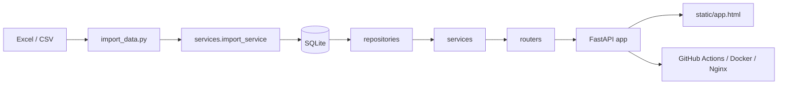

# HEIGO 项目总手册

## 1. 项目定位

HEIGO 是一套围绕 Football Manager 联机联赛运行的单体式数据平台。

它的目标不是做通用足球网站，而是解决联赛运营中的几个具体问题：

- 联赛名单如何稳定展示和更新
- 球员属性如何方便查询和分享
- 管理员写操作如何留痕并支持撤销
- 联赛规则、工资、球队统计如何保持一致
- 本地开发与线上部署如何尽量简单可靠

从产品职责上看，当前系统最合适的定位是：

- 面向玩家的联赛数据工作台
- 面向管理员的维护与导入后台

## 2. 适用范围

当前系统适合：

- 单实例部署
- 中小规模联机联赛后台
- 以 SQLite 为主库的内部运营系统
- 需要较强数据导入、审计、回滚能力的管理场景

当前系统不适合：

- 多租户 SaaS
- 高频并发的大规模公网查询服务
- 多实例共享写入
- 复杂异步任务调度密集场景

相关补充文档：

- [导入模板说明](IMPORT_TEMPLATE_GUIDE.md)
- [部署手册](../DEPLOY.md)
- [首次上线清单](../DEPLOY_FIRST_RUN_CHECKLIST.md)

## 3. 技术路线

### 3.1 后端

- FastAPI 提供 HTTP API 和首页入口
- SQLAlchemy 负责 ORM 和数据库访问
- Alembic 负责正式 schema 迁移
- SQLite 是当前默认数据库
- pandas + openpyxl 用于 Excel / CSV 导入处理

### 3.2 前端

前端采用原生静态方案：

- `static/app.html`
- `static/app.css`
- `static/js/*.js`

没有引入 React / Vue。当前前端强调的是：

- 单体可维护
- 页面加载快
- 与后端接口耦合简单
- 部署时不需要额外 Node 构建链

### 3.3 部署

线上推荐方案：

- Ubuntu + Docker CE
- Docker Compose 运行应用
- Nginx 做反向代理与 HTTPS
- GitHub Actions 自动 SSH 到服务器执行部署

### 3.4 数据更新

联赛数据更新不是直接修改数据库，而是通过正式导入完成：

- Excel：联赛名单主数据
- CSV：球员属性库
- 导入前自动备份 SQLite
- 严格模式校验失败则不提交
- 成功后刷新可见数据和审计记录

字段级模板、工作表名和常见报错说明见：

- [导入模板说明](IMPORT_TEMPLATE_GUIDE.md)

## 4. 总体架构



## 5. 目录与职责

### 5.1 顶层目录

```text
HEIGOOA/
├─ alembic/                     # Alembic 迁移脚本
├─ deploy/                      # Nginx 模板等部署资源
├─ docs/                        # 项目文档与截图
├─ repositories/                # 数据访问层
├─ routers/                     # 路由层
├─ services/                    # 业务服务层
├─ static/                      # 前端静态页面
├─ data/                        # 本地 / 服务器持久化数据库目录（运行时）
├─ imports/                     # 本地 / 服务器导入目录（运行时）
├─ main1.py                     # 应用装配与入口
├─ database.py                  # 数据库初始化与迁移入口
├─ import_data.py               # 导入主程序
├─ Dockerfile                   # 镜像构建
├─ docker-compose.yml           # 容器编排
├─ DEPLOY.md                    # 部署手册
└─ DEPLOY_FIRST_RUN_CHECKLIST.md
```

### 5.2 路由层

`routers/` 当前分为四块：

- `frontend_routes.py`
  - 负责返回 `static/app.html`
- `public_routes.py`
  - 提供公开查询、属性详情、Excel 导出、互动接口
- `admin_read_routes.py`
  - 提供管理员读接口，例如操作审计、日志、导入摘要
- `admin_write_routes.py`
  - 提供管理员写接口，例如转会、返老、工资重算、正式导入

### 5.3 服务层

`services/` 是当前业务主入口，按职责分为：

- `read_service.py`
  - 查询逻辑
- `admin_write_service.py`
  - 管理员写操作编排
- `import_service.py`
  - 正式导入、备份、导入根目录解析
- `league_service.py`
  - 联赛统计、工资刷新、球队缓存刷新
- `wage_service.py`
  - 工资相关逻辑
- `transfer_service.py`
  - 转会与交易类逻辑
- `roster_service.py`
  - 名单和操作撤销相关逻辑
- `auth_service.py`
  - 登录、登出、管理员会话
- `operation_audit_service.py`
  - 审计记录写入与读取
- `maintenance_service.py`
  - 维护类能力
- `reaction_service.py`
  - 送花 / 踩鸡蛋互动
- `export_service.py`
  - Excel 导出

### 5.4 Repository 层

`repositories/` 负责把数据库访问从服务层拆出去，当前包括：

- `player_repository.py`
- `attribute_repository.py`
- `team_repository.py`
- `league_info_repository.py`
- `transfer_log_repository.py`
- `admin_user_repository.py`
- `operation_audit_repository.py`
- `player_reaction_repository.py`

## 6. 数据模型

### 6.1 核心表

- `league_info`
  - 联赛规则与参数
- `teams`
  - 球队主表
- `players`
  - 联赛名单球员主表
- `player_attributes`
  - 球员属性库主表
- `transfer_logs`
  - 管理员写操作影响下的球员流转日志
- `admin_users`
  - 管理员账号
- `admin_sessions`
  - 管理员会话
- `operation_audits`
  - 后端持久化运维审计
- `player_reaction_summaries`
  - 球员互动汇总
- `player_reaction_events`
  - 球员互动事件明细

### 6.2 当前数据设计重点

- `players.team_id` 已使用真实外键关联 `teams`
- `transfer_logs.from_team_id / to_team_id` 已使用真实外键
- `league_info` 已从弱类型单列升级为强类型存储
- 管理员会话已经从内存迁移到数据库
- 审计日志已经从文件补齐到数据库持久化

### 6.3 当前数据库边界

当前使用 SQLite，优点是：

- 部署简单
- 备份直接
- 单机开发方便
- Docker volume 持久化容易

缺点是：

- 不适合多实例共享写入
- 高并发场景上限明显
- 某些复杂运维与权限边界不如 PostgreSQL 清晰

## 7. 前端结构与页面职责

### 7.1 页面结构

前端一级入口当前是：

- 首页
- 联赛概览
- 联赛名单
- 球员库
- 维护中心（仅管理员）

### 7.2 前端模块

前端 JS 已拆成六个模块：

- `static/js/app.core.js`
  - 通用状态、主题切换、公共工具、弹窗等
- `static/js/app.home.js`
  - 首页 Hero 搜索
- `static/js/app.overview.js`
  - 联赛概览页
- `static/js/app.players.js`
  - 联赛名单页
- `static/js/app.database.js`
  - 球员库、详情页、对比、导图、互动
- `static/js/app.admin.js`
  - 维护中心

### 7.3 当前前端重点能力

- 联赛名单页：
  - 固定列宽
  - 排序与筛选状态
  - 当前查看球员高亮
  - 键盘导航
- 球员详情页：
  - 左侧信息卡 + 位置熟练度图 + 球员习惯
  - 右侧技术 / 精神 / 身体三卡
  - 身体卡内雷达图
  - 下方隐藏属性
- 对比功能：
  - 对比夹
  - 双球员对比页
  - 独立成长预览滑杆
- 互动功能：
  - 送花 / 踩鸡蛋
  - 浏览器级冷却限制
- 导图功能：
  - 独立导出模板
  - 手机和桌面导出同一张图

## 8. 当前已经落地的关键更新

以下内容是当前仓库已完成的重要阶段性成果。

### 8.1 后端与数据层

- 管理员密码升级为更合理的 hash 方案，并支持旧 hash 自动升级
- 管理员会话改为数据库持久化
- `players` 和 `transfer_logs` 与 `teams` 的关联从字符串过渡到真实外键
- `transfer_logs.operation` 增加数据库级约束
- `league_info` 升级为强类型存储结构
- `operation_audits` 审计体系落库
- 旧 `admin_operations.log` 已并入后端审计
- 导入链路升级为严格模式 + dry-run + JSON 报告
- Alembic 迁移成为正式 schema 入口

### 8.2 运维与部署

- Dockerfile 已按生产持久化目录调整
- `docker-compose.yml` 已明确 `data/` 与 `imports/` 卷映射
- GitHub Actions 自动部署已接通
- Nginx HTTPS 模板已提供
- 健康检查接口已加入容器编排

### 8.3 前端与产品体验

- 首页收敛为 Hero Search
- 联赛名单页收敛为专业数据工作区
- 球员详情页重构为桌面阅读页 + 手机分区页
- 分享图从长截图改为独立导出模板
- 双人对比与对比夹已落地
- 球员互动（花 / 鸡蛋）已落地
- 详情导图已做到手机和桌面同构导出

## 9. 数据更新方式

### 9.1 导入源

系统默认从导入目录中读取两类文件：

- `*HEIGO*.xlsx`
- `*球员属性*.csv`

服务器部署下，对应目录通常是：

```text
/srv/heigo/imports
```

### 9.2 Excel 工作表要求

正式导入当前要求的关键工作表：

- `信息总览`
- `联赛名单`

兼容模式下可选：

- `球员对应球队`

### 9.3 推荐流程

#### 后台正式导入

1. 把 Excel / CSV 放进 `imports/`
2. 进入维护中心
3. 执行“正式导入最新联赛数据”
4. 查看导入摘要与运维审计

#### 命令行 dry-run

```powershell
python import_data.py --dry-run --report-json strict_import_report.json
```

### 9.4 导入前原则

- 永远优先先跑 dry-run
- 正式导入前保留备份
- 不要直接手改生产 SQLite
- 导入失败时先看报错清单和运维审计

## 10. 本地开发方式

### 10.1 启动

```powershell
cd D:\HEIGOOA
.\start_local.ps1
```

或：

```powershell
python main1.py
```

默认地址：

- [http://127.0.0.1:8001](http://127.0.0.1:8001)

### 10.2 常用检查

健康检查：

```powershell
curl http://127.0.0.1:8001/health
```

数据库审计：

```powershell
python audit_schema.py
```

### 10.3 常用测试

```powershell
python test_alembic_migrations.py
python test_import_data.py
python test_phase1.py
python test_simulation.py
```

如果改动的是前端详情页、导图、对比、移动端样式，建议再补一轮真实浏览器烟测。

## 11. 部署方式

### 11.1 当前推荐部署方案

- 服务器：Ubuntu
- 容器：Docker CE + Docker Compose
- 反向代理：Nginx
- 自动部署：GitHub Actions
- 数据库持久化：宿主机挂载 `data/`
- 导入文件持久化：宿主机挂载 `imports/`

### 11.2 关键运行目录

```text
/srv/heigo
├─ data/
│  ├─ fm_league.db
│  └─ backups/
├─ imports/
├─ docker-compose.yml
└─ Dockerfile
```

### 11.3 当前容器约定

- 应用监听：`8080`
- 容器内数据库：`/app/data/fm_league.db`
- 容器内导入目录：`/app/imports`
- 备份目录：`/app/data/backups`

### 11.4 线上更新流程

```bash
cd /srv/heigo
git pull origin main
docker compose up -d --build
```

如果已接通 GitHub Actions，则通常是：

1. 本地提交代码
2. `git push origin main`
3. GitHub Actions 自动 SSH 到服务器执行部署

### 11.5 HTTPS 与域名

推荐结构：

- Docker 仅绑定 `127.0.0.1:8080`
- Nginx 对外开放 `80/443`
- 域名经 Nginx 反代到应用

Nginx 模板见：

- `deploy/nginx/heigo.example.conf`

## 12. 运维与故障处理

### 12.1 健康检查

- 后端健康接口：`/health`
- Docker healthcheck 已使用该接口

### 12.2 备份与回滚

正式导入前系统会自动备份 SQLite。

也可以手动备份：

```bash
cp /srv/heigo/data/fm_league.db /srv/heigo/data/backups/fm_league_manual_$(date +%Y%m%d_%H%M%S).db
```

回滚时：

1. 用备份覆盖当前数据库
2. 重启容器

### 12.3 紧急 schema 修复

正常情况下应该优先使用 Alembic。

仅在历史兼容或紧急情况下，才显式使用：

- `runtime_schema_repair.py`

不要把 runtime fallback 当作常规启动路径。

### 12.4 常用运维命令

```bash
docker compose ps
docker compose logs -f heigo
docker compose restart heigo
curl http://127.0.0.1:8080/health
```

## 13. 开发约定

### 13.1 文档约定

- 所有文档使用 UTF-8
- 修改部署、导入、迁移链路时必须同步更新文档
- 新增管理员动作时，必须明确是否写入 `operation_audits`

### 13.2 数据约定

- 生产数据库不提交到 GitHub
- `data/`、`imports/` 为运行时目录，不作为代码源
- 导入问题优先通过源数据修复，不建议直接手改库

### 13.3 代码约定

- 路由层尽量保持薄
- 业务逻辑优先放在 `services/`
- 数据访问优先放在 `repositories/`
- 前端公共状态和工具优先放在 `app.core.js`
- 页面职责继续保持模块化，不回退到 `app.js` 大一统

## 14. 后续方向

### 14.1 短期

- 继续收紧 README / DEPLOY / 手册之间的引用关系
- 继续提升导入报错可读性
- 为管理员维护中心补更多状态摘要
- 继续优化分享图和对比页的细节质量

### 14.2 中期

- 进一步拆分后端服务层职责
- 继续减少 `main1.py` 装配层外的历史耦合
- 将前端更多通用 UI 抽成稳定组件体系
- 给机器人接入预留服务端图片导出接口

### 14.3 长期

- 如果联赛规模和并发继续增加，迁移到 PostgreSQL
- 引入异步任务队列处理大导入和重算任务
- 进一步把后台维护能力产品化
- 评估前后端进一步解耦

## 15. 新维护者的阅读顺序

新接手这个项目，建议按这个顺序阅读：

1. `README.md`
2. `docs/PROJECT_MANUAL.md`
3. `docs/HEIGO_AUDIT.md`
4. `DEPLOY.md`
5. `database.py`
6. `main1.py`
7. `routers/`
8. `services/`
9. `static/app.html` + `static/js/*.js`

这样能先理解全局，再进入实现细节。
