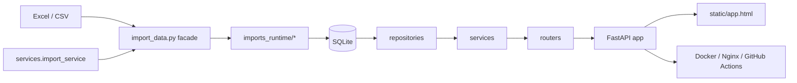

# HEIGO 椤圭洰鎬绘墜鍐?
鏈墜鍐屾槸 HEIGO 褰撳墠鍞竴瀹屾暣鎶€鏈枃妗ｏ紝鐢ㄤ簬璇存槑椤圭洰瀹氫綅銆佹灦鏋勮璁°€佹牳蹇冮摼璺€佸叧閿害鏉熴€佸凡鐭ラ闄╁拰鏂囨。缁存姢瑙勫垯銆?
## 1. 椤圭洰瀹氫綅涓庨€傜敤杈圭晫

HEIGO 鏄竴濂楀洿缁?Football Manager 鑱旀満鑱旇禌杩愯惀鐨勫崟浣撳紡鏁版嵁骞冲彴锛屼富瑕佽В鍐充互涓嬮棶棰橈細

- 鑱旇禌鍚嶅崟濡備綍绋冲畾灞曠ず鍜屾洿鏂?- 鐞冨憳灞炴€у浣曚究鎹锋煡璇€佸垎浜拰瀵规瘮
- 绠＄悊鍛樺啓鎿嶄綔濡備綍鐣欑棔銆佸彲杩借釜銆佸彲鎾ら攢
- 鑱旇禌瑙勫垯銆佸伐璧勫拰鐞冮槦缁熻濡備綍淇濇寔涓€鑷?- 鏈湴寮€鍙戝拰绾夸笂閮ㄧ讲濡備綍灏介噺绠€鍗曞彲闈?
褰撳墠绯荤粺鏇撮€傚悎琚悊瑙ｄ负锛?
- 闈㈠悜鐜╁鐨勮仈璧涙暟鎹伐浣滃彴
- 闈㈠悜绠＄悊鍛樼殑缁存姢涓庡鍏ュ悗鍙?- 鍩轰簬 SQLite 鐨勫崟瀹炰緥鑱旇禌杩愯惀绯荤粺

閫傚悎锛?
- 鍗曞疄渚嬮儴缃?- 涓皬瑙勬ā鑱旀満鑱旇禌鍚庡彴
- 浠ユ寮忓鍏ラ┍鍔ㄦ暟鎹洿鏂扮殑杩愯惀鍦烘櫙
- 寮鸿皟瀵煎叆鍙潬鎬с€佸璁¤兘鍔涘拰缁存姢鏁堢巼鐨勫唴閮ㄧ郴缁?
涓嶉€傚悎锛?
- 澶氱鎴?SaaS
- 楂橀骞跺彂鐨勫ぇ瑙勬ā鍏綉鏌ヨ鏈嶅姟
- 澶氬疄渚嬪叡浜啓鍏?- 楂樺害渚濊禆澶嶆潅寮傛浠诲姟璋冨害鐨勭郴缁?
## 2. 鎶€鏈爤涓庨儴缃插舰鎬?
### 2.1 鎶€鏈爤

- 鍚庣锛欶astAPI
- ORM锛歋QLAlchemy 2.x
- 杩佺Щ锛欰lembic
- 鏁版嵁搴擄細SQLite锛堝綋鍓嶄富鏂规锛?- 鏁版嵁澶勭悊锛歱andas銆乷penpyxl
- 鍓嶇锛氬師鐢?HTML / CSS / JavaScript
- 閮ㄧ讲锛欴ocker銆丏ocker Compose銆丯ginx
- 鑷姩閮ㄧ讲锛欸itHub Actions + SSH

### 2.2 閮ㄧ讲褰㈡€?
鎺ㄨ崘鐢熶骇缁撴瀯锛?
`GitHub -> 鏈嶅姟鍣?/srv/heigo -> Docker Compose -> Nginx -> HTTPS`

褰撳墠璁捐閲嶇偣鏄細

- 鍗曚綋鏈嶅姟锛岄儴缃查摼鐭?- 鏁版嵁鐩綍銆丯apCat 杩愯鎬佺洰褰曚笌瀵煎叆鐩綍瀹夸富鎸佷箙鍖?- 搴旂敤鍗囩骇涓嶈鐩栫敓浜ф暟鎹簱鍜屽鍏ユ枃浠?- 绠＄悊鍛樺垵濮嬪寲涓庡唴閮?HTML / SVG 娓叉煋璁块棶閫氳繃鐜鍙橀噺鏄惧紡鎺у埗

閮ㄧ讲鎿嶄綔璇﹁锛?
- `DEPLOY.md`
- `DEPLOY_FIRST_RUN_CHECKLIST.md`

## 3. 鎬讳綋鏋舵瀯涓庣洰褰曡亴璐?
### 3.1 鎬讳綋鏋舵瀯


```mermaid
flowchart LR
    A[Excel / CSV] --> B[import_data.py facade]
    E[services.import_service] --> B
    B --> C[imports_runtime/*]
    C --> D[(SQLite)]
    D --> F[repositories]
    F --> G[services]
    G --> H[routers]
    H --> I[FastAPI app]
    I --> J[static/app.html]
    I --> K[Docker / Nginx / GitHub Actions]
```

补充说明：

- `imports_runtime/` 当前承载正式导入运行时模块，负责 source resolver、parser、validator、reporting 和 persistence 的职责拆分。
- `import_data.py` 继续保留为兼容 facade，供 CLI、测试脚本和 `services/import_service.py` 直接调用。
- `scripts/maintenance/` 当前承载运维、排障、修复和诊断脚本，避免继续堆在仓库根目录。
- `scripts/maintenance/rename_teams_from_workbook.py` 可在正式导入前，按新工作簿批量把数据库中的球队名对齐到 Excel 命名，减少球队更名带来的严格模式失败。
- `output/` 当前承载日志、截图、分析报表等可再生产物；`data/backups/` 承载可留档的数据库备份。

### 3.2 椤跺眰鐩綍鑱岃矗

```text
HEIGOOA/
鈹溾攢 alembic/                     # Alembic 杩佺Щ鑴氭湰
鈹溾攢 bot/                         # 鍩轰簬 NapCat / OneBot 鐨?QQ 缇ゆ満鍣ㄤ汉鏈嶅姟涓庣嫭绔嬮儴缃插崟鍏冿紙鍙€?profile锛?鈹溾攢 deploy/                      # Nginx 妯℃澘绛夐儴缃茶祫婧?鈹溾攢 docs/                        # 椤圭洰鏂囨。涓庢埅鍥?鈹溾攢 repositories/                # 鏁版嵁璁块棶灞?鈹溾攢 routers/                     # 璺敱灞?鈹溾攢 services/                    # 涓氬姟鏈嶅姟灞?鈹溾攢 static/                      # 鍓嶇闈欐€侀〉闈?鈹溾攢 data/                        # 鏈湴 / 鏈嶅姟鍣ㄦ暟鎹簱鐩綍锛堣繍琛屾椂锛?鈹溾攢 imports/                     # 鏈湴 / 鏈嶅姟鍣ㄥ鍏ョ洰褰曪紙杩愯鏃讹級
鈹溾攢 main1.py                     # 搴旂敤瑁呴厤鍏ュ彛
鈹溾攢 database.py                  # 鏁版嵁搴撳垵濮嬪寲涓庤縼绉诲叆鍙?鈹溾攢 import_data.py               # 姝ｅ紡瀵煎叆涓荤▼搴?鈹溾攢 Dockerfile                   # 搴旂敤闀滃儚
鈹溾攢 docker-compose.yml           # 瀹瑰櫒缂栨帓
鈹溾攢 CHANGELOG.md                 # 鏇存柊璁板綍
鈹溾攢 VERSION                      # 褰撳墠鐗堟湰
鈹斺攢 AGENTS.md                    # Agent 宸ヤ綔鍑嗗垯
```

### 3.3 鍒嗗眰鑱岃矗

褰撳墠鍚庣涓昏閬靛惊锛?
`routers -> services -> repositories -> database/models`

鍚勫眰鑱岃矗濡備笅锛?
- `routers/`
  - 璐熻矗 HTTP 鎺ュ彛杈圭晫銆佽姹傚弬鏁版帴鍏ュ拰鍝嶅簲杈撳嚭
- `services/`
  - 璐熻矗涓氬姟缂栨帓銆佽鍒欒绠椼€佸鍏?瀵煎嚭銆佸啓鎿嶄綔鑱斿姩銆佸璁″啓鍏?- `repositories/`
  - 璐熻矗鏁版嵁搴撹鍐欏皝瑁咃紝鍑忓皯鏈嶅姟灞傜洿鎺ユ嫾瑁呮煡璇?- `database.py` / `models.py`
  - 璐熻矗寮曟搸鍒濆鍖栥€佽縼绉诲惎鍔ㄣ€佹ā鍨嬪畾涔変笌 SQLite 杩愯鏃剁害鏉?
### 3.4 涓昏璺敱妯″潡

- `frontend_routes.py`
  - 杩斿洖鍓嶇鍏ュ彛椤甸潰
- `public_routes.py`
  - 鐞冨憳浜掑姩鎺掕姒?`/api/reactions/leaderboard` 涔熺敱姝ゆā鍧楁彁渚?
  - 鎻愪緵鍏紑鏌ヨ銆佸睘鎬ц鎯呫€佸鍑恒€佷簰鍔ㄦ帴鍙?- `admin_read_routes.py`
  - 鎻愪緵绠＄悊鍛樿鎺ュ彛锛屽瀹¤銆佸鍏ユ憳瑕併€佽繍缁磋鍥?- `admin_write_routes.py`
  - 鎻愪緵绠＄悊鍛樺啓鎺ュ彛锛屽杞細銆佹秷璐广€佽繑鑰併€佹寮忓鍏ャ€侀噸绠?
### 3.5 涓昏鏈嶅姟妯″潡

- `read_service.py`
  - 鏌ヨ閫昏緫涓庡叕寮€璇绘ā鍨嬬粍瑁?- `admin_write_service.py`
  - 绠＄悊鍛樺啓鎿嶄綔缂栨帓
- `import_service.py`
  - 姝ｅ紡瀵煎叆銆佸鍏ユ牴鐩綍瑙ｆ瀽銆佸浠芥帶鍒?- `league_service.py`
  - 宸ヨ祫銆佺悆闃熺粺璁°€佺紦瀛樺埛鏂般€佽仛鍚堣绠?- `auth_service.py`
  - 鐧诲綍銆佺櫥鍑恒€佺鐞嗗憳浼氳瘽
- `operation_audit_service.py`
  - 瀹¤璁板綍鍐欏叆銆佸鍑恒€佹煡璇?- `transfer_service.py` / `roster_service.py` / `wage_service.py`
  - 浜ゆ槗銆佸悕鍗曘€佸伐璧勭瓑瀛愰鍩熼€昏緫

### 3.6 鍓嶇缁撴瀯

鍓嶇褰撳墠閲囩敤鍘熺敓闈欐€佹柟妗堬細

- `static/app.html`
- `static/app.css`
- `static/js/app.core.js`
- `static/js/app.home.js`
- `static/js/app.overview.js`
- `static/js/app.players.js`
- `static/js/app.database.js`
  - 鍚屾椂鎵块€佺悆鍛樻悳绱㈢粨鏋溿€佽鎯呴〉鍜?`鐞冨憳鎼滅储 / 浜掑姩鎺掕姒?` 浜岀骇鍒囨崲
- `static/js/app.admin.js`

瀹冪殑浼樺娍鏄瀯寤洪摼绠€鍗曘€侀儴缃茶交閲忥紱浠ｄ环鏄殢鐫€鍔熻兘澧為暱锛屽ぇ鍨嬭剼鏈枃浠堕渶瑕佹寔缁帶鍒惰竟鐣屻€?
缁存姢涓績褰撳墠閬靛惊鈥滀袱灞傛潈闄愨€濓細

- `admin` tab 鍙綔涓虹鐞嗗憳鐧诲綍鍏ュ彛琚樉寮忓敜璧?- 鏈櫥褰曠敤鎴疯繘鍏ユ椂鍙樉绀虹櫥褰曞尯
- 宸茬櫥褰曠鐞嗗憳鎵嶆樉绀哄畬鏁寸淮鎶ら潰鏉?
## 4. 鏍稿績鏁版嵁娴?
### 4.1 鍏紑鏌ヨ閾捐矾

鏌ヨ涓昏矾寰勶細

`娴忚鍣?-> routers/public_routes.py -> services/read_service.py -> repositories/* -> SQLite`

鍏稿瀷鑳藉姏鍖呮嫭锛?
- 鑱旇禌姒傝
- 鐞冮槦鍒楄〃涓庣粺璁?- 鑱旇禌鍚嶅崟涓庢悳绱?- 灞炴€у簱鎼滅储涓庣悆鍛樿鎯?- 宸ヨ祫鏄庣粏
- Excel 瀵煎嚭

鐞冨憳浜掑姩鎺掕姒滃綋鍓嶄篃灞炰簬鍏紑鏌ヨ閾捐矾锛屾帴鍙ｅ涓嬶細

- `GET /api/reactions/leaderboard`
- 鏀寔鍙傛暟锛?`metric=flowers|eggs|net`銆?`limit`銆?`team`銆?`version`
- 鏁版嵁鏉ユ簮涓?`player_reaction_summaries` 锛屽綋鍓嶈繑鍥炵疮璁￠矞鑺便€侀浮铔嬬粺璁″拰鍑€濂借瘎鍊?
- 鍓嶇鍏ュ彛浣嶄簬 `鐞冨憳搴?tab` 锛岄€氳繃 `鐞冨憳鎼滅储 / 浜掑姩鎺掕姒?` 浜岀骇鍒囨崲杩涘叆

鎼滅储绾﹀畾锛?
- 鐞冨憳鎼滅储涓庡睘鎬ф悳绱㈠叡鐢ㄧ粺涓€鐨勬悳绱㈠綊涓€鍖栭€昏緫
- 榛樿鏀寔澶у皬鍐欐姌鍙犮€佺┖鏍?甯歌鍒嗛殧绗︽竻鐞嗗拰甯歌鍙橀煶绗﹀彿鍘婚櫎
- 褰撳墠宸查澶栨敮鎸佷竴鎵硅冻鐞冩暟鎹腑甯歌鐨勬娲茶瑷€鐗规畩瀛楁瘝锛屼緥濡?`脴 / 酶`銆乣脝 / 忙`銆乣艗 / 艙`銆乣艁 / 艂`銆乣膼 / 膽`銆乣脽`
- 褰撳墠宸叉敮鎸佸痉璇紡鏇夸唬杈撳叆鐨勫鏉炬悳绱紝渚嬪 `枚 -> oe`銆乣眉 -> ue`銆乣盲 -> ae`
- 褰撳墠宸叉敮鎸佸笇鑵婂瓧姣嶅悜鎷変竵鎼滅储閿殑鍩虹鏄犲皠锛屾柟渚挎病鏈夊笇鑵婂瓧绗﹁緭鍏ユ潯浠剁殑鐜╁妫€绱?- 棣栭〉 Hero 鎼滅储鐨勨€滅簿纭懡涓苟鐩存帴杩涘叆璇︽儏鈥濆垽鏂紝鐜板凡涓庡悗绔悳绱㈠綊涓€鍖栬鍒欎繚鎸佷竴鑷?- 鍥犳鍍?`gundogan / guendogan`銆乣odegaard`銆乣sesko`銆乣gyokeres` 杩欑被鑻辨枃閿洏杈撳叆锛屽凡缁忓彲浠ュ懡涓搴旂殑鍘熷濮撳悕
- 璇ヨ兘鍔涘綋鍓嶈鐩栧叕寮€鐞冨憳鎼滅储鍜屽睘鎬у簱鎼滅储锛涚悆闃熷悕绉版悳绱㈣嫢鍚庣画闇€瑕佸悓绛夎兘鍔涳紝鍙鐢ㄥ悓涓€褰掍竴鍖栫瓥鐣?
### 4.2 绠＄悊鍛樺啓鎿嶄綔閾捐矾

鍐欐搷浣滀富璺緞锛?
`绠＄悊鍛樺墠绔?-> admin_write_routes -> admin_write_service / 瀛愰鍩熸湇鍔?-> repositories / models -> SQLite -> operation_audits`

瑕嗙洊鎿嶄綔鍖呮嫭锛?
- 杞細銆佹捣鎹炪€佽В绾︺€佹秷璐广€佽繑鑰?- 鎵归噺浜ゆ槗銆佹壒閲忔秷璐广€佹壒閲忚В绾?- 鎾ら攢鎿嶄綔
- 鐞冮槦淇敼銆佺悆鍛樹慨鏀广€乁ID 淇敼
- 宸ヨ祫閲嶇畻
- 鐞冮槦缂撳瓨閲嶇畻
- 姝ｅ紡瀵煎叆

鍏抽敭绾︽潫锛?
- 鍐欐搷浣滃悗閫氬父瑕佸悓姝ュ伐璧勩€佺悆闃熺粺璁″拰瀹¤
- 鍏抽敭鍐欐搷浣滆淇濇寔浜嬪姟涓€鑷存€?- 鍘嗗彶娴佽浆璁板綍淇濈暀鍦?`transfer_logs`

### 4.3 姝ｅ紡瀵煎叆閾捐矾

姝ｅ紡瀵煎叆涓昏矾寰勶細

`Excel / CSV -> import_data.py -> services/import_service.py -> SQLite -> 澶囦唤 / 瀹¤ / 鍒锋柊`

褰撳墠瀵煎叆绛栫暐锛?
- 浠ユ寮忓鍏ヤ綔涓虹敓浜ф暟鎹洿鏂颁富鍏ュ彛
- 榛樿涓ユ牸妯″紡鏍￠獙
- 瀵煎叆鍓嶈嚜鍔ㄥ浠?SQLite
- 澶辫触鏁翠綋鍥炴粴
- 鎴愬姛鍚庡埛鏂板叕寮€鏁版嵁鍜屽璁¤褰?
瀵煎叆鏍煎紡銆佸瓧娈靛拰甯歌閿欒璇﹁锛?
- `docs/IMPORT_TEMPLATE_GUIDE.md`

补充约定：

- 项目中的联赛导入 `xlsx`、球员属性 `csv` 以及同类历史导入原件，默认都视为“导入数据库的源数据”
- 这类文件主要服务于正式导入、问题回溯和版本留档，不应默认按普通代码文件理解
- 因此，看到这类文件出现在本地工作区时，应先判断它是否只是当前待导入 / 待留档的原始数据，而不是立刻把它并入功能提交
- 这类原始数据允许保留在项目根目录或 `imports/` 目录中用于本地导入，但通常不随功能提交一起推送

### 4.4 閮ㄧ讲涓庢洿鏂伴摼璺?
鏇存柊涓昏矾寰勶細

`鏈湴寮€鍙?-> Git 鎻愪氦 -> GitHub -> 鏈嶅姟鍣ㄦ媺鍙?/ Actions 閮ㄧ讲 -> Docker Compose 閲嶅缓 -> Nginx 杞彂`

姣忔鎺ㄩ€佸墠锛岄櫎浜嗕唬鐮佹湰韬紝杩樺簲鍚屾妫€鏌ワ細

- `VERSION`
- `CHANGELOG.md`
- `docs/PROJECT_MANUAL.md`
- 瀵煎叆/閮ㄧ讲鐩稿叧涓撻鏂囨。

褰撳墠閮ㄧ讲涓殑棰濆瀹夊叏绾︽潫锛?
- 鐢熶骇鐜涓嶅啀鑷姩鎾鍥哄畾榛樿绠＄悊鍛樺彛浠?- 濡傞渶棣栧惎鍒涘缓绠＄悊鍛橈紝搴旀樉寮忛厤缃?`HEIGO_BOOTSTRAP_ADMINS`
- 绠＄悊鍛樹細璇?cookie 鐨?`Secure` 绛栫暐榛樿浣跨敤 `SESSION_COOKIE_SECURE=auto`锛屾寜 HTTP 鐩磋繛鎴?HTTPS / 鍙嶄唬璇锋眰鑷姩鍖归厤
- `/internal/share/player/{uid}` 涓?`/internal/render/player/{uid}.svg` 鍦ㄩ儴缃插満鏅腑搴旈€氳繃 `INTERNAL_SHARE_TOKEN` 淇濇姢
- `napcat` 鐨?OneBot API 璧?Docker 鍐呯綉璁块棶锛屽涓绘満榛樿浠呬繚鐣欐湰鍦?WebUI 鍏ュ彛
- `bot-nonebot` 涓?`napcat` 閫氳繃 Compose `bot-nonebot` profile 鍙€夊惎鐢紝涓嶅簲闃诲涓荤珯榛樿閮ㄧ讲
- `data/napcat/*` 鐢ㄤ簬鎸佷箙鍖?NapCat 鐧诲綍鎬?/ 閰嶇疆锛宍data/bot-nonebot-output` 鐢ㄤ簬鎸佷箙鍖栨満鍣ㄤ汉鍥剧墖缂撳瓨

## 5. 鏁版嵁妯″瀷涓庡叧閿璁＄害鏉?
### 5.1 鏍稿績琛?
- `league_info`
  - 鑱旇禌瑙勫垯涓庡弬鏁?- `teams`
  - 鐞冮槦涓昏〃
- `players`
  - 鑱旇禌鍚嶅崟鐞冨憳涓昏〃
- `player_attributes`
  - 鐞冨憳灞炴€у簱涓昏〃
- `transfer_logs`
  - 绠＄悊鍛樺啓鎿嶄綔褰卞搷涓嬬殑鐞冨憳娴佽浆鏃ュ織
- `admin_users`
  - 绠＄悊鍛樿处鍙?- `admin_sessions`
  - 绠＄悊鍛樹細璇?- `operation_audits`
  - 鍚庣鎸佷箙鍖栬繍缁村璁?- `player_reaction_summaries`
  - 鐞冨憳浜掑姩姹囨€?- `player_reaction_events`
  - 鐞冨憳浜掑姩浜嬩欢鏄庣粏

琛ㄧ粨鏋勪腑鍜岀悆鍛樹簰鍔ㄦ帓琛屾渶鐩稿叧鐨勪袱寮犺〃濡備笅锛?

- `player_reaction_summaries`
  - 鐢ㄤ簬绱鐞冨憳椴滆姳 / 楦¤泲姹囨€诲拰鍏紑鎺掕姒滄煡璇?
- `player_reaction_events`
  - 鐢ㄤ簬淇濈暀鍗曟浜掑姩浜嬩欢锛屼究浜庡悗缁仛鏃堕棿绐楃儹搴︾粺璁°

### 5.2 褰撳墠鏁版嵁璁捐閲嶇偣

- `players.team_id` 宸蹭娇鐢ㄧ湡瀹炲閿叧鑱?`teams`
- `transfer_logs.from_team_id / to_team_id` 宸蹭娇鐢ㄧ湡瀹炲閿?- `league_info` 宸蹭粠寮辩被鍨嬪崟鍒楀崌绾т负寮虹被鍨嬪瓨鍌?- 绠＄悊鍛樹細璇濆凡浠庡唴瀛樿縼绉诲埌鏁版嵁搴?- 杩愮淮瀹¤宸蹭粠鍗曠函鏂囦欢鏃ュ織琛ラ綈鍒版暟鎹簱鎸佷箙鍖?
### 5.3 SQLite 浣滀负褰撳墠涓绘柟妗堢殑杈圭晫

浼樼偣锛?
- 閮ㄧ讲绠€鍗?- 澶囦唤鐩存帴
- 鍗曟満寮€鍙戞柟渚?- volume 鎸佷箙鍖栧鏄?
灞€闄愶細

- 涓嶉€傚悎澶氬疄渚嬪叡浜啓鍏?- 楂樺苟鍙戝満鏅笂闄愭槑鏄?- 鏇村鏉傜殑鏉冮檺杈圭晫鍜岃繍缁磋兘鍔涗笉濡?PostgreSQL

### 5.4 褰撳墠杩愯绾︽潫

- 鐢熶骇鏁版嵁鏇存柊浼樺厛閫氳繃姝ｅ紡瀵煎叆瀹屾垚
- 瀵煎叆闂浼樺厛淇簮鏁版嵁锛屼笉寤鸿鐩存帴鎵嬫敼鐢熶骇搴?- `data/` 涓?`imports/` 瑙嗕负杩愯鏃剁洰褰曪紝涓嶄綔涓轰唬鐮佹簮鎻愪氦
- 鍋ュ悍妫€鏌ョ粺涓€浣跨敤 `/health`

## 6. 褰撳墠宸ョ▼鐜扮姸涓庢灦鏋勬紨杩涙憳瑕?
### 6.1 宸插畬鎴愮殑鍏抽敭宸ョ▼鍖栨紨杩?
- 浠庡崟鏂囦欢鍘熷瀷閫愭婕旇繘涓哄垎灞傚崟浣?- 寤虹珛 Alembic 姝ｅ紡杩佺Щ璺緞
- 灏嗙鐞嗗憳浼氳瘽浠庡唴瀛樿縼绉诲埌鏁版嵁搴?- 灏嗚繍缁村璁′粠鏂囦欢鏃ュ織琛ラ綈鍒版暟鎹簱鎸佷箙鍖?- 瀵煎叆閾捐矾鏀舵暃鍒颁弗鏍兼ā寮忋€佹敮鎸?dry-run 鍜岀粨鏋勫寲鎶ュ憡
- 鐞冮槦缁熻鍒锋柊浠庡叏閲忛噸绠楅€愭鏀舵暃涓烘洿鍙帶鐨勫閲?/ 瀹氬悜鍒锋柊
- 鍏紑鎺ュ彛涓庣鐞嗗憳鍚庡彴鑳藉姏瀹屾垚鍩虹妯″潡鍖栨媶鍒?
### 6.2 褰撳墠澶嶆潅搴﹂泦涓尯鍩?
褰撳墠澶嶆潅搴︿富瑕侀泦涓湪锛?
- `import_data.py`
- `static/js/app.database.js`
- `services/read_service.py`
- `services/admin_write_service.py`

杩欒鏄庣郴缁熷凡缁忓叿澶囧伐绋嬪寲鍩虹锛屼絾澶嶆潅搴﹀苟娌℃湁鍧囧寑鍒嗗竷锛屽悗缁淮鎶ゆ椂瑕侀噸鐐瑰叧娉ㄥ鍏ヨ剼鏈€佸墠绔ぇ鏂囦欢鍜屽叧閿湇鍔℃ā鍧椼€?
### 6.3 褰撳墠閫傚悎鐨勮繍琛屾柟寮?
- 鍗曞疄渚嬮儴缃?- 鑱旇禌绠＄悊鍚庡彴
- 涓皬瑙勬ā鏁版嵁鏌ヨ
- 瀵煎叆椹卞姩鐨勬暟鎹繍钀?
### 6.4 褰撳墠涓嶅缓璁殑浣跨敤鏂瑰紡

- 澶氬疄渚嬪苟鍙戝啓搴?- 楂樺苟鍙戝叕缃?API 鏈嶅姟
- 缁曡繃姝ｅ紡瀵煎叆鐩存帴鎿嶄綔鐢熶骇搴?- 鏈粡楠岃瘉鐨勬ā鏉垮拰缂栫爜鐩存帴瀵煎叆

## 7. 宸茬煡椋庨櫓銆佸吀鍨嬮棶棰樹笌浼樺寲鏂瑰悜

### 7.1 宸茬煡椋庨櫓涓庨棶棰?
- 瀵煎叆閾捐矾澶嶆潅搴﹂珮锛屾槸鏈€鍏抽敭涔熸渶鑴嗗急鐨勪笟鍔￠摼璺?- 鍘熺敓鍓嶇铏界劧杞婚噺锛屼絾澶ц剼鏈枃浠剁户缁闀夸細澧炲姞缁存姢鎴愭湰
- SQLite 涓庡崟瀹炰緥妯″瀷鍖归厤褰撳墠闃舵锛屼絾瑙勬ā涓婂崌鍚庝細閬囧埌澶╄姳鏉?- 婧愮爜銆佹ā鏉挎垨鍘嗗彶鏁版嵁涓瓨鍦ㄧ紪鐮?/ 涔辩爜椋庨櫓锛岄渶瑕佹寔缁不鐞?- 鍚姩鍒濆鍖栥€佸璁¤ˉ褰曘€侀粯璁よ处鍙锋挱绉嶇瓑閫昏緫浠嶉渶鎸佺画鏀舵暃杈圭晫

### 7.2 鐭湡浼樺寲鏂瑰悜

- 缁х画鏀舵暃鏂囨。缁撴瀯锛岄伩鍏嶉噸澶嶈鏄?- 鎻愬崌瀵煎叆鎶ラ敊鍙鎬т笌妯℃澘濂戠害娓呮櫚搴?- 澧炶ˉ鍏抽敭閾捐矾鍥炲綊娴嬭瘯锛屽挨鍏舵槸瀵煎叆銆佸仴搴锋鏌ャ€佺粺璁′竴鑷存€с€佸璁¤惤搴?- 褰撳墠宸茶ˉ鍏?`scripts/run-core-regressions.ps1`锛岀敤浜庣粺涓€鍥炲綊涓诲簲鐢ㄥ畨鍏ㄨ竟鐣屻€佺淮鎶や腑蹇冨叆鍙ｆ祦鍜屽墠鍚庣鎼滅储涓€鑷存€?- 缁х画鍑忚交 `main1.py` 鍜岃秴澶ц剼鏈殑鑱岃矗璐熸媴

### 7.3 涓湡浼樺寲鏂瑰悜

- 鎷嗗垎瀵煎叆澶фā鍧楀拰鍓嶇澶фā鍧?- 缁熶竴閿欒妯″瀷銆佸鍏ユ姤鍛婄粨鏋勩€佸璁℃憳瑕佺粨鏋?- 鎸佺画瀹屽杽缁熻缂撳瓨涓庡疄鏃惰鐩栬竟鐣?- 涓哄悗鍙扮淮鎶や腑蹇冭ˉ鍏呮洿寮虹殑璇婃柇鍜屽璁¤鍥?
### 7.4 闀挎湡婕旇繘鏂瑰悜

- 濡傛灉瑙勬ā鍜屽苟鍙戠户缁鍔狅紝璇勪及杩佺Щ PostgreSQL
- 瀵规寮忓鍏ャ€佸叏閲忛噸绠椼€侀噸鍨嬪鍑哄紩鍏ュ紓姝ヤ换鍔″寲鑳藉姏
- 缁х画浜у搧鍖栧悗鍙扮淮鎶や笌杩愮淮鑳藉姏
- 瑙嗗墠绔鏉傚害鍐冲畾鏄惁杩涗竴姝ュ伐绋嬪寲

## 8. 鏂囨。缁存姢绾﹀畾

### 8.1 鏂囨。瑙掕壊鍒掑垎

- `README.md`
  - 椤圭洰鍏ュ彛椤碉紝鍙繚鐣欑畝浠嬨€佺増鏈害瀹氥€佸揩閫熷惎鍔ㄣ€佹枃妗ｅ鑸?- `docs/PROJECT_MANUAL.md`
  - 鍞竴瀹屾暣鎶€鏈枃妗?- `CHANGELOG.md`
  - 鍞竴鏇存柊璁板綍
- `docs/IMPORT_TEMPLATE_GUIDE.md`
  - 瀵煎叆妯℃澘涓庡鍏ユ敞鎰忎簨椤逛笓棰樻枃妗?- `DEPLOY.md` / `DEPLOY_FIRST_RUN_CHECKLIST.md`
  - 閮ㄧ讲涓庝笂绾夸笓棰樻枃妗?- `AGENTS.md`
  - Agent 椤圭洰绾у伐浣滃噯鍒?- `bot_nonebot/README.md`
  - 鍩轰簬 NapCat / OneBot 鐨?QQ 缇ゆ満鍣ㄤ汉鎺ュ叆鏂规銆佹帴鍙ｈ竟鐣屻€佺洰褰曠粨鏋勪笌閮ㄧ讲寤鸿涓撻鏂囨。

### 8.2 鍙樻洿鍚屾瑙勫垯

姣忔鍑嗗鎺ㄩ€?GitHub 鍓嶏紝鑷冲皯妫€鏌ュ苟鎸夐渶鏇存柊锛?
1. `VERSION`
2. `CHANGELOG.md`
3. `docs/PROJECT_MANUAL.md`
4. 鍙楀奖鍝嶇殑涓撻鏂囨。

鐗堟湰鐩稿叧绾﹀畾锛?
- 鏍圭洰褰?`VERSION` 鏄綋鍓嶇増鏈敮涓€鏉ユ簮
- `README.md` 鍙鏄庡浣曡鍙栫増鏈紝涓嶇‖缂栫爜澶氬鐗堟湰鏂囨湰
- `CHANGELOG.md` 涓殑姝ｅ紡鐗堟湰鏉＄洰搴斾笌 `VERSION` 淇濇寔涓€鑷?
浠ヤ笅鏀瑰姩蹇呴』鍚屾鏇存柊鏂囨。锛?
- 鏋舵瀯璋冩暣
- 瀵煎叆妯℃澘鎴栧鍏ラ摼璺皟鏁?- 鏁版嵁搴撹縼绉荤瓥鐣ヨ皟鏁?- 閮ㄧ讲娴佺▼璋冩暣
- 瀹¤銆佺粺璁℃垨寮€鍙戞祦绋嬭皟鏁?
寤鸿鐨勫彂甯冨墠鑷鍏ュ彛锛?
- 鏂囨。涓€鑷存€ф鏌ワ細`scripts/release-docs-check.ps1`
- 涓诲簲鐢ㄦ牳蹇冨洖褰掞細`scripts/run-core-regressions.ps1`
- 缁熶竴鍙戝竷鍓嶆鏌ワ細`scripts/pre-release-check.ps1`

鍏朵腑 `scripts/run-core-regressions.ps1` 褰撳墠瑕嗙洊锛?
- `/health` 鍋ュ悍妫€鏌ュ绾?- `HEIGO_BOOTSTRAP_ADMINS` 鍒濆鍖栭厤缃В鏋?- `/internal/share/player/{uid}` 鐨勫唴閮?token 淇濇姢
- `/internal/render/player/{uid}.svg` 鐨勫唴閮?token 淇濇姢涓庤繑鍥炲绾?- `heigomanage` 鍏ュ彛涓庣淮鎶や腑蹇冪櫥褰曢〉鍒囨崲
- 缁存姢涓績鐧诲綍鍚庝細璇濇牎楠屼笌 `401` 鏈巿鏉冨洖閫€鐧诲綍椤?- 鍚庣鎼滅储褰掍竴鍖栦笌鍓嶇 Hero 绮剧‘鍛戒腑涓€鑷存€?
褰撳墠 GitHub Actions 閮ㄧ讲娴佺▼涔熶細鍦ㄧ湡姝ｉ儴缃插墠鍏堟墽琛?`scripts/pre-release-check.ps1`锛岀敤浜庨樆鏂湭閫氳繃涓诲簲鐢ㄦ牳蹇冨洖褰掓垨鏂囨。鑷鐨勫彉鏇寸洿鎺ヨ繘鍏ョ敓浜ч儴缃层€?
### 8.3 鏂囨。鍐欎綔鍘熷垯

- 涓嶆柊澧炲钩琛岀殑鈥滅浜屼唤鎶€鏈€昏鈥?- 鎬昏绫诲唴瀹圭粺涓€鍥炲啓鍒版湰鎵嬪唽
- 鏇存柊鍘嗗彶缁熶竴鍐欏叆 `CHANGELOG.md`
- 鎿嶄綔鎵嬪唽淇濇寔涓撻鍖栵紝涓嶆贩鍏ユ€绘墜鍐屾鏂?
## 9. 鏂扮淮鎶よ€呴槄璇婚『搴?
寤鸿鎸変互涓嬮『搴忛槄璇伙細

1. `README.md`
2. `docs/PROJECT_MANUAL.md`
3. `CHANGELOG.md`
4. `docs/IMPORT_TEMPLATE_GUIDE.md`
5. `DEPLOY.md`
6. `bot_nonebot/README.md`
7. `database.py`
8. `main1.py`
9. `routers/`
10. `services/`
11. `static/app.html` 涓?`static/js/*.js`

杩欐牱鍙互鍏堝缓绔嬪叏灞€璁ょ煡锛屽啀杩涘叆瀹炵幇缁嗚妭銆?
## 补充：分享渲染与机器人架构（2026-03）

当前分享链路已经调整为：

- 主站负责三类分享图：球员图、工资图、名单图
- 主站内部 SVG / PNG 路由统一收口在 `routers/frontend_routes.py`
- 默认分享模板版本已提升到 `3`，用于新的球员详情图版式
- 主站 PNG 渲染统一收口在 `services/share_png_service.py`
- 球员分享的共享模型 / HTML / SVG 已拆分为：
  - `services/share_card_model_service.py`
  - `services/share_html_renderer.py`
  - `services/share_svg_renderer.py`
- 机器人改为 `bot_nonebot/`，不再本地转图和缓存图片文件

当前机器人架构边界：

- `bot_nonebot` 只调用公开读接口和 PNG 签名接口约定
- 图片真实渲染与缓存都留在主站，减少重复逻辑与二次缓存
- `docker-compose.yml` 默认只负责主站
- `docker-compose.bot.yml` 作为 `napcat + bot-nonebot` 的可选叠加层
- 机器人命令中，`球员图 <名字或UID> +1~+5` 可直接请求主站成长预览分享图，默认使用当前最新属性版本
- 机器人命令中，`工资` 默认返回文字版工资计算过程，`工资图` 才显式请求图片
- 机器人命令中，`名单` 默认返回文字版名单，`名单图` 才显式请求图片；两者均支持 `第N页` / `N页` / `pN` 页码写法，文字名单会提示下一页
- 机器人名单查询支持常见中文别名和英文简写，再回退到球队名模糊匹配
- 前端详情页、对比页与分享图中的成长预览只保留 `+N` 步进和逆足 `+1` 提示，不再显示预览 CA 推算值

当前主站新增图片接口：

- `/internal/render/player/{uid}.png`
- `/internal/render/wage/{uid}.png`
- `/internal/render/roster.png?team=...&page=...`

当前球员分享图版式要点：

- HTML 预览页与 SVG 成图共用同一套球员分享模型
- 球员详情图采用中文文案、位置熟练度图、属性分组与能力雷达的统一版式
- 无真实数据时不显示花 / 蛋反应徽标占位
- 主站球员详情页在 HTTPS 或 localhost 等安全上下文中可直接把球员图写入剪贴板；公网 HTTP、移动端限制或权限拒绝时，应明确展示生成后的图片预览、下载按钮和长按保存提示

这样做的目的：

- 避免 bot 侧再次维护一套 SVG / PNG 渲染链
- 避免同一业务数据在主站和 bot 两边各缓存一份
- 让图片分享样式与主站分享页保持同一套模型来源
- 让 NapCat / OneBot 层只做消息协议，不再承担业务渲染复杂度

## 补充：P0 结构收口说明（2026-03）

为降低入口文件和前端数据库页的维护风险，当前已开始按低风险方式做第一轮结构收口：

- `main1.py` 保留为兼容入口，负责对外暴露 `app`、本地启动和少量历史兼容函数
- 应用启动初始化、cookie 安全策略和 FastAPI 装配分别下沉到：
  - `app_bootstrap.py`
  - `app_security.py`
  - `app_factory.py`
- 前端数据库页按“共享状态 / 搜索与排行榜 / 对比夹”做了首轮拆分：
  - `static/js/app.database.js`
  - `static/js/database.search.js`
  - `static/js/database.compare.js`
- 当前数据库页的搜索区已扩展为“双层模式”：
  - 默认保留原有关键词搜索入口，继续支持姓名 / UID 搜索与直接进入详情
  - 新增高级搜索面板，由搜索框右侧图标按钮打开
  - 高级搜索面板支持 `CA / PA / 年龄` 上下限、全属性范围、位置熟练度图筛选
- 当前数据库页的球员对比支持最多同时加入 4 名球员：
  - 对比夹固定保留 4 个槽位，少于 2 人时不能打开对比页
  - 对比页顶部显示 4 张球员卡，并允许分别调节每名球员的成长预览步进
  - 基础信息、技术、定位球、精神、身体、隐藏与位置熟练度统一改为紧凑对比面板
  - 各项能力直接显示具体数值，并在同一属性名下叠放多色进度条，自动高亮当前最高值
  - 桌面端优先保证 `技术 / 定位球 / 精神 / 身体` 四组核心能力在首屏完整出现，且不出现横向滚动条
- 球员详情页启用整区滚动停靠：从详情工具栏向下滚动并接近属性内容时，`#playerDetailContent` 作为唯一主吸附点停靠到视口顶部；不再为单张属性卡设置连续吸附，桌面与移动端均保持原生惯性和可打断性，`prefers-reduced-motion: reduce` 下关闭吸附。
- 位置筛选当前固定按 AND 逻辑处理；单个位置点击按 `>=10 -> >=15 -> >=18 -> 关闭` 循环
  - 桌面端使用锚定搜索区的弹出层，移动端与窄屏缩放下切换为底部抽屉式全宽面板

当前这轮拆分的目标是缩小热点文件职责，而不是改变现有页面行为、导入流程或部署方式。

## 补充：P1 后台写操作骨架收口（2026-03）

为降低后台继续新增管理动作时的重复开发成本，当前已开始按低风险方式收口后台写操作模板：

- 新增 `services/admin_action_runner.py`，统一承接后台写动作的：
  - 管理员校验
  - 变更后 transfer log 落库
  - 球队统计刷新与最终 commit 边界
  - 失败回滚
- `services/admin_write_actions.py` 继续负责后台接口级审计包装，但不再自己承载底层变更骨架。
- `services/transfer_service.py` 与 `services/roster_service.py` 已将核心单动作逐步改为返回统一 mutation 结果，再由 runner 处理公共收尾逻辑。
- `services/roster_service.py` 中原先函数内临时导入 `create_transfer_log` 的写法已清理，避免局部隐藏依赖。
- `services/league_service.py` 继续保留：
  - `recalculate_team_stats()` 作为“可选 commit”的底层统计刷新函数
  - `persist_with_team_stats()` 作为“刷新统计并提交”的统一持久化入口
- `services/admin_service.py` 当前仅作为兼容聚合层，避免旁路直接绕过统一后台写入口。

这一轮收口的目标是把“查对象 -> 变更 -> transfer log -> team stats -> commit -> 审计响应”拆成更清晰的责任边界，而不是改变现有管理后台接口协议。

当前后台写动作约定如下：

- `services/admin_write_actions.py`
  - 负责后台接口级包装。
  - 负责把 request 转成审计 payload，并调用 `execute_admin_action()`。
  - 允许记录成功/失败审计。
  - 不负责业务对象变更。
  - 不负责直接 `db.commit()`。
- `services/transfer_service.py` / `services/roster_service.py`
  - 负责查对象、校验、修改 ORM 对象、整理 transfer log 参数、声明受影响球队和统计 scope。
  - 单动作函数应优先返回统一的 `AdminMutationResult`，再交给 runner 处理公共收尾。
  - 这些函数默认不应自己写审计。
  - 这些函数默认不应自己直接 `db.commit()`。
  - 如需撤销逻辑等特殊辅助函数，应尽量只做对象回滚和 scope 计算，不重复提交策略。
- `services/admin_action_runner.py`
  - 负责统一管理员校验。
  - 负责统一执行 mutation 后的公共收尾：
    - transfer log 落库
    - 团队统计刷新
    - 最终 `commit`
    - 管理后台文本日志写入
  - 负责在异常时统一 `rollback`，保证失败动作不留下半完成状态。
- `services/league_service.py`
  - `recalculate_team_stats()` 是底层统计刷新函数。
  - 只有显式传入 `commit=True` 时才允许在内部提交。
  - `persist_with_team_stats()` 是“刷新统计并提交”的统一入口，供后台写动作公共收尾调用。

推荐的新增后台写动作实现顺序：

1. 在 `transfer_service.py` 或 `roster_service.py` 中实现对象变更与 `AdminMutationResult` 拼装。
2. 如动作需要 transfer log，则只声明 log 参数，不在动作函数里单独落库提交。
3. 在 `admin_write_actions.py` 中增加对应包装项，复用统一审计入口。
4. 补单测，优先验证：
   - 失败时是否回滚
   - 是否写入正确 transfer log
   - 是否刷新受影响球队统计
   - 是否维持外键 / 引用一致性

当前球员流转中，“大海海捞”使用独立的 `POST /api/admin/sea-fish`：球员只要不属于超级、甲级或乙级球队，即统一视为“大海球员”并允许海捞；尚未进入联赛 `players` 表、但存在于球员属性数据库中的 UID 也可直接海捞，系统会以属性数据库 CA 同时初始化其初始 CA 与当前 CA，并带入基础资料。目标必须是三级联赛球队。隐藏球队统一命名为“大海”，数据库迁移会把旧“85大海”及其他非三级联赛球员归入该球队。该动作与旧 `POST /api/admin/fish` 的手工创建语义分离；撤销新海捞会将球员送回大海并恢复原 CA，撤销旧海捞仍删除当时创建的球员。

当前约定下，允许直接 `commit` 的位置只有两类：

- `admin_action_runner.py` 中统一收尾时
- `league_service.py` 中显式设计为持久化入口的 helper，例如 `persist_with_team_stats()`

除这两类之外，后台写动作函数应尽量只修改对象状态，不单独决定提交时机。

## 补充：P2-1 导入链路模块化（2026-03）

为继续按“分段替换、不中断现有导入与部署”的原则降低导入链路维护成本，当前已先完成第一轮导入运行时拆分：

- `import_data.py`
  - 当前收口为兼容 facade。
  - 继续保留 `run_import(...)`、CLI 参数入口以及外部脚本可直接 import 的兼容导出。
- 新增 `imports_runtime/`
  - `reporting.py`：导入报告数据结构与输出。
  - `source_resolver.py`：导入原件解析与自动选取。
  - `validators.py`：表头归一化、字段解析、校验辅助。
  - `workbook_parser.py`：工作表定位、Excel 读取、球员对应球队回退读取。
  - `attribute_parser.py`：属性 CSV/XLSX 解析、表头标准化、习惯解码、雷达衍生列。
  - `persistence.py`：正式导入的 ORM 写入编排、`flush` / `rollback` / `commit` 边界和 `run_import(...)` 实现。
- `services/import_service.py`
  - 继续通过 `import_data.run_import` 调用正式导入，不需要感知内部模块拆分。
- 当前保持不变的兼容约束：
  - 严格模式规则不变。
  - `dry-run` 语义不变。
  - `ImportReport` 结构与现有测试依赖字段不变。
  - 导入成功前的 `rollback` / `commit` 策略不变。

当前导入链路约定如下：

- `imports_runtime/source_resolver.py`、`validators.py`、`workbook_parser.py`、`attribute_parser.py`
  - 优先承载纯函数、只读解析和结构化校验逻辑。
  - 不负责数据库提交。
- `imports_runtime/persistence.py`
  - 负责正式导入时的数据库写入编排。
  - 负责 `Session` 生命周期以及 `flush` / `rollback` / `commit` 决策。
  - 负责在“无错误且非 dry-run”条件下提交。
- `import_data.py`
  - 仅作为 CLI 入口与兼容导出层。
  - 允许继续被 `services/import_service.py`、测试脚本和诊断脚本直接 import。

这一轮的目标是把导入复杂度按职责拆到目录边界里，而不是改变任何现有导入模板、后台入口或部署方式。

## 补充：P2-2 读取服务边界收紧（2026-03）

为降低公开读接口继续扩张时的耦合度，当前已先完成一轮读取链路职责拆分：

- `services/read_service.py`
  - 只保留查询编排、参数标准化、错误边界和少量跨仓库协调逻辑。
- 新增 `services/read_presenters.py`
  - 负责 `TeamResponse`、`PlayerResponse`、属性搜索结果、属性详情、排行榜条目、球队信息等 schema 组装。
  - 把球员位置排序、雷达维度映射等展示型拼装从主读服务中抽离。
- 新增 `services/team_stat_source_service.py`
  - 负责球队缓存字段 / 实时字段说明、最近一次缓存刷新状态说明以及实时 overlay 拼装。
- `repositories/attribute_repository.py`
  - 补充按可用版本选择属性模型的辅助函数，减少 `read_service.py` 直接依赖属性 ORM 类。
- `team_links.py`
  - 继续保留写操作侧的球队关联辅助，不再承担读服务的球队查询职责。

当前读取链路约定如下：

- `services/read_service.py`
  - 负责调用 repositories、决定查询路径、协调 attribute version / team overlay / audit read 等跨模块读取流程。
  - 不负责堆积展示字段映射和响应 schema 拼装细节。
- `services/read_presenters.py`
  - 负责把 ORM / 查询结果对象转换成对外响应模型。
  - 不负责数据库访问。
- `services/team_stat_source_service.py`
  - 负责球队统计来源说明与实时覆盖字段的呈现规则。
  - 不负责业务查询入口选择。

这一轮的目标是让公开读取链路更接近“repository 查询 -> read_service 编排 -> presenter 输出”，而不是改变现有接口协议。

## 补充：P2-3 仓库职责清理（2026-03）

为减少根目录噪音并明确“代码 / 原始导入 / 运行产物”的边界，当前已完成一轮仓库职责整理：

- 根目录保留：
  - 核心入口、配置文件、文档、应用代码、测试代码。
  - 允许留档的导入原件，例如联赛 Excel、属性 CSV/XLSX。
- `scripts/maintenance/`
  - 承载 `check_*`、`fix_*`、初始化、审计、严格导入诊断、手工 schema repair 等维护脚本。
  - 通过目录内的 `sitecustomize.py` 兼容脚本搬迁后的仓库模块导入。
  - 推荐再按用途理解为三类：
    - `check_*` / `audit_*` / `debug_*`：只读排查。
    - `fix_*` / `recalculate_*` / `init_*`：可写修复或批量维护。
    - `runtime_schema_repair.py`：仅限应急修复。
- `output/`
  - `output/logs/`：运行日志与启动日志。
  - `output/screenshots/`：临时 UI 截图与手工验证截图。
  - `output/reports/`：分析报表、严格导入问题导出、测试导出样例等可再生产物。
  - `output/debug/`：临时文本产物。
- `data/backups/`
  - 承载可保留的数据库备份文件。

当前约定下：

- 新增维护脚本应优先放到 `scripts/maintenance/`，而不是继续放在仓库根目录。
- 新增运行日志、分析文件、截图、调试导出应优先放到 `output/` 下合适子目录。
- 导入原件仍可留在根目录或 `imports/`，不与一般产物混放。

## 补充：站点更新与数据纠错页面（2026-03）

为给普通访问者提供一个低打扰的站点信息入口，当前新增了两类公开页面：

- `/updates`
  - 用于展示项目更新历史。
  - 数据源直接读取仓库内的 `CHANGELOG.md`。
  - 页面只做展示，不维护第二份独立更新文档。
- `/data-feedback`
  - 用于提交球员资料、球队归属、属性数值、工资名额等数据纠错反馈。
  - 当前为第一版，重点是“可提交、可留档、后台可查看”。

当前实现约定如下：

- 公开入口
  - 主站页脚上方展示：
    - `更新记录`
    - `数据纠错`
  - 这两个入口不并入联赛概览，也不放进主导航，避免打扰主要查询流程。
- 更新记录
  - 后端通过只读服务解析 `CHANGELOG.md`，对外提供结构化接口。
  - 网站前台单独页面消费该接口并展示版本、日期、分组和条目。
- 数据纠错
  - 公开页提交后，反馈会写入 SQLite 表 `data_feedback_reports`。
  - 当前默认状态为 `open`。
  - 后台管理员页面提供只读列表，便于集中核对。

这一轮的目标是先把“入口 -> 提交 -> 留档 -> 后台查看”的闭环打通，而不是一次性做完整工单系统、通知推送或反馈处理流。

## 补充：自动化测试入口约定（2026-03）

为避免本地排查脚本误伤自动化测试收集，当前补充以下约定：

- 仓库根目录的 `test_db.py` 与 `test_sqlite.py`
  - 当前定位为面向本地数据库文件的手工排查脚本。
  - 依赖开发者机器上的 `heigo.db` 现状，不保证在临时数据库、CI 或全新环境下可重复执行。
  - 不属于项目默认自动化测试套件。
- `pytest.ini`
  - 当前通过 `addopts = --ignore=test_db.py --ignore=test_sqlite.py` 将上述两个脚本排除出 `pytest` 自动收集入口。
- 后续新增测试时的边界
  - 可重复自动化测试应优先使用临时 SQLite、fixture 数据和显式初始化流程，不应依赖仓库根目录现成数据库内容。
  - 一次性数据库排查、线上问题复盘或手工核对脚本，应优先放入 `scripts/maintenance/` 或明确命名为诊断脚本，而不是继续挂在默认 `pytest` 发现路径下。

## 补充：正式导入全量同步约定（2026-04）

当前正式导入的联赛名单写入语义已从“仅按 UID 新增 / 更新”收口为“全量同步”：

- `imports_runtime.persistence.run_import()` 在成功解析 `联赛名单` 后，会先执行名单 upsert，再按本次 Excel 中出现过的 UID 集合清理 `players` 表里已经不在新名单中的旧球员。
- 旧球员清理与球队清理、球队缓存重算处于同一导入事务内；只要导入失败或 `dry-run`，这些变更都会一起回滚。
- 球队人数、门将数、名额占用、工资与最终工资缓存会在清理后的最终名单基础上重算，因此网站展示应与当次 Excel 名单保持一致。
- `player_attributes` 与 `player_attribute_versions` 仍按属性版本库语义维护，不因为联赛名单缺少某个 UID 就删除历史属性记录。

这一约定的目的，是避免旧名单球员残留在 `players` 表中，继续污染球队名单页、球队人数和工资统计。

## 补充：属性版本默认选择与缓存排障（2026-04）

当前属性库的版本选择约定如下：

- `/api/attributes/versions` 会返回 `available_versions` 与 `default_version`
- `default_version` 由 `repositories/attribute_repository.py` 结合 `attribute_versions.py` 统一按“数值最新优先”计算，例如 `2630` 应覆盖 `2620`
- 前端数据库页、详情页和排行榜筛选都应从该接口读取默认版本，而不是在页面脚本中硬编码某个历史版本号

当前线上排障经验如下：

- 如果接口 `GET /api/attributes/versions` 已返回最新版本，但页面仍默认查询旧版属性库，优先排查浏览器缓存和静态资源版本，而不是直接怀疑数据库
- 如果属性搜索页长时间停留在“搜索中”，应先检查 `/api/attributes/versions` 与 `/api/attributes/search/...` 的实际状态码和返回体，再判断是前端缓存问题还是后端数据问题
- 当前已知的一类后端数据问题是历史属性记录 `ca / pa` 为空；现有 `services/read_presenters.py` 已统一兜底为 `0`，避免单条异常记录中断整批查询响应

## 补充：球员库高级搜索模式（2026-04）

当前球员库公开查询已在原有 `GET /api/attributes/search/{player_name}` 之外，新增高级搜索接口：

- `POST /api/attributes/advanced-search`
- 请求体支持：
  - `query`
  - `version`
  - `age / ca / pa` 的 `{min,max}`
  - `attributes` 范围字典
  - `positions` 列表，每项为 `{position,min_score}`
  - `limit`
- 响应当前返回：
  - `items`
  - `data_version`
  - `limit`
  - `truncated`
  - `applied_filters_summary`

当前实现约定如下：

- 空关键词允许搜索，但必须至少存在一个高级筛选条件；不允许“空关键词 + 无条件”直接全库拉取
- 仓库层对高级筛选字段使用 allowlist，只允许对白名单属性字段和位置字段生成过滤条件
- 位置筛选当前固定按 AND 语义处理；例如同时要求 `ST >= 15` 与 `AMC >= 15` 时，球员必须同时满足这两个位置阈值
- 为避免一次返回过大结果集，高级搜索当前默认上限为 `200`；命中过多时响应会返回 `truncated=true`
- 数据库页会把高级搜索条件纳入 SPA history capture / restore；切换属性版本、从详情页返回和浏览器前进后退时，都应保留高级筛选上下文

## 补充：比赛驱动积分榜与赛程（2026-06）

当前积分榜采用“赛程 / 比赛结果为事实源，积分榜实时计算”的方案：

- 赛程原始文件放在 `imports/schedules/`，例如 `imports/schedules/86届赛程 (2).xlsx`
- 当前导入器支持工作簿按 `超级赛程 / 甲级赛程 / 乙级赛程` 分 sheet 的块状格式
- 每个轮次块按 `主队 / vs / 客队` 识别；导入时会写入 `matches` 表
- 同一场比赛按 `级别 + 轮次 + 主队 + 客队` 匹配，重复导入会保留已有比分和状态
- 未赛、延期、取消比赛只展示在赛程中，不参与积分榜计算
- 已赛比赛必须有双方比分，并按胜 3 分、平 1 分、负 0 分计算积分榜
- 默认排名规则为：积分、净胜球、进球数、胜场、球队名
- 积分榜响应中同时返回总战绩、胜率、主场战绩和客场战绩
- 积分榜响应同时返回赛季排名预测。`services/standings_prediction_service.py` 按真实剩余对阵执行 1,200 次确定性赛季模拟，当前积分、净胜球、胜场和主客场表现决定球队状态，并通过六场中性先验压低赛季初少量偶然赛果的影响。每队返回最可能名次、90% 预测区间、预测置信度、冠军/前二/前五/后五概率和竞争标签；每级别另返回赛季初段、中段、后段、收官冲刺或最终阶段摘要。
- 预测区间会随剩余比赛减少自然收束；赛程尚未导入时统一显示第 1 名至该级别末位的宽区间，全部赛程结束后预测名次和区间严格等于最终排名。模拟结果按积分榜数据与剩余赛程指纹缓存 90 秒，比分或赛程变化会自动形成新缓存键，无需数据库迁移或人工刷新预测数据。
- 前端默认用颜色标识每个级别的前五升级区和后五降级区
- 积分榜前端样式参考 `imports/examples/rankexample.png`，使用 `总数据 / 主场数据 / 客场数据` 分组表头，并保留主教练和队伍标识列

公开读接口：

- `GET /api/matches`
  - 可选参数：`level`、`round_no`
  - 返回各级赛程、轮次和比赛列表
- `GET /api/standings`
  - 返回按级别分组后的积分榜行

后台写接口：

- `POST /api/admin/matches/import`
  - 从 `imports/schedules/` 自动选择最新 Excel 赛程文件导入
  - 操作会进入 `competition/import_schedule` 审计分类
- `PATCH /api/admin/matches/{match_id}`
  - 管理员可编辑比分、状态、日期和备注
  - 操作会进入 `competition/update_match_result` 审计分类

赛程维护账号：

- `admin_users.role` 当前支持 `admin` 与 `schedule_editor`
- `admin` 保留完整维护权限
- `schedule_editor` 只允许访问 `POST /api/admin/matches/import` 与 `PATCH /api/admin/matches/{match_id}`
- 启动时可通过环境变量 `HEIGO_SCHEDULE_ADMINS` 创建赛程维护账号，格式为 `username=password;username2=password2`
- 已存在账号不会被覆盖密码；如需调整密码，应通过维护脚本或数据库管理流程显式修改

前端入口：

- 主导航新增 `积分榜`，位置在 `联赛名单` 和 `球员库` 之间
- 页面内通过二级切换展示 `积分榜 / 赛程`
- 页面内通过 `超级 / 甲级 / 乙级` 按钮切换级别
- 管理员登录后，赛程行会显示比分与状态编辑控件，保存后重新加载赛程和积分榜
- 当前结果区会显示关键词 / 高级条件 chips，并提供“一键清空高级条件”入口；这部分属于数据库页搜索体验的一部分，不应绕开 `database.search.js` 再做平行实现

## 补充：伤停统计模块（2026-06）

伤停统计位于主站 `数据统计` 模块下，作为 `积分榜 / 赛程 / 球员榜 / 伤停` 的第四个二级页签。

数据模型：

- 当前伤停状态保存在 `player_suspension_records` 表，每名球员最多一条当前记录。
- 字段包含球员 UID、球员名、球队、级别、黄牌数、红牌停赛、红伤停赛和工作人员备注。
- 黄牌数允许 `0-3`；累计三张黄牌视为停赛。
- 红牌停赛和红伤停赛为独立布尔状态，任一为真时该球员进入停赛栏。
- 当黄牌数为 0、无红牌停赛、无红伤停赛且备注为空时，后台保存会自动清除该球员的伤停记录。

公开读接口：

- `GET /api/suspensions`
  - 返回 `超级 / 甲级 / 乙级` 下每队的伤停聚合。
  - 每队分为 `one_yellow`、`two_yellows`、`suspended` 三组。
  - 每队同时返回从球员备注汇总出的 `notes` 列表。

后台写接口：

- `PATCH /api/admin/suspensions`
  - 权限与赛程维护一致，允许 `admin` 和 `schedule_editor` 维护。
  - 请求字段包括 `player_uid`、`yellow_cards`、`red_card_suspended`、`red_injury_suspended`、`notes`。
  - 后端会校验球员必须属于 `超级 / 甲级 / 乙级` 的可维护球队。
  - 操作会进入 `competition/update_suspension_record` 审计分类。

前端交互：

- 伤停页继续使用 `超级 / 甲级 / 乙级` 级别按钮切换，不展示杯赛级别。
- 公开用户可查看每队 `1张黄牌 / 2张黄牌 / 停赛` 三栏和备注。
- 工作人员登录后，每队卡片底部出现录入行。
- 球员输入使用队内球员 `datalist` 自动补全；输入球员名开头或 UID 后保存。

## 补充：容器更新与静态资源缓存经验（2026-04）

当前部署与排障中应注意以下边界：

- 宿主机 `/srv/heigo` 的源码更新并不会自动更新运行中的 `heigo` 容器；正式生效仍依赖 `docker compose build heigo` 与 `docker compose up -d heigo`
- 如镜像重建暂时受阻而必须应急排障，可以临时把修复过的源码 `docker cp` 进运行容器后重启主站；但这种热修只应作为恢复手段，后续仍应补一次正式镜像重建
- 当前前端静态资源查询参数由根目录 `VERSION` 注入；如果后端接口已正确返回最新属性版本或新工资帽规则，但浏览器仍表现为旧逻辑，应优先怀疑静态资源缓存，处理方式是强制刷新，或在发布时同步提升 `VERSION`
- 主站通过 `GZipMiddleware` 压缩大于 1KB 的响应；带 `?v=<VERSION>` 的 `/static/` 资源使用一年期 `immutable` 缓存，未带版本号的静态资源只使用短缓存
- 主站 UI 使用 Apple / Windows / Android 系统中文字体栈，不应在全站 CSS 中引用十余 MB 的完整中文字体文件；站点 Logo 等首屏图片应按实际展示尺寸提供网页优化版本
- 主站 CSS 按固定顺序加载：`app.css`（尚未迁移的历史规则）→ `css/ui-foundation.css`（变量与公共交互）→ `css/shell.css`（品牌区域、桌面主导航、顶部工具、账号菜单与页脚）→ `css/pages/*.css`（页面唯一所有权）→ `css/responsive.css`（移动底栏、更多菜单及已迁移模块的最终响应式规则）。当前 `pages/database.css` 独占球员搜索、候选名单、战力榜、战术板、互动榜、球员详情与对比，`pages/competition.css` 独占数据统计与杯赛规则，`pages/team.css` 独占球队中心、联赛概览及 `.team-cup-*`；已迁移选择器不得重新追加到 `app.css`，新增或迁移规则应先确定唯一归属，并同步维护 `test_frontend_css_layers.js` 的所有权约束
- 教练主页链接的 HTML 渲染器常驻于 `static/app.js`，供积分榜、伤停、联赛概览和球队中心直接使用；链接点击后再通过 `ensureAppModule('coaches')` 加载完整教练模块。功能模块不得直接调用只存在于另一个懒加载脚本中的全局函数，否则刷新直达页面时会出现依赖未定义。数据统计的接口请求错误与页面渲染错误应分别捕获和提示。

## 补充：数据统计模块与杯赛淘汰赛（2026-06）

当前主导航中的 `数据统计` 统一承载比赛与榜单相关功能，二级页签包括 `积分榜 / 赛程 / 球员榜 / 伤停`。

级别切换分为两类：

- 联赛级别：`超级 / 甲级 / 乙级`
- 杯赛级别：`冠军杯 / 联盟杯 / 无铭剑杯`

联赛赛程的比赛数据编辑窗口按球员位置展示名单，固定顺序为 `前锋 → 边锋 → 中场 → 后腰 → 后卫 → 门将`。复合位置按能够胜任的最靠前位置归类，同一位置组内按姓名排序；只有历史比赛事件、但已不在当前名单且缺少位置信息的球员放在末尾。

杯赛阶段实现如下：

- 冠军杯小组赛固定为 5 组、每组 6 队；联盟杯小组赛固定为 4 组、每组 6 队
- 杯赛赛程页直接使用“小组赛分组 / 小组赛赛况”两个一级入口，不再嵌套“小组赛阶段 / 淘汰赛阶段”；每组 6 队完整后自动生成 10 轮、30 场主客场双循环赛程，同组任意两队互换主客场各赛一场。轮次按连续主客场排列：奇数轮为首回合，紧接的偶数轮立即交换主客场；赛况页全宽展示全部对阵并只维护双方进球数，不录球员事件
- 小组积分榜独立放在积分榜页面，与淘汰赛阶段并列为一级入口；每组排名按胜 3、平 1、负 0 计算，并集中展示晋级去向和跨组资格概览
- 冠军杯每组前三名与五组中成绩最好的小组第四共 16 队晋级冠军杯淘汰赛；其余四个小组第四转入联盟杯淘汰赛
- 联盟杯每组前三名共 12 队晋级，与冠军杯转入的四支球队组成联盟杯 16 强；跨组第四名依次按积分、净胜球、进球数和球队名比较，小组赛未全部结束时所有去向标记为“暂列”
- 冠军杯：从 16 强开始，阶段为 `1/8淘汰赛 / 1/4淘汰赛 / 半决赛 / 决赛`
- 联盟杯：从 16 强开始，阶段同冠军杯
- 无铭剑杯：从 32 强开始，阶段为 `1/16淘汰赛 / 1/8淘汰赛 / 1/4淘汰赛 / 半决赛 / 决赛`
- 对阵图采用中心对称布局，左右两侧为早期淘汰赛，中间为决赛和冠军区域
- 奖杯图标来源为 `imports/trophy/`，当前对应资源为 `champion.png`、`league.png`、`FA.png`

两回合规则：

- 冠军杯和联盟杯按主客场两回合处理
- 无铭剑杯从半决赛和决赛开始按两回合处理
- 总比分相同时，系统需要支持按客场进球规则确认晋级方；前端保存比分时应提示维护者补充客场进球优势方

维护权限：

- 杯赛球队编辑、比分编辑和初始化权限沿用赛程维护权限
- `admin` 与 `schedule_editor` 可以维护杯赛；普通公开用户只读
- 杯赛球队必须从已有球队中选择，不允许自由输入不存在的球队名
- 冠军杯和联盟杯小组名单通过 `cup_group_teams` 保存，按杯赛、小组和槽位唯一；同一球队在同一杯赛中只能出现一次
- `GET /api/cups/{competition}/groups` 公开返回固定小组结构和当前球队；`PUT /api/admin/cups/{competition}/groups/{group_no}` 由具备 `schedule.write` 的工作身份按组保存 6 个球队槽位，并进入操作审计
- 完整分组的组内赛程复用 `cup_matches`，阶段键为 `group_{group_no}`；`PATCH /api/admin/cups/{competition}/group-matches/{match_id}` 只接收双方比分，允许平局，同时清空双方比分可恢复未赛
- 前端球队输入读取现有可见球队库，支持按队名片段、常用简称、主教练或联赛级别筛选；输入仍须解析到唯一已有球队，服务端不接受自由文本队名
- 杯赛“一键初始化”用于开始一届全新的淘汰赛：操作前必须明确确认，确认后清空该杯赛已有球队、比分、备注和晋级链，并按冠军杯/联盟杯 15 个、无铭剑杯 31 个对阵槽位重新建立空白赛制；取消确认不得修改任何数据。

前端展示约定：

- 冠军杯代表色使用金色 `#FFD700`
- 联盟杯与无铭剑杯应保持与冠军杯不同的视觉识别
- 对阵图中的长队名可以使用简称展示，但应保留完整队名提示
- 奖杯图片不得出现明显白底割裂，应通过透明处理、混合背景或容器样式融入主站玻璃化背景

## 补充：数据统计移动端和图片保存（2026-06）

移动端当前按“主流程先可读、复杂表格内部横滑”的原则处理：

- 积分榜手机端使用卡片式列表，不再强行展示桌面完整表格
- 手机积分榜通过 `总 / 主场 / 客场` 分段控件切换数据范围
- 赛程手机端允许赛程表格容器内部横向滚动，但整页不应出现横向溢出
- 球员榜和伤停页手机端应保持单列或紧凑卡片布局
- 数据统计页各二级 tab 在 390px、430px、768px 宽度下都应检查整页横向溢出

图片保存约定：

- 积分榜页提供当前级别积分榜保存图片入口
- 伤停页提供当前级别伤停统计保存图片入口
- 保存图片按钮应放在对应统计块的标题操作区，避免与级别切换、tab 切换混在一起
- 生成图片时应排除维护表单、按钮等 `capture-exclude` 类控制元素

赛程比分维护约定：

- 赛程维护从“单场保存”升级为“一键保存当前进展”
- 已输入双方比分的比赛默认视为已赛
- 如果需要撤销结果，应对单场执行“重置为未赛”
- 该流程用于减少每轮录入后反复刷新和重复点击保存

伤停统计补充：

- 各级伤停统计旁可维护一段更新时间/说明注释
- 每支球队卡片可独立维护一段球队更新备注，推荐填写“更新至第 N 轮赛后”、核对来源或特殊说明；球队备注按球队 ID 保存并随伤停 Excel 一起导出。
- 伤停页可按当前级别导出 Excel。工作簿包含“球队汇总”和“伤停明细”两个工作表：汇总覆盖该级别全部球队，即使暂无伤停也保留一行；明细逐名记录黄牌、红牌/红伤停赛、球员备注、球队备注和更新时间。
- 伤停队伍卡片在桌面端可按两列展示
- 单队内部按 `1张黄牌 / 2张黄牌 / 停赛` 三组纵向排列
- 球员转会、离队、球队不一致或已从当前球员表移除时，原伤停记录会进入对应级别的“离队 / 球队不一致记录”卡片；该卡片不允许继续编辑历史归属，只提供清除操作。
- 清除历史伤停记录以记录本身保存的原级别执行权限校验，不要求球员当前仍属于原球队。

## 补充：数据统计工作闭环（2026-07）

数据统计页在公开浏览能力之外，为拥有 `schedule.write` 或 `suspensions.write` 的工作身份提供当前轮次工作面板。普通公开用户不显示维护面板和确认操作。

轮次范围：

- 联赛工作按双轮周期管理，例如 `第 1-2 轮`、`第 17-18 轮`。
- 系统优先选择已经开始录入但尚未确认完成的最新双轮周期；没有已开始轮次时选择最早赛程周期。
- 工作台只统计三个级别的当前工作周期，不再把全部未来 `scheduled` 比赛作为当前待办。

完成度实时计算：

- 比分完成：比赛为已赛、判负、延期或取消等已处理状态；正常已赛必须有完整比分。
- 事件完成：正常比赛的进球事件总数等于总比分、助攻不超过进球，并且恰好有一名最佳球员。
- 判负、延期和取消比赛不强制录入进球、助攻或最佳球员。
- 数据异常和缺失任务由 `services/competition_work_service.py` 统一计算，前端只负责展示和定位，不维护平行判断。

轮次状态：

- `competition_responsibility_assignments` 保存超级、甲级、乙级的长期职责，每个级别分别设置 `schedule`（赛程与比赛事件）和 `suspensions`（伤停）负责人。
- `competition_round_work_states` 只保存伤停确认、提交复核与最终完成状态，不复制比分或球员事件，也不再要求逐轮任命负责人。
- 新轮次按 `待任命 → 处理中 → 待复核 → 已完成` 流转；赛程与比赛事件负责人负责提交，完整管理员负责最终复核。
- 可任命对象包括完整管理员、拥有对应权限的赛事工作人员，以及启用对应权限的教练工作账号；同一账号可以兼任多个级别或两类职责。
- 普通工作账号只能修改自己负责级别的数据。完整管理员保留三个级别的全局维护、任命和复核能力。
- 工作账号和教练工作账号的“我的任务”及指标按自己的级别职责统计；伤停负责人不会收到其他级别或赛程事件待办。
- 伤停记录在确认后发生修改，会自动撤销当前轮次的伤停确认。
- 提交复核或完成后，相关比赛或球员事件再次变化时会自动退回处理中，并要求重新提交。
- `competition_round_work_logs` 保存负责人变更、伤停确认、提交、退回和复核记录；相关高层操作同时写入 `operation_audits`。

工作接口：

- `GET /api/workspace/competition-work`：返回三个级别当前工作周期的完成度和逐场任务。
- `PATCH /api/workspace/competition-responsibilities/{level}`：完整管理员任命该级别的赛程与比赛事件负责人、伤停负责人。
- `PATCH /api/workspace/competition-work/{level}/{round_start}/assignment`：兼容旧入口，仅映射为该级别赛程与比赛事件职责设置。
- `PATCH /api/workspace/competition-work/{level}/{round_start}/suspensions`：确认或取消当前周期伤停核对。
- `POST /api/workspace/competition-work/{level}/{round_start}/submit`：负责人执行完整校验并提交管理员复核。
- `POST /api/workspace/competition-work/{level}/{round_start}/review`：完整管理员复核通过或填写原因退回修改。
- `POST /api/workspace/competition-work/{level}/{round_start}/complete`：保留的兼容入口，仅可对已提交待复核任务执行通过。

前端维护约定：

- 工作面板提供缺比分、缺球员事件和数据异常三个精确任务入口。
- 自动保存必须显示 `有未保存修改 / 保存中 / 已保存 / 保存失败` 状态；保存失败不得清空当前输入。
- 工作筛选、数据统计页签、级别、轮次和球员榜类型进入浏览器历史与 URL 状态。
- 从工作台指标进入数据统计时，应落到对应任务筛选，而不是只打开赛程首页。

## 补充：统一数据状态与更新时间（2026-07）

全站数据状态由 `services/data_status_service.py` 统一计算，公开接口为 `GET /api/data-status`。页面只渲染服务端结果，不在各模块维护另一套完整度判断。

覆盖范围与口径：

- 联赛名单：结合当前三级联赛球队、球员数量和最近一次正式名单导入审计，显示来源文件与更新时间；已有数据但缺少正式导入审计时明确标记“状态未知”。
- 球员数据库：显示当前默认属性版本、版本球员数和最近一次属性导入审计时间。
- 赛程：三级联赛分别计算；活动轮次取最高非 `scheduled` 轮次，只检查已经开始的进度，未来已导入但尚未开赛的轮次不算待补。连续完成轮次从第 1 轮开始，正常已赛必须有完整比分，判负、延期和取消视为结果已处理。
- 积分榜：直接继承同级别赛程/赛果状态，并标明随赛果实时计算；工作台不重复把积分榜列成第二条赛程待办。
- 球员榜：复用比赛事件完整度；正常已赛要求进球事件总数与比分一致、助攻不超过进球且恰好一名最佳球员，事件数量异常不污染赛程/积分榜状态。
- 伤停：应更新轮次继承同级别赛程连续完成轮次。`site_notes.round_no` 保存 `0–34` 的结构化轮次；球队备注有轮次时优先使用，否则回退到级别备注轮次，落后的球队数量形成更新提醒。

状态枚举固定为 `normal / pending / stale / error / unknown`，前端必须同时使用线性图标、中文状态文字和说明，不得只依赖颜色。状态条位于联赛名单、球员库及数据统计当前子页；点击可直达对应模块、级别和二级页签，读取失败时提供可点击重试。联赛工作台仍是独立后台模块，只在现有“我的工作”页增加“数据状态”摘要，不与球队中心合并；普通工作人员按 `schedule.write` / `suspensions.write` 权限过滤，完整管理员查看全部可操作提醒。

机器人暂不消费该接口；需要接入时应复用同一服务端状态，不另建基于天数的机器人判断。

## 补充：FCLOGO 队徽匹配中心（2026-07）

队徽匹配属于“联赛工作台”后台能力，不属于球队中心。仅完整管理员可访问工作台的“队徽匹配”视图，按以下流程操作：选择三级联赛球队、选择 FCLOGO 检索或本地上传来源、预览候选、对照当前与候选队徽、勾选人工核对并二次确认。系统永不自动覆盖现有队徽。

- 搜索端点：`GET /api/admin/team-logo-match/search?team_id=<id>&q=<name>`，结果缓存 10 分钟并自动清理；默认优先名称吻合且为 `Color` 的版本
- 采用端点：`POST /api/admin/team-logo-match/apply`，客户端只提交 FCLOGO slug 与展示元数据，不能提交任意 SVG 下载 URL
- 本地上传端点：`POST /api/admin/team-logo-match/upload`，multipart 字段为 `team_id`、`confirmed=true` 和 `logo`；支持 JPG/PNG/WEBP（最大 2MB）及 SVG（最大 5MB），必须经服务端人工确认标记、图片校验和统一衍生处理
- 上游白名单固定为 `fclogo.top`、`assets.fclogo.top` 和 FCLOGO 使用的指定 Sanity 图片路径；搜索使用公开匿名键，可通过 `FCLOGO_SUPABASE_KEY` 环境变量替换
- SVG 最大 5MB，拒绝 DOCTYPE/ENTITY，移除脚本、嵌入对象、事件属性、外部 href、外部 CSS URL 与 data URL；清洗后保留 SVG，并通过 CairoSVG/Pillow 生成透明 512×512 WebP 作为 `Team.logo_path`
- `team_logo_sources` 保存来源页、来源名称、年份、类型、SVG/WebP 路径、SHA-256、搜索词、匹配分数、操作人和时间；再次匹配时保留历史来源文件与记录
- 上游搜索、下载、SVG 校验或转换失败时事务回滚，原队徽路径保持不变

## 补充：教练主页、账号、荣誉和助教团队（2026-06）

教练主页当前是与 `数据统计`、`球员库` 同层级的主导航模块。

核心设计：

- 教练内部以 `uid` 标识，外部以教练昵称展示
- 教练列表按 `超级 / 甲级 / 乙级` 分组展示
- 可从联赛概览、积分榜等出现教练名的位置点击跳转到对应教练主页
- 教练名字链接应保持普通绿色链接风格，不使用额外蓝色标签框

数据模型：

- `coaches`：教练主表，保存 UID、昵称、球队、级别、头像、称号、称号样式和简介
- `coach_accounts`：教练账号表
- `coach_sessions`：教练登录会话
- `coach_honors`：荣誉室
- `coach_reaction_summaries` / `coach_reaction_events`：鲜花和鸡蛋互动
- `coach_assistants`：助教团队

账号与权限：

- 全站顶栏右上角提供统一教练身份入口：未登录显示“教练登录”，登录后显示头像、昵称和球队；展开菜单直达我的球队、个人主页、QQ 与登录安全、联赛工作台及退出登录，移动端缩为头像按钮。首页的加入 HEIGO、导出 Excel、明暗主题与教练入口统一使用同一套轻量玻璃胶囊交互样式
- 主站初始化必须调用 `/api/coach/check` 恢复教练会话，不能要求用户先进入教练主页或球队中心才显示登录状态
- 管理员可为教练创建或重置账号
- 完整管理员可在工作台“人员与权限”直接设置教练关联球队；保存时同步 `coaches.team_id / team_name / level` 与 `teams.manager`，并解除同一球队原有教练关联
- 完整管理员可将重复教练合并到指定目标教练；合并会迁移荣誉、助教、互动事件与汇总、缺失主页资料及球队归属，随后删除来源记录并注销双方现有会话
- 重复教练合并只保留目标教练的登录账号；来源教练资料及来源登录账号在迁移完成后必须删除，账号目录不得继续显示被合并对象
- 教练账号必须绑定唯一 QQ 号；QQ 号与密码是完成安全设置后的主要登录凭证，原账号名继续作为兼容入口，避免绑定异常时完全失去登录路径
- QQ 绑定或更换必须由已登录教练再次验证当前密码；完整管理员只提供查看与解绑恢复能力，不能替教练填写 QQ 号
- 新建账号及管理员重置密码时标记 `must_change_password`；登录安全流程固定为先修改默认密码、再绑定唯一 QQ，两步均不可关闭或跳过
- 现有未绑定 QQ 的教练账号在下次恢复会话或登录时也必须立即完成绑定；完成前不得进入球队中心个人操作、个人资料维护、队徽与阵容维护或联赛工作台，后端不得发放工作身份
- 管理员修改已关联教练昵称时，应同步更新对应球队的 `manager` 字段，防止后续按球队同步时因昵称变化产生第二个教练 UID
- 教练登录后可以维护自己的头像、个人称号、称号样式、简介、密码、荣誉和助教团队
- 管理员可继续维护教练昵称和称号样式；教练本人只能维护自己的资料与称号样式，不能改昵称
- `heigoworker` 这类工作账号不应拥有教练账号权限管理能力

头像上传：

- 支持 JPG、PNG、WEBP
- 限制大小和最小尺寸，后端统一处理为标准头像资源
- 新头像文件名保留时间戳以绕开浏览器缓存
- 保存新头像后，应删除同教练旧头像文件，避免长期累积资源占用

荣誉室：

- 荣誉应支持届数前缀，例如 `第85届`
- 排列顺序按届数从低到高
- 支持冠军、亚军、季军，并展示金银铜牌图标
- 新人赛冠军使用像素鸡图标
- 当前标准赛事包括：超级杯、冠军杯、联盟杯、无铭剑杯、足总杯、联赛杯、联机联赛联盟杯、世界杯、新人赛、超级联赛、甲级联赛、乙级联赛

称号样式：

- 样式值保存在 `coaches.title_color`，历史字段名继续复用，语义扩展为称号样式 key
- 支持静态色：`白色 / 绿色 / 蓝色 / 紫色 / 橙色 / 红色 / 冠军金 / 冰蓝 / 粉蓝 / 翡翠 / 银灰 / 黑金`
- 支持动态样式：`彩虹闪动 / 跑马灯 / 呼吸微光 / 低频闪烁 / 颜色跳变 / 极光流动`
- 样式应表现为文字颜色或文字渐变，而不是简单外圈或标签背景
- 教练列表和教练详情页都应完整表现称号样式，并在用户启用减少动态效果时降级为静态显示

助教团队：

- 助教团队显示在具体教练主页左侧基本信息框下方
- 支持自由新增、编辑、删除助教
- 助教级别从高到低为 `全权助教 / 正式助教 / 实习助教`
- 级别配色参考球员属性强弱差异：全权助教为高强度金色，正式助教为蓝绿/青色，实习助教为灰紫色
- 助教团队读接口随 `GET /api/coaches/{coach_uid}` 的 `assistants` 字段返回
- 管理接口包括 `POST/PATCH/DELETE /api/admin/coach-assistants...` 与 `POST/PATCH/DELETE /api/coach/me/assistants...`

## 补充：球队卡片、队徽上传和批量匹配（2026-06）

联赛概览当前同时支持表格视图和卡片视图：

- 桌面端保留表格/卡片切换
- 手机端默认使用卡片视图，避免表格挤压
- 卡片核心展示队徽、队名、级别、主教练、工资、8M、7M、伪名数量等信息
- 手机卡片应隐藏或弱化总身价、平均 CA、平均 PA、成长等高密度字段
- 联赛概览与球队中心统一使用轻量“联赛签名”：超级为紫罗兰 `S / 超级 / SUPER`，甲级为澄蓝 `A / 甲级 / FIRST`，乙级为薄荷绿 `B / 乙级 / SECOND`
- 完整签名由 27px 字母铭牌与中文、英文双行文字组成；紧凑场景只保留 S/A/B 铭牌，且不增加第二层外框；禁止再使用盾牌、军衔、绶带、皇冠或奖章结构
- 字母铭牌使用数据字体、磨砂半透明底、等级色文字和短底线，外层背景与当前 surface 混合；明暗模式调整边框和透明度，但不改变三级主色

队徽上传：

- 管理员可为任意球队上传队徽
- 对应球队教练登录后可上传自己球队队徽
- 队徽标准建议为 180x180 或以上的正方形图片
- 展示时应尽量完整呈现队徽，不强行裁切关键图形
- 当前卡片样式要求队徽与背景自然衔接，避免大面积白色框显得突兀

批量导入：

- 批量队徽压缩包放置在 `imports/team_logos/`
- 当前约定文件可命名为 `logos.zip`
- 解压后的图片名称优先按球队名匹配，也可通过 FM 编号或已知别名辅助匹配
- 批量匹配后仍应保留单队上传能力，用于修正个别不准确匹配

## 补充：联赛名单按需渲染与分页（2026-07）

- 首页初始化只加载联赛球员数据，不提前生成名单页完整 DOM；首次进入 `联赛名单` 时才渲染当前结果
- 首次进入名单页时先完成页面切换，再在下一动画帧生成名单，避免同步表格构建阻塞导航反馈
- 全部名单桌面端每页展示 50 人，手机端每页展示 20 人，避免近千行表格或卡片同时参与布局和绘制
- 球队、姓名筛选和排序变化后自动回到第一页；球队筛选结果较少时不显示多余分页控件
- 分页只影响前端展示，不改变 `currentPlayers` 的完整筛选结果，也不影响复制、球员详情、阵容预览和排序语义

## 补充：阵容预览战术板（2026-06）

阵容预览位于联赛名单聚焦到具体球队后的操作入口。

目标：

- 支持公开查看球队首发和替补；本队主教练与完整管理员可保存正式阵容
- 支持保存当前阵容预览为图片

战术板视觉：

- 主体是深绿色/青绿色足球场战术板
- 球场使用细白线绘制边界、中线、中圈、禁区、球门区和角球线
- 球员卡片层级高于球场线和槽位
- 球员卡片由球衣图标、位置标签和球员姓名组成
- 不同位置色彩按角色分组：前锋红色、攻击线紫色、中场/边后卫绿色、防守青绿色、门将灰紫色

阵型与槽位：

- 支持常见阵型，例如 `4-3-3`、`4-2-3-1`、`3-4-3`、`3-5-2`、`4-4-2`
- 阵型只用于自动填入和提供站位参考，不作为保存时的位置约束
- 实际可摆放位置不是严格阵型格子，而是战术板通用槽位
- 通用槽位覆盖前锋线、前腰线、中场线、后腰线、后卫线和门将位
- 保存时必须恰好安排 11 名不同的本队球员，但不强制门将、后卫、中场或前锋的数量

交互：

- 桌面端支持拖拽球员卡片，在首发槽位和替补席之间互换
- 手机端支持点击换人：点击球员选中，再点击目标槽位或替补席完成移动
- 拖动或选中球员时才显示深色圆角 `+` 占位槽；平时不显示占位槽
- 替补席球员同样以球员卡片形式展示

移动端：

- 竖屏手机保持球场在上、替补席在下的紧凑布局
- 横屏手机改为球场在左、替补席在右，以获得更大操作面积
- 手机端球员卡片进一步缩小，并只显示球员姓氏；桌面端仍显示完整姓名
- 手机端必须检查 390px 竖屏和 844x390 横屏下无整页横向溢出

保存图片：

- 保存图片应只截取战术板内容，排除操作按钮
- 文件名应包含球队名、阵型和日期

球队中心战力摘要：

- 球队详情首屏统一读取 `GET /api/teams/{team_id}/center`；该聚合接口只返回当前球队需要的名单、该队积分行、该队联赛赛程、该队伤停状态、球队战力明细、阵容、当前级别战力汇总和杯赛形势，并在同一数据库会话中生成
- 前端不得恢复为多接口扇出；球队切换必须通过 `AbortController` 取消上一支球队的未完成请求，取消请求不显示为错误
- 球队详情浏览器缓存固定为 60 秒，并在赛程、伤停、阵容或其他数据统计写入后失效；接口真实失败必须展示可重试错误状态，不得把失败静默解释为空名单或 0
- `GET /api/teams/power-summaries` 统一计算 54 队的阵型预览平均 HEIGO 战力与全队平均 HEIGO 战力
- 战力校准缓存 5 分钟，54 队汇总缓存 2 分钟；名单、CA/PA、转会、正式导入和阵容保存成功后必须调用统一失效函数，避免显示旧排名
- 页面展示的平均值与名次必须同时取自该接口的估计形态汇总结果，不得再用前端当前形态数据单独重算平均值
- 两类平均值分别在超级、甲级、乙级内部排名，球队中心在战力数值下方展示当前级别名次
- 未保存阵容按阵型预设自动选择 11 人；已保存阵容按实际场上球员计算，阵型外的自由槽位同样计入
- “队内战力核心”分别标注加权战力与 HEIGO 战力；相对排名“前百分之几”只归属于 HEIGO 战力

球队中心完整名单：

- 提供简略、详细、卡片三种视图；简略版以 HEIGO 战力为主，详细版展示年龄、初始/当前 CA、当前 PA、位置、国籍、工资及名额，卡片版提供相同字段与更适合触屏的阅读结构
- 移动端无历史偏好时默认卡片版，桌面端默认简略版；两类设备宽度分别保存视图偏好，避免桌面选择覆盖手机体验
- 三种视图均提供逐球员复制，复制文本包含 UID、姓名、年龄、初始 CA、当前 CA、PA、位置、国籍、工资与名额；整队名单图复制继续作为独立标题栏入口

球队中心后续赛程：

- 阵型预览旁只保留一个“后续赛程”模块，展示未来 4 轮，并将同一对手的连续两轮合并为一张赛程卡
- 不再在完整球队名单下方重复渲染第二个后续赛程模块；“完整赛程”入口保留在阵型旁的赛程卡头部
- 赛程卡中的“主场 / 客场”必须作为独立的加粗级别标签显示，不与轮次压成同一行小字；后续赛程标题区不再重复解释“未来 4 轮 / 连续两轮合并”
- 桌面端阵容/赛程与战力核心/最近赛果两排必须复用同一组左右列轨道，确保上下模块的竖向交界线完全一致
- 阵容预览标题栏提供“复制阵容图”，与编辑/查看阵容同级；安全上下文优先写入图片剪贴板，不支持或权限失败时展示预览和下载入口，编辑弹窗工具栏不重复提供图片导出按钮

联赛概览与完整名单切换：

- 联赛概览的球队列表标题区提供“球队概览 / 完整联赛名单”双向切换；完整名单继续复用 `players` 模块，不复制第二套球员列表逻辑
- 首次进入联赛概览时，`renderOverview()` 必须同步调用球队列表渲染，接口已有数据时不得继续保留初始“加载中”占位
- 进入完整联赛名单时自动清除球队和姓名筛选，默认展示全部联赛球员；桌面端保留完整表格字段，手机端使用包含年龄、CA、PA、成长和工资的名单卡片
- 主页“导出 Excel”使用最近一次正式导入的名单工作簿作为结构模板，保留全部工作表、公式、样式和辅助数据页，只回写网站当前联赛规则、球队与球员名单；信息总览必须沿用超级、甲级、乙级各 18 行且级别间隔 2 行的模板槽位，C/F 两列球队名逐行一致，每级序号独立从 1 开始。生成结果必须通过严格模式回导校验，找不到有效导入模板时才回退到标准双 Sheet 导出

球队中心教练入口：

- 球队中心欢迎区提供教练登录按钮，复用 `/api/coach/login` 和现有 `coach_session_token` 会话
- 登录入口使用与球队中心背景一致的绿色/青色半透明卡片，不使用独立紫色主按钮；桌面端保持至少 250×74px 的明显点击区域，手机端宽度可扩展到 330px
- 登录成功后优先按教练账号返回的 `team_id` 查找球队，缺少稳定 ID 时再以 `team_name` 兼容匹配
- 已存在有效教练会话时，入口显示为“进入我的球队”，无需再次输入账号密码
- 教练账号未关联有效球队时不猜测目标球队，应提示联系管理员检查账号资料

## 补充：资源保留与日志策略（2026-07）

- 主数据库 `data/fm_league.db` 与 `data/backups` 下的全部数据库备份永久保留，不设置自动过期或自动删除。
- 分享图片缓存位于 `data/share-cache`，默认只保留最近 30 天的 PNG；主站启动时清理一次，运行期间每 24 小时复检一次，可通过 `HEIGO_SHARE_CACHE_RETENTION_DAYS` 调整但不得低于 1 天。
- 手工检查使用 `python3 scripts/maintenance/cleanup_share_cache.py`（默认 dry-run）；确认候选正确后增加 `--execute` 执行。
- 清理器只接受目录名为 `share-cache` 的根路径且只处理 `.png`，不会处理数据库、备份、导入文件、上传素材、NapCat 数据或 Docker volumes。
- 四个 Compose 服务统一使用 `json-file` 日志轮转：单文件上限 20MB，最多保留 3 个文件。

## 补充：首页、导航和高级搜索入口（2026-06）

首页当前承担三个任务：

- 统一搜索球队、联赛球员、教练、UID 与球员库数据
- 快速进入球员库高级搜索
- 优先展示 MY CLUB、三级联赛进度、最近赛果和争冠形势
- 以紧凑播报轨告知当前站点关键公告

主页宣传由联赛工作台统一维护。开始/结束展示时间按 `Asia/Shanghai` 联赛时间解释，启用且处于展示窗口内的内容由公开接口返回；站内按钮可直接前往球队中心、完整联赛名单、联赛概览、教练主页、数据统计各子页及球员库各子页，并可为积分榜、赛程、球员榜和伤停指定具体联赛级别。

- 每条宣传可选择 `主页卡片`、`访问弹窗` 或 `主页卡片 + 访问弹窗`；弹窗按宣传 `updated_at` 记录浏览器已读版本，后台修改后会重新向访客展示，每次访问最多自动展示一条，避免连续弹窗打断操作
- 系统内置一条可继续编辑的网站介绍弹窗，面向联机联赛教练说明球队中心、联赛数据、10W+ 球员库和个性化教练主页；弹窗正文按换行拆分功能要点，工作台可用“标题｜说明”格式编辑成结构化功能卡

当前首页统计包括：

- 联赛球队数量
- 联赛球员数量
- 球员库球员总数

首页不再重复铺设四张静态快捷入口卡；动态“今日联赛”承担主要信息入口。MY CLUB 始终是第一张卡，登录教练可从队徽、下一场和最近赛果直接进入关联球队；访客则看到登录与浏览球队的简短引导。

移动端首屏规则：

- 普通主页公告使用单行紧凑播报轨，多条公告横向滚动；访问弹窗和重大荣誉宣传不因此降级
- 搜索输入与“全站搜索 / 球员库高级搜索”按钮保持 44px 触控高度，低优先级的公开模式说明不占据手机首屏
- 390×844 无需滚动即可看到搜索与 MY CLUB；375px 下保持无横向溢出，底部导航不遮挡搜索操作

公告：

- 首页公告用于发布短期重要运营提醒
- 例如教练主页启用、教练账号默认密码、提醒教练完善个人主页和荣誉室

冠军宣传：

- 首页在搜索主视觉上方展示已产生的杯赛冠军横幅，数据直接读取冠军杯、联盟杯和无铭剑杯淘汰赛决赛结果，不增加第二套冠军录入入口
- 决赛状态为已赛且存在晋级球队时才视为冠军已产生；横幅展示奖杯、队徽、冠军球队、主教练和决赛比分，并可跳转到对应杯赛对阵图
- 多项杯赛均已产生冠军时，横幅以冠军荣誉带并列展示各项冠军，不折叠为轮播或隐藏切换
- 最新冠军首次访问时展示一次冠军弹窗；已读状态按赛事、冠军球队和决赛更新时间记录，新冠军或结果重新确认后可再次展示
- 用户可关闭当前批次冠军横幅；当冠军结果版本发生变化时，横幅会重新出现
- 手机端冠军弹窗使用底部弹层，冠军横幅改为紧凑布局；动效必须尊重 `prefers-reduced-motion`

高级搜索：

- 球员库高级搜索入口已前移到首页搜索区
- 高级搜索弹窗应居中展示，移动端限制最大高度并允许内部滚动
- 筛选条件按 tab 分组：`基础区间+位置熟练度 / 身体属性 / 精神属性 / 技术属性 / 门将属性 / 隐藏属性`

页面切换：

- 主站 tab 切换使用轻量淡入和上移动画
- 应尊重 `prefers-reduced-motion`
- 手机端主导航允许横向滑动，并提供轻量滑动提示

主站请求与赛事数据加载：

- `app.core.js` 的 `fetchWithTimeout` 是主页面统一请求入口：普通 GET/HEAD 默认 15 秒，写操作默认 30 秒，导入、上传与导出默认 120 秒；调用方仍可传入 `AbortSignal` 主动取消旧请求
- 首页摘要、管理员身份、工作身份和教练身份使用独立结算；单项失败时保留其他成功结果，公开页面和浏览器历史恢复继续执行，并向用户提示刷新重试
- 数据统计缓存键固定为“子模块 + 当前赛事”。三级联赛分别请求 `GET /api/matches?level=...`、`GET /api/standings?level=...`、`GET /api/player-rankings?level=...` 和 `GET /api/suspensions?level=...`；冠军杯、联盟杯或无铭剑杯只读取当前杯项所需的小组或淘汰赛接口
- 切换赛事时必须先恢复对应缓存，没有缓存才发起该赛事的新请求；较慢的旧赛事响应不得覆盖用户已经切换到的新赛事
- `app.html` 在阻塞样式表之前读取 `themeMode`，并在可见内容解析前设置 `body.light-mode`，避免暗色用户首屏短暂出现浅色背景
- 移动端可见正文与辅助标签不得低于 `--text-xs`（12px）；更小字号只允许用于导出图、图表内部刻度或不承担阅读任务的装饰内容

## 补充：积分榜 Excel 与统一数据导入（2026-07）

积分榜 Excel：

- 数据统计的积分榜标题栏提供“导出 Excel”，请求 `GET /api/export/standings.xlsx?level=超级|甲级|乙级`
- 工作簿固定为两个 Sheet：`主积分榜` 与 `赛程`，不依赖额外隐藏 Sheet
- `赛程` 中的主队比分、客队比分和状态为黄色可编辑区；双方比分完整时，即使状态仍为“未赛”，也按正常已赛结果参与公式统计
- 延期和取消不计入积分榜；主队判负、客队判负、双方判负与站内积分榜保持相同胜负和积分语义
- `主积分榜` 通过兼容 Excel/WPS 的普通公式计算场次、胜平负、进失球、净胜球和积分；排名依次比较积分、净胜球、进球、胜场、球队名
- 排名数字会随赛果自动更新，但球队行不依赖新版动态数组自动移动；需要查看最新物理顺序时，按“排名”列升序排序
- 工作簿启用自动重算、冻结表头、状态下拉、筛选和级别色表头，便于离线维护与转发
- 工作簿视觉遵循网站浅色数据卡语义：白色/浅灰表面、`#2C3E50` 正文、细灰边框、`#27AE60` 操作色，并按超级紫、甲级蓝、乙级绿显示级别强调；升级区、降级区分别使用网页同源的浅绿和浅红

统一导入入口：

- 联赛工作台侧栏提供“数据导入”，集中展示联赛名单、球员数据库、赛程上传，以及服务器最新名单/赛程导入
- 完整管理员可见全部导入卡；拥有 `schedule.write` 的工作账号只显示赛程上传与服务器赛程导入
- 数据统计页只承担赛程编辑、刷新和工作闭环，不再重复放置赛程文件上传按钮
- 赛程上传继续调用 `POST /api/admin/matches/import/upload`，服务器赛程导入继续调用 `POST /api/admin/matches/import`，权限和事务语义不变

## 补充：杯赛内容导航（2026-08）

- 冠军杯和联盟杯的赛程视图直接显示“小组赛分组 / 小组赛赛况”两个一级入口，页面内部不再嵌套第二套切换
- 杯赛赛程只承载小组分组和完整赛况；积分榜通过“小组赛积分榜 / 淘汰赛阶段”一级切换分别承载小组排名与淘汰赛对称晋级图
- 冠军杯小组赛展示 A–E 五组、联盟杯展示 A–D 四组，每组固定 6 个球队槽位；公开用户只读，具备 `schedule.write` 的工作身份可按组编辑
- 球队录入使用与比赛事件、伤停球员选择相同的浮层自动补全思路，输入队名片段即可从现有球队库筛选；其他小组已使用的球队在候选中明确标注并禁用
- 小组赛分组完整后按固定双循环算法生成组内赛程；赛况页全宽展示十轮全部对阵和比分输入，不重复展示积分榜；主客场两个回合均计入本组独立积分榜，小组赛积分榜在积分榜页面独立显示每队当前或最终晋级去向；无铭剑杯继续明确显示没有小组赛配置
- 冠军杯每组前三与最佳小组第四进入冠军杯 16 强，其余四个小组第四转入联盟杯；联盟杯每组前三与冠军杯转入四队组成联盟杯 16 强。当前仅生成晋级池，不在缺少抽签规则时自动写入淘汰赛对阵槽位
- 淘汰赛初始化按钮只在积分榜的淘汰赛视图显示，避免用户在小组赛赛程中误操作

## 补充：伤停紧凑浏览与只读图片（2026-08）

- 伤停页默认显示“有记录”球队，并提供“待处理 / 全部球队”筛选；待处理包括停赛、历史异常和球队更新轮次落后于当前级别轮次
- 桌面与移动端均使用折叠球队摘要，摘要保留黄牌关注与停赛数量；点击展开后才显示分类明细，具备权限的账号点击“维护”后只展开当前球队的录入及进度编辑
- 伤停图片不截取当前页面节点，而是根据已加载的伤停数据生成独立只读报告，因此当前输入框、自动补全浮层、编辑按钮和未保存内容不会进入图片，也不会因截图重绘而丢失
- 图片顶部汇总参赛球队、黄牌关注、停赛球员和涉及球队；正文只渲染有内容的球队及非空分类，无记录球队统一收束到底部名单，以缩短分享图片但保持覆盖完整
- 级别更新轮次/备注与单队更新轮次/备注采用 650ms 防抖自动保存，输入失焦时立即提交；前端按保存键串行请求并维护版本号，避免旧响应覆盖后续输入；短暂网络中断时自动等待 900ms 重试一次
- 进度自动保存只更新内存状态、展示文字和保存反馈，不重新渲染伤停面板；球员伤停记录仍使用“保存记录”明确提交，避免尚未完成的球员选择被自动写入

## 补充：UI Phase 1 公共设计基础（2026-07）

- 主站在 `app.css` 后加载 `static/css/ui-foundation.css`，后者是字体、字号、间距、圆角、控件高度、状态色、阴影、动效、焦点和 reduced-motion 的公共设计层；页面专项规则仍保留在原文件并逐步迁移。
- 全站结构图标使用统一的 1.8px 线性 SVG，不再依赖不同系统字形不一致的字符或 emoji；图标继续继承当前主题颜色。
- 移动端输入框保持至少 44px 高和 16px 字号，避免 iOS 聚焦自动放大；按钮、链接和角色按钮共享清晰键盘焦点、按压、禁用与忙碌状态。
- 中文 UI 字体通过 `python3 scripts/build_ui_font_subset.py` 从固定页面文案和当前数据库动态文本生成 `static/font/heigo-ui-cn.woff2`；构建后应控制在 300KB 内，使用 `font-display: swap`，原始 14MB TTF 仅作为构建源，不在页面中直接加载。
- 新增或修改球队名、教练昵称、宣传内容等大量中文动态文案并准备发布时，应重新运行字体子集脚本，再执行前端回归测试。
- 公共反馈统一由 `app.core.js` 的 `renderUiState`、`showUiToast`、`setUiButtonBusy`、`setUiFieldError` 和 `setUiInlineFeedback` 提供；新增页面不应自行复制空状态、按钮 spinner 或字段错误结构。
- 长表单和自动保存区域使用 `.ui-save-state` 表达 `saving / saved / warning / error`，并保留 `aria-live`，避免只靠颜色传达状态。
- `#resultModal` 统一承担普通结果与表单弹窗：打开后焦点进入弹窗并限制在弹窗内，Esc 可关闭非锁定弹窗，关闭后恢复触发控件焦点；首次密码修改和 QQ 绑定等锁定流程仍必须显式完成。
- 普通保存、复制、上传、登录和无需阅读详情的维护成功反馈使用 `showSuccessToast` / `showUiToast`，默认 3.2 秒后自动消失且不抢占焦点；包含警告列表的导入结果、错误恢复说明、确认操作和编辑表单继续使用 `#resultModal`。公共弹窗的遮罩、表面、圆角、阴影、标题和 44px 关闭按钮由 `ui-foundation.css` 统一，页面专项样式只调整宽度或内容布局。

## 补充：全站效率与录入保护（2026-08）

- 球队中心落地页只保留一个球队查找入口：自定义 combobox 同时匹配球队名和主教练，候选项显示球队级别与主教练，支持键盘方向键、回车和 Esc；搜索词继续驱动下方球队目录过滤。
- 浏览器 history state 除既有页面、排序、筛选和轮次外，还保存球队中心搜索词、移动联赛折叠、赛事征程、伤停视图筛选、积分榜主客场口径，以及积分榜、赛程、球员榜和伤停的移动展开项。状态切换使用 `replaceState`，页面级导航仍使用 `pushState`。
- 桌面长表格通过 `position: sticky` 保留表头和主要名称列：积分榜与球员榜固定第 2 列，联赛名单固定姓名列，球员库结果固定第 1 列；固定单元格必须继承隔行、悬停、升降级和选中状态背景，移动端继续使用卡片而不是强制宽表。
- `app.core.js` 使用当前标签页的 `sessionStorage` 键 `heigoPendingWorkContext:v1` 保存登录失效现场。401 发生时记录规范化 history state、滚动位置、焦点元素和已打开的比赛数据窗口；管理员、工作教练或普通教练重新登录后统一调用恢复函数。记录最多保留 12 小时，不写入密码或表单内容，比赛事件未提交内容继续由独立的 7 天本机草稿承担。
- 非首页桌面外壳采用紧凑品牌栏，模块标题、状态条和球队目录欢迎区优先为搜索、筛选、录入及数据正文让出首屏空间；首页仍保留完整品牌表达。
- 主页宣传弹窗不再进入首页后立即阻断操作：公开访客停留 6.5 秒且仍在首页时才展示，登录身份不自动弹出，同一内容版本关闭后继续记忆。
- 公共数据状态统一为“已同步 / 待补录 / 已延迟 / 需修正 / 待确认”，轮次型模块同时展示当前连续完成轮次、目标轮次、伤停适用轮次、数据来源与最后更新时间。
- 联赛赛程卡片只保留一个“编辑比赛数据”入口；统一窗口一次编辑双方比分、`未赛 / 正常比赛 / 主队判负 / 客队判负 / 双方判负`、进球、助攻、乌龙球和本场最佳。未赛时比分框仍可直接输入，填写任一方比分会自动切换为正常比赛并开放球员矩阵；主动把状态改回未赛则立即清空双方比分和全部球员事件。判负按规则写入固定比分并不保存球员事件，正常比赛要求双方比分完整。
- 比赛数据窗口在输入后将比分、比赛判定和球员事件草稿保存在浏览器本机，保留 7 天；关闭或请求失败后再次打开同一比赛会自动恢复，成功保存后清除草稿，并提供 8 秒短时撤销。比分和球员数字输入支持 Enter / Shift+Enter 前后移动，Ctrl/Cmd+Enter 保存；“保存并下一场”按当前可见轮次的赛程顺序继续打开下一场。
- 移动横向标签通过共享溢出检测显示右侧横滑箭头，滚动到末端后自动淡出；页面底部为固定导航保留额外安全空间。
- 主页宣传图片使用懒加载和低请求优先级，球队目录的离屏联赛组使用 `content-visibility` 延迟渲染；日常验证继续优先运行静态检查、接口/服务测试和单一浏览器关键路径。

## 补充：每日日报与群聊播报（2026-08）

- 日报由 `services/daily_report_service.py` 统一生成，公开入口为 `GET /api/daily-report?report_date=YYYY-MM-DD`；首页仪表盘复用同一服务，不在前端重复拼接文案。
- 日报接口额外返回 `focus_content`、`image_url`、`fixture_group_count` 和 `focus_count`。`focus_content` 是机器人使用的浓缩头版；`GET /api/daily-report/image?report_date=YYYY-MM-DD` 由 `daily_report_image_service.py` 直接把完整日报渲染为 1200px PNG，缓存位于 `HEIGO_SHARE_CACHE_ROOT/daily-report`，缓存键包含日期、内容指纹和模板版本，不依赖 Playwright 或 Chromium。
- 图片接口支持 `scope=full` 与 `scope=focus`：`full` 保留完整日报，`focus` 只渲染当天焦点头版并放大正文，供群聊机器人使用。图片渲染器按赛事标签、对阵标题、单行赛果和解读正文拆分比赛票据；同组主客两场比分固定在一个 SVG 文本行内，超长时自动缩小字号而不换行，解释文字再按卡片真实可用宽度排到下方。比分以金色数据字强调，球队名提高字重，并能从帽子戏法、梅开二度、多次助攻、传射建功、本场最佳及伤停句式中识别和高亮球员姓名；焦点自动稿会保留每组最重要的一条球员高光。机器人正常回复只包含日报标题与 `scope=focus` 图片；只有图片发送失败时才发送 `focus_content` 文字。
- `services/team_name_service.py` 维护当前三级联赛 54 支球队的常见中文名和历史简称映射。自动稿生成后统一本地化球队名；公共读取历史已发布稿时也在响应层转换并生成新的展示指纹，因此无需重写数据库里的人工原稿。工作台读取仍保留原始可编辑正文。
- 当日数据按 `updated_at` 的北京时间自然日读取，适合赛果补录和修正场景；文案使用“今日更新”而不宣称比赛一定在当天进行。当前数据没有进球时间，因此禁止生成逆转、绝杀、补时等无法验证的叙述。
- 联赛与杯赛分别按赛事和同一对手聚合当天更新的主客两场；合并只影响日报叙述，两个回合的轮次、主客方向和比分在票据中逐场保留，积分榜仍对每场比赛独立计分。联赛焦点复用实时排名预测：按前二、前五和后五概率识别争冠、升级与保级竞争球队，再叠加帽子戏法、净胜球、总进球和战力反差评分。赛季后段及收官冲刺自动把相关赛果标记为“争冠关键战 / 升级关键战 / 保级关键战”，完整日报还会列出下一轮预测关键战；头版最多 6 组，并优先保留三类竞争新闻，其余比赛进入常规战报。
- 两回合焦点叙述先总结“两战全胜 / 双方各取一胜 / 两回合保持不败 / 两回合均战平”，再逐一说明首回合和次回合的主客场、胜方比分与比赛形态；比赛形态包括一球险胜、大比分取胜、零封横扫、进球大战和反客为主。单场焦点同样保留对应的比赛形态描述，不再因为生成焦点浓缩稿而只剩平淡结论。
- 自动稿按比赛形态选择险胜、普通胜利、大胜、零封大胜、高比分胜利、闷平、普通平局、高比分平局、单方判负或双方判负主句，再从帽子戏法、梅开二度、多次助攻、传射建功、本场最佳和战力反差中选择一个重点补句。模板通过日报日期、比赛 ID 和类别稳定选取，刷新不会随机改变文本。
- 工作台“每日日报”仅完整管理员可维护：生成操作会保存可继续编辑的草稿；保存草稿不公开，发布后首页、公开接口和机器人优先读取人工终稿。没有人工发布稿时，公开接口返回自动稿；自动稿缓存 180 秒以降低球队战力汇总开销。
- `daily_report_narrative_templates` 保存话术分类、名称、正文、启用状态和排序；后台支持新增、编辑、启停和删除，并校验 `{winner}`、`{loser}`、`{score}`、`{total_goals}`、`{player}`、`{team}`、`{goals}`、`{assists}` 等占位符。话术变更在下一次重新生成时生效，并清除自动稿缓存。
- `daily_reports` 每个日期只保存一份人工稿，状态为 `draft / published`，同时保存统计快照和内容指纹。生成、保存、发布及话术维护均写入操作审计。
- NoneBot 支持“联赛日报 / HEIGO日报 / 今日联赛”手动查询；可在命令前后附加 `YYYY-MM-DD`、`YYYY年M月D日`、`M月D日`，也可使用“昨天 / 前天”，例如“联赛日报 2026-08-02”“8月2日联赛日报”“昨天联赛日报”。无年份日期若晚于北京时间今天则解释为上一年，明确未来日期与无效日期会返回提示而不请求日报接口。正常回复只发送对应日期的日报标题并附上 `scope=focus` 的焦点头版 PNG，图片发送失败时才回退为 `focus_content` 文字。`HEIGO_DAILY_REPORT_GROUPS` 配置定时播报群，留空时继承新闻播报群，`HEIGO_DAILY_REPORT_HOUR` 默认 22。定时任务按日报日期和内容指纹去重，发布后正文发生变化会形成新指纹。
- NoneBot 同时支持三级联赛积分榜和伤停查询。不写级别时默认超级；也可使用“超级积分榜 / 积分榜 甲级 / 乙级联赛积分榜”以及“超级伤停 / 甲级伤停统计 / 联赛伤停 乙级”。机器人先读取公开积分榜或伤停数据，再返回 `GET /api/league-report/image?kind=standings|suspensions&level=超级|甲级|乙级` 生成的 1200px PNG。服务端模板复用主站东京夜色背景、蓝紫渐变、磨砂卡片、三级联赛签名及成功/警告/危险状态色：积分榜保持主站单体紧凑表格、前五/后五色带和排名预测摘要；伤停保持四项摘要、三列球队卡片和一黄/两黄/停赛分组，仅展开有球员记录或核对进度落后/缺口的球队。图片由 `services/league_report_image_service.py` 使用 CairoSVG 服务端渲染，缓存按级别、类型、数据指纹和模板版本隔离，不启动浏览器；图片失败时机器人发送完整精简文字。
- NoneBot 同时支持“排位 / 排位榜 / 排位排行榜 / 排位积分榜”和三级联赛“球员数据榜 / 射手榜 / 助攻榜 / 最佳球员榜”。排位沿用主站跨三级联赛总榜口径，不接收赛事范围；球员榜不写级别时默认超级，不写指标时默认射手榜，也可使用“甲级射手榜 / 助攻榜 乙级 / 超级最佳球员榜”。机器人先读取 `GET /api/rankings` 或 `GET /api/player-rankings?level=...`，再返回 `GET /api/statistics-report/image?kind=rankings|player_rankings&level=...&metric=goals|assists|mvps` 生成的 1200px PNG。排位图片保持主站 `HEIGO RATING DESK` 的三项规则摘要、完整 54 队长表、等级签名、基础分和总分层级；球员图片保持射手/助攻/最佳切换、比赛明细覆盖率及进球/助攻/最佳/出场表格。图片与积分榜、伤停共用东京夜色和玻璃卡片设计令牌，由 CairoSVG 渲染，缓存键包含类型、级别、指标、数据指纹和模板版本；图片发送失败时回退为前 20 名文字榜。
- 前端对比工作区依赖球员库按需样式；`comparisonOverlay`、`compareDock` 与 `candidateDock` 必须在 HTML 中默认 `hidden`，对应模块渲染或主动打开时才解除。这样首页刷新不会在懒加载 CSS 到达前显示对比弹层的未样式化内容。
