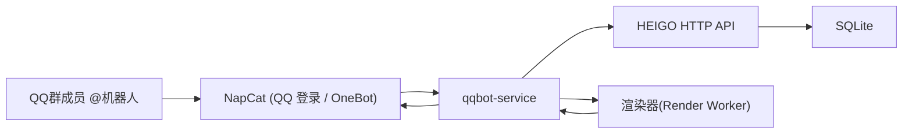

# HEIGO QQ 群机器人技术方案

## 1. 文档目的

本文档用于给当前 HEIGO 单体项目提供一套可落地的 QQ 群机器人接入方案，重点回答以下问题：

- 机器人如何与当前 FastAPI + SQLite + Docker Compose 架构协同
- 机器人如何复用现有公开查询接口与“球员分享卡”能力
- 机器人项目在仓库中的推荐目录结构、部署方式与接口边界
- 机器人上线后在资源、流量、风控与维护上的注意事项

本文档是专题方案文档，不替代 `docs/PROJECT_MANUAL.md` 的总览职责。

## 2. 目标与边界

### 2.1 目标

本方案的目标是提供一个部署在同一台云服务器上的 QQ 群机器人，使其能够在群聊中：

- 根据球员名或 UID 查询球员详情
- 根据球员名返回 HEIGO 风格的球员详情图
- 根据球队名返回名单摘要或分页名单图
- 返回工资明细、版本信息、帮助信息等只读内容

### 2.2 非目标

当前阶段不建议把机器人设计为以下形态：

- 群内直接执行写操作，如交易、导入、撤销、工资重算
- 高并发开放式公网查询机器人
- 多租户、多联赛共享实例机器人
- 绕过 HEIGO 服务层直接读写生产 SQLite

机器人默认只做**只读查询助手**。

## 3. 与当前 HEIGO 架构的关系

当前 HEIGO 后端分层遵循：

`routers -> services -> repositories -> database/models`

机器人方案应保持这一边界，不应直接在机器人代码中复制数据库查询逻辑。推荐做法是：

- QQ Bot 服务只负责：
  - 接收 OneBot 事件
  - 解析命令
  - 调用 HEIGO 内部 HTTP 接口
  - 控制缓存、限流、图片渲染与消息发送
- HEIGO 主服务继续负责：
  - 数据查询
  - 版本管理
  - 球员详情聚合
  - 名单与工资等领域逻辑

这样可以避免机器人项目出现第二套平行业务实现。

## 4. 推荐总体架构



### 4.1 组件职责

#### HEIGO 主服务

- 继续作为联赛数据的唯一业务服务入口
- 对机器人暴露只读接口
- 保持当前数据库读写逻辑、导入逻辑与审计逻辑不变

#### qqbot-service

- 接收 NapCat 上报的 OneBot 消息事件
- 识别群内命令
- 调用 HEIGO API 获取结构化数据
- 渲染球员图 / 名单图
- 通过 OneBot API 回发文本或图片
- 实施频控、白名单、缓存和降级

#### Render Worker

- 负责把“球员分享卡”生成 PNG
- 初期建议通过浏览器渲染 + 截图实现
- 后期若查询量上升，可替换为 SVG / Pillow 直出

#### 可选 Redis

- 用于缓存查询结果
- 用于记录群级 / 用户级频控
- 用于渲染任务短期排队或去重

## 5. 推荐仓库落地方式

建议仍在当前仓库内维护机器人代码，但与主应用保持清晰边界。

### 5.1 目录结构

```text
HEIGOOA/
├─ bot/
│  ├─ app/
│  │  ├─ main.py
│  │  ├─ config.py
│  │  ├─ routers/
│  │  │  ├─ onebot_routes.py
│  │  │  ├─ internal_debug_routes.py
│  │  ├─ services/
│  │  │  ├─ command_service.py
│  │  │  ├─ reply_service.py
│  │  │  ├─ render_service.py
│  │  │  ├─ rate_limit_service.py
│  │  │  ├─ whitelist_service.py
│  │  ├─ clients/
│  │  │  ├─ heigo_client.py
│  │  │  ├─ onebot_client.py
│  │  ├─ render/
│  │  │  ├─ player_share_page.py
│  │  │  ├─ playwright_renderer.py
│  │  │  ├─ templates/
│  │  ├─ schemas/
│  │  │  ├─ onebot_events.py
│  │  │  ├─ bot_commands.py
│  │  └─ utils/
│  │     ├─ text.py
│  │     ├─ cache_keys.py
│  │     └─ logging.py
│  ├─ requirements.txt
│  ├─ Dockerfile
│  └─ README.md
├─ docs/
│  └─ QQ_BOT_INTEGRATION_PLAN.md
```

### 5.2 目录设计原则

- `bot/` 作为独立部署单元，避免侵入 HEIGO 主应用目录
- 机器人**不能**直接导入 `repositories/` 去查 SQLite
- 机器人与 HEIGO 的交互统一走 `clients/heigo_client.py`
- 图片渲染逻辑集中在 `bot/app/render/`，不要散落在命令解析层

## 6. 查询与渲染复用策略

### 6.1 可直接复用的 HEIGO 接口

当前已有接口可直接为机器人提供数据：

- `GET /api/players`
- `GET /api/players/team/{team_name}`
- `GET /api/players/search/{player_name}`
- `GET /api/attributes/search/{player_name}`
- `GET /api/attributes/{uid}`
- `GET /api/attributes/versions`
- `GET /api/player/wage-detail/{uid}`
- `GET /api/export/excel`

其中：

- 文本查人、候选列表、名单摘要可优先使用 `/api/players/*`
- 球员图应以 `/api/attributes/{uid}` 为主
- 版本切换可使用 `/api/attributes/versions`

### 6.2 对“球员分享卡”的复用策略

当前“复制球员图”能力是浏览器侧 DOM 渲染，不是后端图片接口。

推荐分两步：

#### 阶段 A：增加内部分享页

新增仅供机器人渲染的内部页面，例如：

- `GET /internal/share/player/{uid}?version={version}&step={step}&theme=dark`

该页面职责：

- 读取球员详情数据
- 复用现有分享卡样式和结构
- 输出一个无交互、固定主题、固定尺寸的渲染页面

#### 阶段 B：由 bot 截图

`qqbot-service` 通过 Playwright 访问内部页面并截图，得到 PNG 后上传回 QQ。

这样做的优点：

- 最大化复用现有分享卡
- 不需要立即重写一套后端生图引擎
- 最适合先完成 PoC

## 7. 建议新增接口清单

本节只列与机器人集成直接相关、值得新增的接口。

### 7.1 HEIGO 内部接口

#### `GET /internal/share/player/{uid}`

用途：

- 返回机器人渲染专用的球员分享页 HTML

请求参数：

- `version`：球员属性版本，缺省时取默认版本
- `step`：成长预览步数，默认 `0`
- `theme`：建议支持 `dark`

返回：

- `text/html`

说明：

- 当前建议使用 `X-Internal-Share-Token` 保护，并由 `qqbot-service` 渲染时自动携带
- 不面向普通前台用户公开
- 当前仓库已补首版路由骨架，可作为 Playwright 截图入口继续迭代

#### `GET /internal/share/roster/{team_name}`

用途：

- 返回名单分享页 HTML

请求参数：

- `style`：`summary` / `full`
- `page`：页码
- `page_size`：默认 25 或 30

返回：

- `text/html`

说明：

- 初期可不做；若机器人先只做球员图，可后置

### 7.2 bot 服务对外接口

#### `POST /onebot/events`

用途：

- NapCat HTTP 上报入口

职责：

- 校验 OneBot 上报密钥（如启用）
- 解析群聊 / 私聊消息事件
- 标准化成内部命令对象
- 在 `onebot` 模式下自动执行文本回复或球员图发送

#### `GET /health`

用途：

- 容器健康检查

返回：

```json
{
  "status":"ok",
  "reply_mode":"onebot",
  "heigo_api":"ok",
  "onebot_api":"ok",
  "config":{
    "onebot_access_token_configured":true,
    "onebot_secret_configured":true,
    "onebot_self_id_configured":true,
    "internal_share_token_configured":true
  }
}
```

#### `POST /internal/render/player`

用途：

- 给调试工具或未来异步任务触发渲染

请求体示例：

```json
{
  "uid": 24048100,
  "version": "2026-03",
  "step": 0,
  "theme": "dark"
}
```

返回：

- PNG 文件流或临时文件信息

说明：

- 可选，不是 MVP 必需

## 8. 命令设计

建议机器人默认只响应：

- 被 `@机器人`
- 或配置前缀，如 `#heigo`

不建议在群内监听任意自然语言。

### 8.1 推荐命令集

#### 查询球员

```text
@机器人 球员 梅西
@机器人 查人 梅西
@机器人 球员 24048100
```

返回：

- 精简文本卡片
- 多结果时返回候选列表

#### 球员图

```text
@机器人 球员图 梅西
@机器人 球员图 24048100
@机器人 球员图 梅西 v2026-03
```

返回：

- 单张 PNG

#### 名单

```text
@机器人 名单 Barcelona
@机器人 名单 Barcelona 第2页
@机器人 名单 Barcelona 摘要
```

返回：

- 文本摘要
- 或分页名单图

#### 工资

```text
@机器人 工资 24048100
@机器人 工资 梅西
```

返回：

- 工资详情文本

#### 帮助

```text
@机器人 帮助
```

返回：

- 可用命令说明

### 8.2 命令解析规则

建议按以下顺序解析：

1. 是否白名单群
2. 是否 `@机器人` 或合法前缀
3. 命令类型识别
4. 参数提取
5. 限流检查
6. 查询 / 渲染
7. 回发结果

### 8.3 推荐容错策略

- 没找到球员：返回前 5 个相近候选
- 多名重名：返回 UID 列表，要求用户二次指定
- 图片渲染失败：降级为文本详情
- HEIGO 升级或导入中：返回“数据更新中，请稍后”

## 9. 图片渲染方案

### 9.1 MVP 方案：Playwright 截图

流程：

1. bot 调用 HEIGO 内部分享页 URL
2. Playwright 打开页面
3. 等待字体与卡片渲染完成
4. 对指定节点截图
5. 上传到 QQ 富媒体接口

优点：

- 复用现有分享卡最快
- 前后端视觉一致
- 当前仓库已补 Playwright 渲染器骨架与球员图自动回复链路

缺点：

- 占用一定 CPU / 内存
- 高并发下扩展性一般

### 9.2 稳定化建议

- 固定截图主题为深色主题
- 固定 viewport 尺寸
- 截图节点使用稳定 CSS 选择器
- 浏览器上下文池化，避免每次新启 Chromium
- 同一球员图在短时间内命中缓存时直接复用结果

### 9.3 长期演进

若未来图片查询明显增多，可演进为：

- 服务端 SVG 渲染
- Pillow 合成静态模板图
- 独立渲染 worker

## 10. 缓存、频控与降级

### 10.1 缓存建议

建议至少对以下内容做短期缓存：

- 球员搜索结果：30~120 秒
- 球员详情：60~300 秒
- 球员图二进制：5~30 分钟
- 名单分页图：5~30 分钟
- 球员图截图失败时可优先回退到最近一次缓存结果

缓存键示例：

- `player-search:{version}:{keyword}`
- `player-detail:{version}:{uid}`
- `player-share:{version}:{uid}:step:{step}:theme:{theme}`
- `roster-share:{team_name}:page:{page}:style:{style}`

### 10.2 频控建议

建议至少做三层：

- 每用户冷却：例如 5~10 秒
- 每群短周期限流：例如 1 分钟 20 次
- 图片渲染并发限制：例如同一时刻仅 1~2 个

### 10.3 降级策略

- OneBot 图片发送失败：退回文本
- Playwright 渲染失败：退回文本
- HEIGO API 超时：提示稍后再试
- 导入中或数据库锁等待明显：暂停图片请求，仅保留文本查询
- 事件处理过程中出现异常时：优先 `ack` 当前事件并返回诊断信息，避免直接 500 导致重复上报

## 11. 安全与风控

### 11.1 数据访问边界

- 机器人只调用 HEIGO 只读接口
- 禁止机器人直接访问管理写接口
- 内部分享页应限制为内网或携带内部令牌访问

### 11.2 非官方 QQ 方案风控建议

- 只在白名单群启用
- 只响应 `@机器人` 或命令前缀
- 不做定时群发
- 不做营销、导流、刷屏
- 不在失败时连续重试群消息
- OneBot 上报入口应启用 token / secret，避免被伪造请求触发群回复

### 11.3 服务器安全建议

- `napcat`、`qqbot-service` 与 `heigo` 通过 Docker 内网通信
- 不把 SQLite 映射给 `qqbot-service`
- bot 单独使用环境变量保存 OneBot token / secret
- `INTERNAL_SHARE_TOKEN` 独立于 OneBot token / secret 保存
- NapCat WebUI 不直接暴露公网，OneBot HTTP API 优先只走 Docker 内网

## 12. Docker Compose 增补建议

下面给出推荐的 Compose 增补示意，重点展示结构而非最终生产文件。

```yaml
services:
  heigo:
    build:
      context: .
    container_name: heigo
    restart: unless-stopped
    init: true
    environment:
      PORT: "8080"
      DATABASE_PATH: /app/data/fm_league.db
      HEIGO_IMPORT_ROOT: /app/imports
      HEIGO_BACKUP_ROOT: /app/data/backups
      SESSION_COOKIE_SECURE: "true"
      HEIGO_BOOTSTRAP_ADMINS: "${HEIGO_BOOTSTRAP_ADMINS:-}"
      INTERNAL_SHARE_TOKEN: "${INTERNAL_SHARE_TOKEN:?Set INTERNAL_SHARE_TOKEN in .env}"
    ports:
      - "${HEIGO_PORT_BIND:-127.0.0.1:8080:8080}"
    volumes:
      - ./data:/app/data
      - ./imports:/app/imports

  napcat:
    image: mlikiowa/napcat-docker:latest
    container_name: heigo-napcat
    restart: unless-stopped
    init: true
    expose:
      - "3000"
      - "3001"
      - "6099"
    ports:
      - "${NAPCAT_WEBUI_BIND:-127.0.0.1:6099:6099}"

  qqbot:
    build:
      context: ./bot
    container_name: heigo-qqbot
    restart: unless-stopped
    init: true
    environment:
      BOT_PORT: "8090"
      HEIGO_BASE_URL: "http://heigo:8080"
      BOT_RENDER_BASE_URL: "http://heigo:8080"
      INTERNAL_SHARE_TOKEN: "${INTERNAL_SHARE_TOKEN:?Set INTERNAL_SHARE_TOKEN in .env}"
      ONEBOT_API_ROOT: "http://napcat:3000"
      ONEBOT_ACCESS_TOKEN: "${ONEBOT_ACCESS_TOKEN}"
      ONEBOT_SECRET: "${ONEBOT_SECRET}"
      ONEBOT_SELF_ID: "${ONEBOT_SELF_ID}"
      QQ_BOT_ALLOWED_GROUPS: "${QQ_BOT_ALLOWED_GROUPS}"
      BOT_REPLY_MODE: "onebot"
    ports:
      - "127.0.0.1:8090:8090"
    depends_on:
      - heigo
      - napcat

  redis:
    image: redis:7-alpine
    container_name: heigo-bot-redis
    restart: unless-stopped
    profiles: ["bot-cache"]
    ports:
      - "127.0.0.1:6379:6379"
```

### 12.1 关键说明

- `qqbot` 通过 `http://heigo:8080` 访问 HEIGO，不暴露给公网
- `qqbot` 通过 `http://napcat:3000` 调用 OneBot HTTP API
- `qqbot` 渲染内部分享页时，通过 `X-Internal-Share-Token` 访问 `/internal/share/player/{uid}`
- `qqbot` 不挂载 `./data`
- `qqbot` 端口只绑定 `127.0.0.1`
- `napcat` 默认只映射本地 WebUI 端口，OneBot API 通过 Compose 内网访问

## 13. Nginx 增补建议

如果使用 HTTP 上报模式，可新增一个仅供 NapCat 事件上报的入口：

```nginx
location /qqbot/ {
    proxy_pass http://127.0.0.1:8090/;
    proxy_set_header Host $host;
    proxy_set_header X-Forwarded-For $proxy_add_x_forwarded_for;
    proxy_set_header X-Forwarded-Proto $scheme;
}
```

也可以单独使用子域名，例如：

- `bot.example.com`

若使用子域名，建议：

- HEIGO 主站保持现状
- OneBot 上报与调试入口独立日志与访问控制

## 14. 资源与流量评估

### 14.1 4H4G 是否可共存

结论：可以，适合当前阶段。

推荐预估：

- `heigo`：现状维持
- `qqbot-service`：256MB~512MB
- Playwright：单并发时额外约 300MB~800MB 峰值
- Redis：可选，约 50MB

因此 4GB 内存下可跑，但要控制图片渲染并发。

### 14.2 流量评估

主要公网流量来自：

- NapCat 所在设备与 QQ 服务的连接
- 服务器对外提供的 HEIGO / Bot 域名访问（如启用）

同机 Docker 内网中的 `qqbot -> heigo` 与 `qqbot -> napcat` 不应视为公网流量主耗项。

粗略估算：

- 文本查询：基本可忽略
- 球员详情 JSON：约数 KB 到十几 KB
- 一张球员图：通常数百 KB 到 1MB 左右

在联赛群常规使用场景下，月 300GB 流量通常足够。

## 15. 实施阶段建议

### 阶段 1：PoC

- 部署并登录 NapCat
- 完成 OneBot HTTP 上报与 HTTP API 连通
- 完成 `@机器人 球员 xxx`
- 完成 `@机器人 帮助`
- bot 调通 HEIGO 查询接口

### 阶段 2：分享图

- HEIGO 新增内部分享页
- bot 集成 Playwright
- 完成 `@机器人 球员图 xxx`

### 阶段 3：名单与缓存

- 新增名单摘要命令
- 视需要增加名单分享页
- 加入缓存与频控

### 阶段 4：稳定化

- 白名单群
- 告警与日志
- 导入期间降级
- 可选 Redis

## 16. 推荐结论

对当前 HEIGO，推荐的落地方案是：

- 保留当前仓库中的独立 `bot/` 服务
- 使用 **NapCat + OneBot** 作为 QQ 协议接入层
- 机器人只调用 HEIGO 的只读 HTTP 接口
- 通过 **内部分享页 + Playwright** 复用现有球员分享卡
- 使用 Docker Compose 与 Nginx 在同一台服务器协同部署

这条路线最符合当前项目的单实例、SQLite、导入驱动、强调可维护性的边界，也最适合作为首期实现方案。
